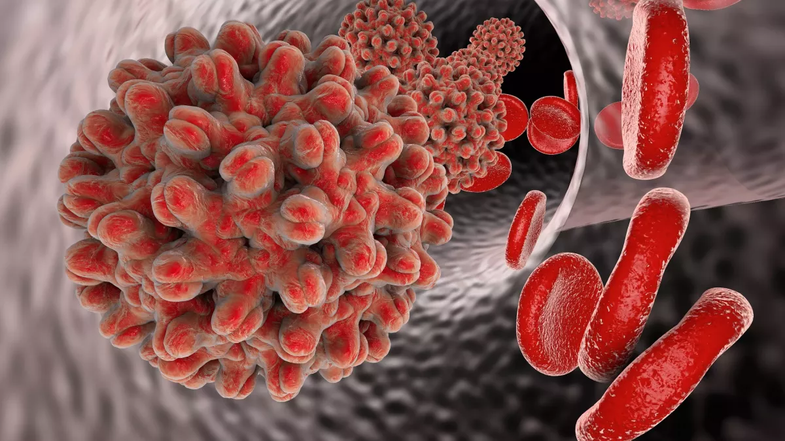
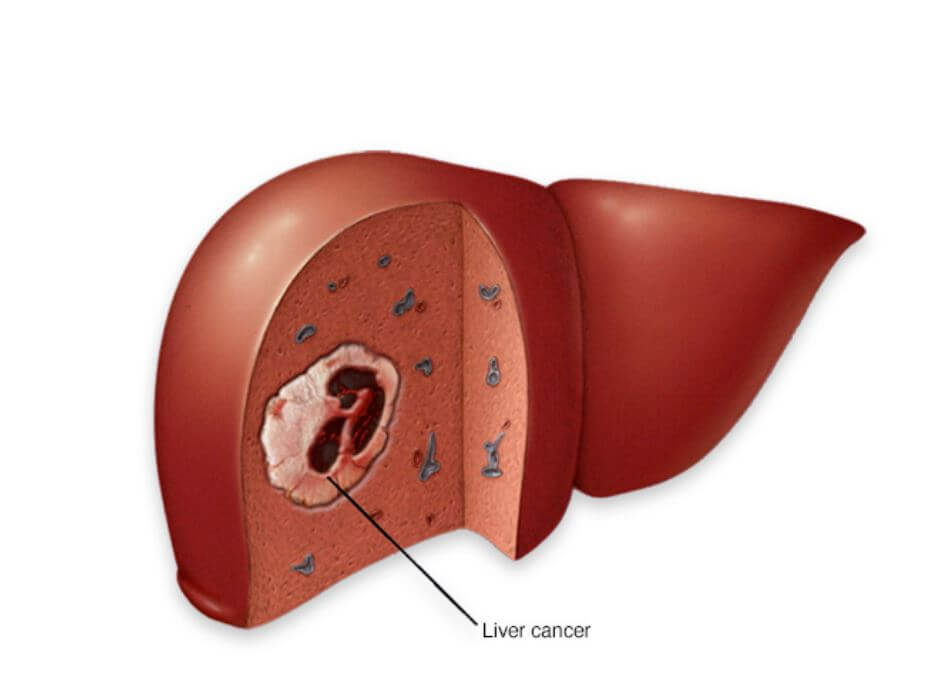
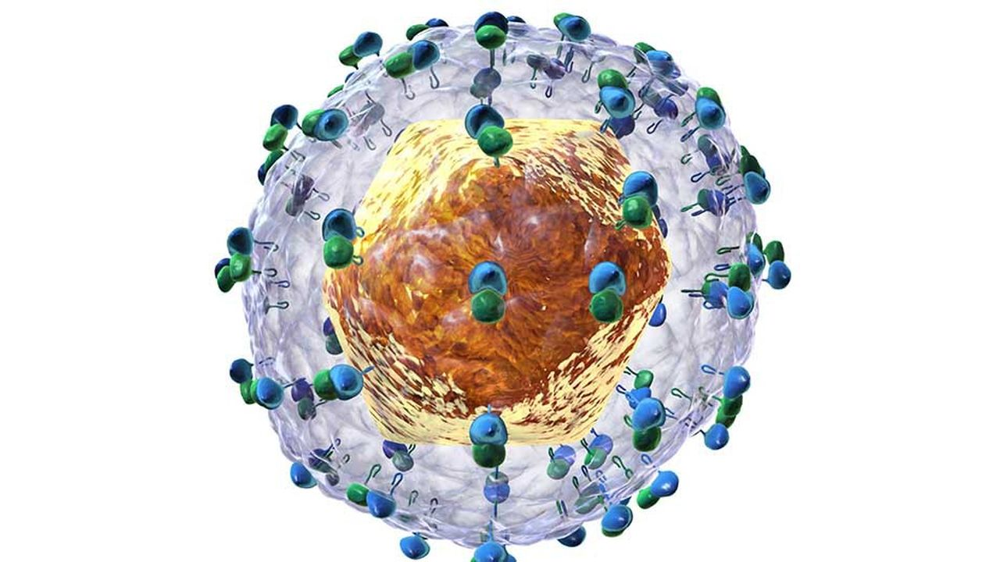

# Hépatites virales B et C et cancer du foie

Les hépatites chroniques virales B et C ont une histoire naturelle relativement semblable. Après contamination par l’un ou l’autre de ces 2 virus, une inflammation se développe dans le foie. Celle-ci induit alors une fibrose – tissu cicatriciel, non fonctionnel - qui peu à peu, après plusieurs années, peut provoquer une cirrhose. Il existe cependant une différence majeure entre ces deux hépatites : les hépatites chroniques virales B peuvent se compliquer de cancer (on parle alors de carcinome hépatocellulaire ou CHC) à n’importe quel moment de l’évolution de la maladie, tandis que les hépatites chroniques virales C ne se compliquent d’un CHC que lorsqu’il y a une cirrhose sous-jacente.

## **Hépatite B (VHB)**

<figure><figcaption>
Source : Passeport Santé
</figcaption></figure>

Le risque de CHC est plus important chez les patients non traités que chez les patients traités par tenofovir ou entecavir. Cependant, même **chez les patients traités, le risque de CHC persiste.**

L'incidence du CHC a été estimée à 0,02 pour 100 personnes-années chez les patients avec infection chronique par le VHB à antigène HBe négatif (porteurs inactifs), à 0,3 pour 100 personnes-années chez les patients atteints d’hépatite chronique virale B sans cirrhose, et à 2,2 pour 100 personnes-années chez les personnes atteintes de cirrhose compensée.

En Afrique subsaharienne, le CHC est une cause majeure de décès **liés au cancer** : la **deuxième cause de décès** chez les hommes et la quatrième chez les femmes en 2020, avec des taux de mortalité selon l'âge de 8,2 et 4,2 pour 100 000 personnes/an, respectivement. Dans cette région, le CHC se manifeste dans des groupes d'âge plus jeunes, avec un taux de **survie médian d'environ 3-4 mois.**

<figure><figcaption>
Source : Canadian Liver Foundation
</figcaption></figure>


En l’absence de traitement, on estime qu'environ 25 % des hommes et 8 % des femmes atteints d’infection chronique virale B acquise en période périnatale mourront d'une cirrhose liée au VHB ou d'un CHC.


Plusieurs facteurs liés à l'hôte (sexe masculin, âge plus avancé ou durée plus longue de l'infection, diabète et antécédents familiaux de CHC), au virus (Ag HBe positif persistant, ADN VHB élevé persistant, génotype VHB ou co-infection VIH, VHC et VHD), au foie (élévation persistante de l'ALAT et maladies hépatiques concomitantes) et au mode de vie (tabagisme et alcool) augmentent les risques de cirrhose et de CHC (Tableau 1).

<figure><figcaption>
Tableau 1. Facteurs de risque de CHC chez les patients infectés par le VHB
</figcaption></figure>

Le CHC lié à l’infection chronique par le VHB est souvent diagnostiqué tardivement et son taux de mortalité est élevé. De nombreux modèles ont été développés pour prédire le risque de CHC afin de guider les décisions de traitement et d'évaluer le besoin de surveillance (Tableau 2).

Chez les patients asiatiques non traités, la plupart des modèles incluent l'âge, la cirrhose et le taux d'ADN du VHB avec une précision bonne à excellente pour la prédiction du CHC sur 5-10 ans.

Chez les patients caucasiens, le score qui comprend des variables très simples (âge, sexe, taux de plaquettes), permet d’évaluer le risque de CHC à 5 ans chez des patients traités par entécavir ou ténofovir.

<figure><figcaption>
Tableau 2. Evolution du risque de cancer chez les patients caucasiens (score PAGE-B)
</figcaption></figure>

La surveillance du CHC par échographie (et mesure optionnelle de l’alpha-fœtoprotéine) tous les 6 mois doit être effectuée chez les patients présentant un risque accru de CHC, à savoir les personnes atteintes de cirrhose, les personnes avec des antécédents familiaux de CHC, les hommes asiatiques de moins de 40 ans, les femmes asiatiques de plus de 50 ans et les hommes africains de moins de 40 ans.

Ces recommandations pour la surveillance du CHC découlent de données montrant une incidence plus élevée et un âge plus précoce de survenue du CHC chez les patients asiatiques et africains, ce qui est probablement lié à l'âge plus précoce de l'infection, bien que d'autres facteurs, tels que les génotypes du VHB ou les carcinogènes environnementaux, puissent également contribuer.

Les recommandations de la Société Française d’Hépatologie (AFEF), publiées en 2020, sont les suivantes :

Il est recommandé de dépister le CHC chez tous les patients atteints d’hépatite B au stade de cirrhose. De plus, il est recommandé de dépister périodiquement un CHC chez les patients sans cirrhose :

• avec antécédent familial de CHC de premier degré,

• en l’absence d’antécédent familial de CHC, chez :

– les hommes à partir de 40 ans (à partir de 30 ans si le taux de plaquettes est inférieur à 100 000/mm3),

– les femmes à partir de 70 ans (à partir de 60 ans si le taux de plaquettes est inférieur à 100 000/mm3).

Puisque **l'alcool et le tabac** sont associés à un risque accru de CHC et qu'il a été montré qu'une [stéatose hépatique](../glossaire.md#s) concomitante accélère la progression vers la [cirrhose](../glossaire.md#c), il faut conseiller de limiter la consommation d'alcool, d'éviter de fumer, de maintenir une alimentation saine et de faire régulièrement de l'exercice physique.

## **Hépatite C**

<figure><figcaption>
Source : Les Echos
</figcaption></figure>

Dans de nombreux pays, l’infection à VHC est la première cause de CHC, avec une incidence de 1 à 3 % par an chez les patients cirrhotiques.

Les autres facteurs de risque sont : l’âge élevé, le sexe masculin, le diabète, l’obésité, le tabac, le génotype viral 3, la consommation élevée d’alcool et la co-infection VIH-VHB et VIH-VHC.

Chez les patients ayant une hépatite chronique par le virus de l'hépatite C (VHC), le traitement par antiviraux à action directe (AAD), en éradiquant le virus, réduit le risque de CHC. Cependant, ce risque de CHC persiste chez de nombreux patients, même après disparition du virus. Au cours des deux prochaines décennies, la plupart des cas de CHC liés au VHC devraient survenir chez des personnes guéries virologiquement.

**La cirrhose est le facteur de risque le plus important pour le CHC.**

Cependant, même parmi les patients atteints de cirrhose, le risque de CHC n'est pas uniforme. Cela peut s'expliquer en partie par la variation du degré de régression ou de progression de l’atteinte du foie (fibrose) au fil du temps. Plusieurs facteurs démographiques (par exemple l'âge), cliniques (par exemple le diabète ou l'obésité) et comportementaux (par exemple la consommation d'alcool ou le tabagisme) peuvent également influencer le risque de CHC.

Les recommandations de la Société Française d’Hépatologie (AFEF) sont les suivantes :

Après réponse virologique post-traitement hépatite C, les patients avec hépatopathie chronique avancée doivent bénéficier de la poursuite du dépistage semestriel du carcinome hépatocellulaire même si le risque de carcinome hépatocellulaire diminue par rapport aux patients sans réponse virologique soutenue. La durée de ce dépistage n’est pas définie, certaines études montrant la persistance d’un risque de carcinome hépatocellulaire plusieurs années après la réponse virologique soutenue.
