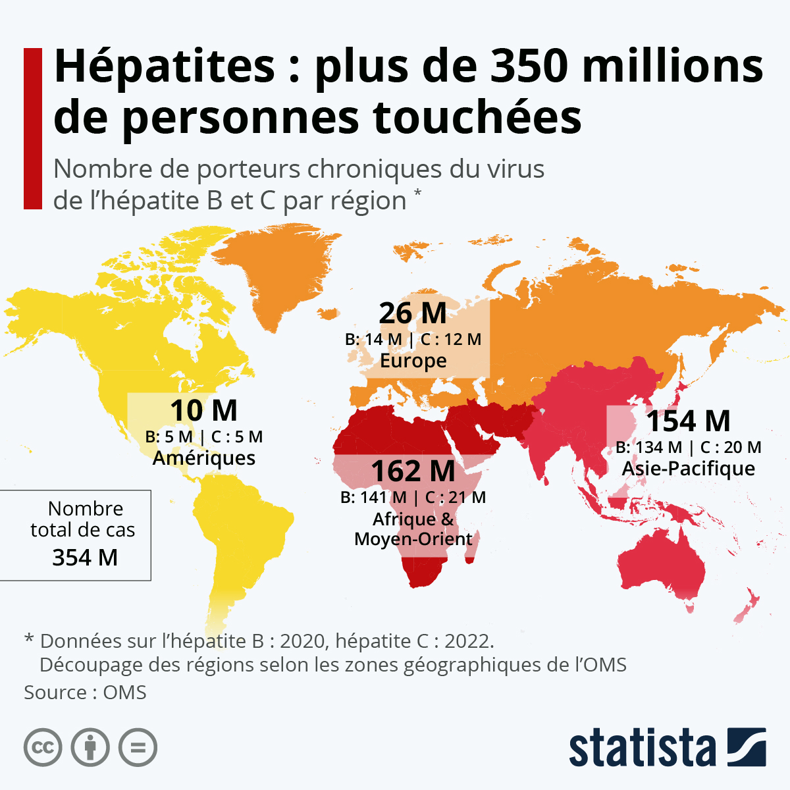

# Les hépatites virales : situation épidémiologique et transmission

Plusieurs virus ont pour cible le foie. On distingue cinq virus responsables d’hépatites : virus A (VHA), virus B (VHB), virus C (VHC), virus D ou delta (VHD) et virus E (VHE).

L’hépatite est une inflammation du foie, aiguë ou chronique, source de problèmes de santé importants comme la cirrhose ou le cancer du foie.

Ces virus présentent des caractéristiques très différentes, notamment en ce qui concerne les modes de transmission, la gravité de la maladie, la répartition géographique et les méthodes de prévention.

Ainsi, seules les hépatites virales B, C et D contribuent au fardeau mondial des pathologies chroniques et des cancers du foie.

Les hépatites virales constituent un problème de santé publique international, comparable à celui posé par d’autres grandes maladies transmissibles comme le VIH, la tuberculose ou le paludisme.

<figure><figcaption></figcaption></figure>

## **Epidémiologie des hépatites virales chroniques dans le monde**

### **Hépatite B (VHB)**

_**Quelques chiffres**_

Dans le monde, on estime actuellement que plus de **deux milliards d’individus** ont été en contact avec le virus de l’hépatite B (VHB) au cours de leur vie.

Alors que l’infection dans sa phase aiguë passe presque toujours inaperçue chez les enfants, elle persiste souvent pour évoluer vers une forme chronique.

Chez l’adulte, c’est le contraire ; même si l’infection aiguë provoque plus souvent des symptômes (fatigue, douleurs abdominales, jaunissement des yeux, urines foncées), elle a plutôt tendance à guérir spontanément dans la majorité des cas.

Le caractère chronique de cette infection est défini par la persistance du virus dans l’organisme pendant au moins six mois, et on estime à plus de **300 millions** **le nombre de personnes porteuses d’une infection chronique à VHB**.

Mais seulement 10% des cas d’infection chronique par le virus de l’hépatite B sont diagnostiqués et 22% d’entre eux sont traités.

Plus de 686 000 personnes meurent dans le monde chaque année des suites d’une infection par l’hépatite B (de cirrhose ou de cancer du foie).

_**Répartition géographique de l’hépatite B**_

L’hépatite B chronique est inégalement répartie dans le monde : elle touche principalement **le continent africain et la région du Pacifique occidental** où plus de 6% des individus en sont atteints, contre une prévalence (fréquence) d’environ 3 à 4% au niveau mondial (Figure 1).

<figure><figcaption>
Répartition géographique de la prévalence et du taux de mortalité de l'hépatite B dans le monde en 2019
</figcaption></figure>

Ainsi en Afrique subsaharienne, beaucoup de pays présentent une prévalence d’hépatite B chronique élevée, supérieure à cette prévalence mondiale, notamment en Afrique Australe et de l’Est. Mais c’est en Afrique de l’Ouest et du centre (Côte d’Ivoire, Sénégal, Mali, Mauritanie, Niger, Nigéria, Cameroun, Gabon, Ghana) que la prévalence est la plus élevée, dépassant parfois les 10% de la population générale.

Dans la région du Pacifique ouest, certaines zones présentent même des prévalences supérieures à 15%, notamment dans les îles du Pacifique (îles Salomon, Vanuatu, Papouasie Nouvelle-Guinée …).

Dans le Sud-Est asiatique, la Chine et la Corée du Sud présentent des prévalences intermédiaires (4 à 6%) tandis que certains pays tels que le Laos et le Vietnam ont des prévalences entre 8 et 10%.

En France métropolitaine, la prévalence de l’infection par l’hépatite B est faible, estimée à moins de 1% de la population (soit moins de 300 000 personnes porteuses du virus), avec trois principales populations particulièrement vulnérables : les hommes qui ont des rapports sexuels avec d'autres hommes (HSH), les usagers de drogues injectables et les personnes originaires des zones de haute prévalence telle que l’Afrique subsaharienne.

_**Pourquoi cette répartition géographique inégale de l’hépatite B chronique dans le monde ?**_

Plusieurs facteurs l’expliquent en partie.

Dans **les pays à ressources élevées**, le renforcement des campagnes de vaccination, l’amélioration de la sécurité des produits transfusionnels combinés à des actions de préventions auprès des populations vulnérables ont entraîné une baisse très importante du nombre d’infection à VHB.

Dans **les pays à ressources limitées** où l’infection par le VHB est généralisée, d’autres facteurs sont associés à un risque plus important de contracter cette infection chronique, tels que le fait d’être un homme ou de vivre en milieu rural.

On constate néanmoins depuis les années 2000 un déploiement important de la vaccination contre l’hépatite B, avec actuellement plus de 90% des pays ayant intégré cette vaccination dans leur calendrier vaccinal au niveau national. Cela se traduit par une diminution de la prévalence de l’infection chronique à VHB déjà observée dans certains pays parmi les populations les plus jeunes ayant eu accès à cette vaccination.

### **Hépatite C (VHC)**

On estime à environ 60 millions le nombre de personnes atteintes d’hépatite virale chronique C, soit presque 1% de la population mondiale (1,5 million environ de nouvelles infections survenant chaque année).

3,2 millions d’enfants et d’adolescents sont atteints d’une infection chronique par le virus de l’hépatite C.

Environ 290 000 personnes sont mortes d’une hépatite C dans le monde en 2019.

9 400 000 personnes sont sous traitement contre une infection chronique par le virus de l’hépatite C.

La prévalence varie selon les régions du monde ; de moins de 1% en Europe à plus de 2% dans certains pays à l’Est méditerranéen (notamment en Egypte).

Au-delà de ces différences régionales, il existe une forte hétérogénéité de prévalence selon les pays. Ainsi, **six pays** (Chine, Pakistan, Inde, Égypte, Russie et États-Unis) **concentrent plus de la moitié** des personnes infectées dans le monde.

En Europe, deux pays (Roumanie et Lettonie) ont des prévalences supérieures à 2% et la moitié des infections chroniques se trouvent dans trois pays (Italie, Roumanie et Espagne).

Plusieurs facteurs expliquent en partie ces différences entre pays et régions du monde :

**L’usage de drogues injectables avec partage de seringues usagées** constitue l’une des principales voies de contamination par le VHC. Ainsi, l’importance de la consommation de drogues injectables explique une part importante des épidémies d’infection à VHC, notamment en Europe de l’Est. En Europe, la majorité des nouvelles contaminations est liée à l’injection de drogues.

La seconde principale voie de contamination par le VHC correspond à un **défaut d’asepsie lors de soins médicaux**, notamment lors des injections. Ainsi, en Europe du Sud comme dans plusieurs pays à ressources limitées, l’utilisation de dispositifs médicaux insuffisamment stérilisés en milieu de soins a été responsable d’une part importante de cette épidémie.

Seules **20% des personnes vivant avec une hépatite chronique C ont connaissance de leur infection,** soit 14 millions de personnes, avec de fortes disparités selon les régions du monde (moins de 10% en Afrique à plus du tiers en Europe et en Amérique).

Le nombre de décès attribuables à l’hépatite C, essentiellement par cancer du foie ou cirrhose, est de l’ordre de 300 000 par an. Ce nombre est en augmentation, notamment parce que, dans les pays à ressources limitées, une part importante des contaminations est survenue à la fin du siècle dernier.

En France, la prévalence de l’hépatite chronique C est estimée à environ 0,3% des adultes (soit à peu près 150 000 personnes) et tend à diminuer depuis une vingtaine d’années. Cette baisse du nombre de personnes infectées peut s’expliquer par plusieurs facteurs :

* la guérison des personnes infectées, notamment grâce aux nouveaux traitements,
* le décès d’un nombre n’important de personnes contaminées il y a plusieurs décennies, majoritairement par transfusion sanguine,
* l’amélioration de la sécurité transfusionnelle et des mesures d’hygiène en milieu de soins,
* le déploiement de mesures de prévention (distribution de seringues à usage unique) auprès des populations à risque (usagers de drogues injectables)


**En Afrique subsaharienne**

* Plus de 91 millions d’Africains vivent avec le VHB ou le VHC.
* En 2020, 26% des malades d’hépatites B et C vivaient en Afrique, avec 125 000 décès associés.
* Plus de 8% de la population totale de 19 pays d’Afrique est infectée par le VHB, tandis que la prévalence de l’hépatite C y est supérieure à 1%.
* Environ 70 % des cas d’hépatite B dans le monde sont concentrés en Afrique.


##

<figure><figcaption>
Source : Hepatitis Global report WHO 2021
</figcaption></figure>

## **Transmission des hépatites virales**

### **Hépatites A et E**

Ces deux virus se transmettent principalement :

* par **voie oro-fécale**, par ingestion d’eau ou d’aliments contaminés par les matières fécales d’un sujet infecté. La maladie est courante dans les pays à revenu faible ou intermédiaire n’ayant qu’un accès limité aux services essentiels d’approvisionnement en eau, d’assainissement, d’hygiène et de santé ;
* par **contact physique étroit** avec une personne infectée (par exemple, lors de rapports sexuels oro-anaux).

### **Hépatite B**

La transmission du VHB se produit par exposition au sang ou à d’autres liquides corporels (exsudat d’une plaie, sperme, secrétions vaginales ou salive) d’une personne infectée (Figure 2).

Les principaux modes de transmission incluent :

* la transmission périnatale de la mère à l'enfant (TME) ;
* la transmission horizontale du jeune enfant à l'enfant ;
* la transmission sexuelle ;
* l’infection iatrogène par exposition à des aiguilles, des seringues ou des produits sanguins contaminés.

Les principaux modes de transmission diffèrent géographiquement :

* dans les zones où la prévalence de l’infection chronique à VHB est élevée, la plupart des transmissions se produisent au cours de la période périnatale ou durant la petite enfance (de 0 à 5 ans).
* dans les régions de faible prévalence (< 2%), la transmission du VHB se produit principalement chez les adolescents et les adultes, souvent dans un contexte de comportements et pratiques à risque (partenaires sexuels multiples, usage de drogues par voie intraveineuse).

.png>)

### **Hépatite C**

Le VHC se transmet par le sang :

* par exposition au sang lors de pratiques d’injection à risque, de soins de santé à risque,
* au cours de la transfusion de sang et de produits sanguins n’ayant pas fait l’objet d’un dépistage,
* de la consommation de drogues par injection,
* ou lors de pratiques sexuelles entraînant une exposition au sang.

### **Hépatite D**

Le virus de l’hépatite D a besoin de celui de l’hépatite B pour pouvoir se multiplier. Les voies de transmission du VHD sont très proches de celles du VHB. Il s’agit :

* d’une co-infection : l’infection par le VHD se produit lorsqu’une personne est infectée simultanément par le VHB et le VHD,
* d’une surinfection lorsque qu’une personne contracte le VHD après avoir été infectée au préalable par le VHB.

Dans les pays à forte prévalence, il semble que le mode de transmission soit majoritairement intrafamilial, mais les facteurs de transmission du VHD dans certaines régions endémiques, surtout en Afrique subsaharienne, restent méconnus.

La co-infection VHB-VHD est considérée comme la forme la plus grave d’hépatite virale chronique en raison de son évolution rapide vers la mort.

## **En conclusion**

* L’hépatite demeure une menace importante pour la santé publique en Afrique. Les progrès en matière de prévention, de diagnostic et de traitement ont été entravés entre 2019 et 2021, lors de la pandémie de COVID-19, en raison d’une mise en œuvre insuffisante des interventions relatives à l'hépatite.
* L’hépatite virale est un problème de santé publique hautement endémique dans la région africaine, comparable à celui posé par d’autres grandes maladies transmissibles telles que l’infection à VIH, la tuberculose et le paludisme.
* Les cinq virus de l’hépatite peuvent tous provoquer des maladies aiguës, mais le plus grand nombre de décès est imputable aux cancers et à la cirrhose du foie qui surviennent après des décennies chez les sujets atteints d’hépatite B ou d’hépatite C chronique.&#x20;
* Il n’existe pas actuellement de vaccin efficace contre l’hépatite C, mais un traitement médical qui aboutit à une guérison. Ces traitements sont encore trop peu utilisés en raison de leurs coûts.
* Un vaccin permettant de prévenir l’hépatite E a été mis au point et homologué en Chine, mais il n’est pas encore disponible ailleurs. La prévention de l’hépatite D passe par la vaccination contre l’hépatite B, mais les taux de guérison sont faibles.

<table data-header-hidden><thead><tr><th width="116"></th><th width="141"></th><th width="116"></th><th width="119"></th><th width="92"></th><th></th></tr></thead><tbody><tr><td><strong>Hépatite</strong></td><td><strong>Transmission</strong></td><td><strong>Mode évolutif</strong></td><td><strong>Traitement</strong></td><td><strong>Vaccin</strong></td><td><strong>Zones de forte prévalence</strong></td></tr><tr><td>A</td><td>
Oro-fécale

Sang
</td><td>Aiguë</td><td>Non nécessaire</td><td>Oui</td><td>Afrique subsaharienne (corrélation au niveau socio-économique)</td></tr><tr><td>B</td><td>
Sang

Sexe

Mère-enfant
</td><td>
Aiguë (90%)

Chronique (10%)
</td><td>Oui</td><td>Oui</td><td><ul><li>Continent africain</li><li>Région du Pacifique occidental</li></ul></td></tr><tr><td>C</td><td>
Sexe

Sang

Mère-enfant
</td><td>
Aiguë 20%

Chronique 80%
</td><td>
Oui

Elimination possible
</td><td>Non</td><td>Six pays = 50 % des sujets : Chine (9,8 millions), Pakistan (7,2 millions), Inde (6,2 millions), Egypte (5,6 millions), Russie (4,7 millions), Etats-Unis (2,9 millions)</td></tr><tr><td>D</td><td>
Sang

Sexe
</td><td>Aiguë Chronique</td><td>
Oui

Satellite du VHB
</td><td>Oui</td><td>Superposables aux zones de l’hépatite B</td></tr><tr><td>E</td><td>Oro-fécale</td><td>Aiguë</td><td>Non nécessaire</td><td>Non</td><td><ul><li>Asie de l’Est</li><li>Asie du Sud</li></ul></td></tr></tbody></table>

## **Pour aller plus loin**

Organisation mondiale de la Santé (OMS). Journée mondiale contre l’hépatite 2022 [https://www.who.int/fr/campaigns/world-hepatitis-day/2022](https://www.who.int/fr/campaigns/world-hepatitis-day/2022)

Organisation mondiale de la Santé (OMS). 91 millions d’Africains infectés par l’hépatite B ou C. [https://www.afro.who.int/fr/news/91-millions-dafricains-infectes-par-lhepatite-b-ou-c](https://www.afro.who.int/fr/news/91-millions-dafricains-infectes-par-lhepatite-b-ou-c)

Organisation mondiale de la Santé (OMS). Principaux repères sur l’hépatite E [https://www.who.int/fr/news-room/fact-sheets/detail/hepatitis-e](https://www.who.int/fr/news-room/fact-sheets/detail/hepatitis-e)

Organisation mondiale de la Santé (OMS). Principaux repères sur l’hépatite A [https://www.who.int/fr/news-room/fact-sheets/detail/hepatitis-a](https://www.who.int/fr/news-room/fact-sheets/detail/hepatitis-a)

Organisation mondiale de la Santé (OMS). Principaux repères sur l’hépatite C [https://www.who.int/fr/news-room/fact-sheets/detail/hepatitis-c](https://www.who.int/fr/news-room/fact-sheets/detail/hepatitis-c)

Organisation mondiale de la Santé (OMS). Principaux repères sur l’hépatite D [https://www.who.int/fr/news-room/fact-sheets/detail/hepatitis-d](https://www.who.int/fr/news-room/fact-sheets/detail/hepatitis-d)

SOS Hépatites. Les modes de transmission des virus des hépatites. 2021. [https://soshepatites.org/modes-de-contaminations](https://soshepatites.org/modes-de-contaminations)
