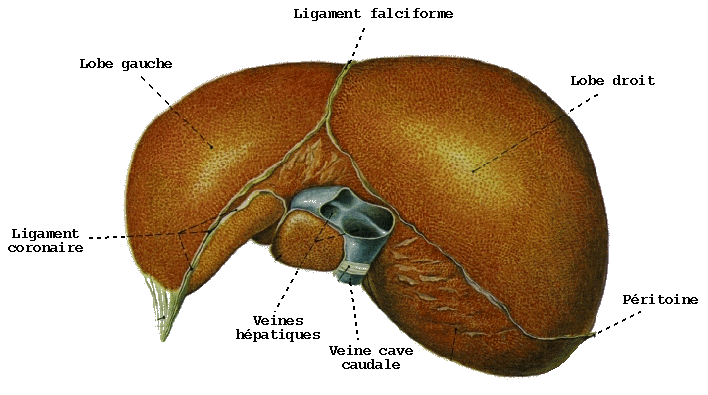

# Les virus des hépatites

## Qu’est-ce-qu’une hépatite virale ?

L’hépatite virale est une atteinte inflammatoire diffuse du foie consécutive à une infection par des virus dont la cible principale est la cellule hépatique (hépatocyte) : on parle de virus hépatotropes. Les lésions hépatocytaires sont essentiellement liées à un mécanisme immunitaire.

<figure><figcaption>
Source : SOS Hépatites
</figcaption></figure>

L'hépatite est dite **aiguë** lors du premier contact de l'organisme avec le virus. Dans de rares cas, l’hépatite peut être fulminante et conduire à une destruction massive du foie, ce qui nécessite une transplantation hépatique. Si le virus n’est pas éliminé, l’hépatite devient **chronique** lorsqu'elle persiste au-delà de 6 mois après le début de l'infection. Cette maladie peut évoluer spontanément vers la guérison ou progresser vers la fibrose, la cirrhose ou le cancer du foie.

## Les différents virus de l’hépatite

Il existe cinq principaux types de virus de l’hépatite, appelés **A, B, C, D et E**.

<figure><figcaption></figcaption></figure>

### **Hépatite A et hépatite E : une transmission digestive**&#x20;

Les hépatites A et E ont de nombreux points communs. Ce sont des virus à ARN, sans enveloppe, très résistants aux agents physico-chimiques.

Ces virus se transmettent essentiellement dans des conditions d’hygiène précaires, par l’eau ou les aliments contaminés. On les retrouve dans les selles de personnes infectées, d’où la notion de transmission féco-orale. La transmission du VHA peut aussi avoir lieu lors de rapports sexuels en cas de contact bouche-anus (anulingus). Pour le VHE, la transmission transfusionnelle est possible, ainsi qu’une transmission par don d’organe.

Les infections par ces virus sont essentiellement aiguës, guérissant spontanément au bout de quelques jours/semaines. Elles se caractérisent par une inflammation hépatique aiguë et de courte durée, conduisant à la destruction d’une partie des cellules du foie. Les capacités régénératrices du foie permettent, en général, de recouvrer complètement des fonctions hépatiques normales. En revanche, l’hépatite fulminante A ou E est possible.

### **Hépatite B/D et hépatite C : une transmission sexuelle et sanguine**&#x20;

Les virus des hépatites B, D et C ont en commun d’être des virus avec une enveloppe et transmissibles par le sang. Pour ces 3 virus, l'infection peut évoluer sous une **forme chronique**.

Le VHD présente la particularité, pour se multiplier, d’être sous la dépendance du VHB, dont il emprunte l’enveloppe. Le VHD n’est donc infectieux qu’en présence du VHB. Ces virus partagent certains modes de transmission comme :

* _Par voie sanguine_

La transmission se fait par contact avec du sang ou des dérivés sanguins contaminés (transfusion sanguine, chirurgie, hémodialyse, acupuncture etc.), par l’usage de drogues par voie intraveineuse ou intra-nasale, par la pratique du tatouage ou du piercing (en particulier pour le VHC) et lors d’un accident avec exposition au sang (AES). <mark style="color:red;">Alors, VHB (et VHD) se transmet principalement par voie sexuelle et périnatale.</mark>

* _Par voie sexuelle_

L’hépatite B est une infection sexuellement transmissible (IST). La transmission du VHB se fait par le sperme et les sécrétions cervico-vaginales. <mark style="color:red;">Elle reste idem pour le VHD mais est moins fréquente pour le VHC.</mark>

* _Transmission de la mère à l’enfant (transmission verticale)_

Ce mode de transmission concerne le VHB, en particulier au moment de l’accouchement lorsque le sang de la mère contient beaucoup de virus (on parle de charge virale élevée) mais aussi au cours de l’allaitement. Une infection à la naissance ou dans la première année de de vie conduit dans plus 90% des cas à un portage chronique du VHB, alors que chez l’adulte le passage à la chronicité concerne moins de 10 % des cas. Cette transmission de la mère à l’enfant est prévenue par le traitement de la femme enceinte et la vaccination de l’enfant à la naissance.

* _Transmission horizontale (le plus souvent intra-familiale)_

Le virus se transmet chez les contacts proches d’un sujet infecté par le VHB par contact direct ou par le partage d’objets contaminés (brosse à dent, rasoir...).

## Aspects immuno-virologiques des virus de l’hépatite

### **Cellules cibles des virus de l’hépatite**

Les virus de l’hépatite se multiplient dans les cellules du foie (hépatocytes) et les cellules de Kupffer, des cellules chargées de la protection du foie (macrophages). Après une infection virale, comme pour tout type de microbe, deux types de réaction immunitaire se mettent en place successivement.

La première est dite innée, c’est-à-dire qu’elle appartient à tout être humain ; elle est immédiate et n’est pas spécifique de l’agent pathogène infectant. Dans un second temps, une réaction immunitaire dite adaptative, mise en place par le système immunitaire en réaction à l’agression par le pathogène, est dirigée spécifiquement vers le virus.

Pour pénétrer dans l’organisme, le virus se lie à des récepteurs à la surface des hépatocytes et y pénètre, par un processus appelé [endocytose](https://fr.wikipedia.org/wiki/Endocytose), au moyen de récepteurs spécifiques. L’activation de ces récepteurs déclenche la production de diverses cytokines, principalement des interférons (IFN) comme les IFN α et β. Après une période de six à huit semaines, le système immunitaire apprend à mieux reconnaître les virus et lance alors une réponse plus ciblée. Certaines des cellules immunitaires (appelées cellules B) commencent à fabriquer des anticorps capables d’identifier et de se lier au virus. Les médiateurs immunitaires recrutent diverses cellules du système immunitaire comme certains globules blancs ou les [lymphocytes T](https://www.monsystemeimmunitaire.fr/les-lymphocytes-t-mediateurs-de-limmunite-cellulaire/) cytotoxiques ou les cellules [Natural Killer](https://www.monsystemeimmunitaire.fr/les-cellules-natural-killer-des-tueuses-par-nature/) (NK) qui vont détruire les hépatocytes infectés et produire d’autres cytokines, comme [l’IFN-γ](https://www.monsystemeimmunitaire.fr/role-de-linterferon-gamma-dans-la-defense-antivirale/), possédant un rôle immunosuppresseur dans la production de nouveaux virus.

Dans le cas des hépatites virales, notamment l’infection au VHB, la réplication du virus en elle-même n’est pas toxique pour la cellule. Les lésions hépatiques sont surtout la conséquence de la destruction, par notre système immunitaire, des cellules infectées. En effet, les cellules immunitaires détruisent les cellules hépatiques infectées par le virus et cela déclenche une réponse inflammatoire dans le foie.

### **Comment faire le diagnostic virologique d’une hépatite virale ?**

Le diagnostic virologique des hépatites virales repose très largement sur la détection des anticorps induits par la présence du virus. On parle de test sérologique. Au début de l’infection ce sont les anticorps type IgM qui sont retrouvés. Ils témoignent donc d'une hépatite aiguë. Une infection ancienne est attestée par la présence des anticorps IgG.

On peut aussi détecter le virus directement dans le sang à l’aide de la technique PCR spécifique de chacun des virus.

<figure><figcaption></figcaption></figure>

## Pour en savoir plus :&#x20;


