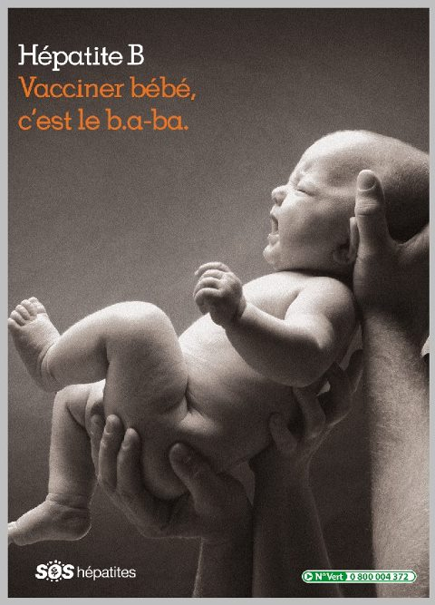

# Protéger les nourrissons de l’hépatite B : ce que tout parent devrait savoir

## **Introduction**

L’hépatite B est une infection virale qui touche des millions de personnes dans le monde. Elle peut s’avérer particulièrement dangereuse en cas de transmission de la mère à l’enfant. L’objectif de ce chapitre est de fournir, à l’attention des parents, des informations importantes sur l’hépatite B et les moyens d’éviter sa transmission aux nourrissons.

Nous parlerons de la transmission mère-enfant de l’hépatite B, de l’efficacité de la vaccination contre l’hépatite B dès la naissance, de la couverture vaccinale actuelle, des défis pour assurer une vaccination dans les meilleurs délais, ainsi que d’autres moyens de prévention de la transmission mère-enfant.

## **Comment l’hépatite B se transmet-elle aux nourrissons ?**

L’hépatite B se transmet essentiellement par contact avec du sang ou des fluides corporels infectés. Quand la mère est infectée par le virus de l’hépatite B (VHB), celui-ci peut se transmettre à l’enfant pendant la grossesse, lors de l’accouchement et après l’accouchement. Ce risque est le plus élevé lorsque la mère a une infection active avec une réplication virale élevée.

## **L'importance de la vaccination à la naissance**

Heureusement, il existe un vaccin extrêmement efficace capable de protéger les nourrissons de l’hépatite B. Il est fondamental que ce vaccin soit administré dans les 24 heures suivant la naissance. On appelle cette injection la « dose de vaccin à la naissance. Ce vaccin contient des petits fragments inoffensifs du virus de l’hépatite B qui vont aider le système immunitaire à reconnaître et à combattre le virus grâce à la production d’anticorps anti-VHB. Administrer le vaccin aussitôt que possible après la naissance permet une protection rapide du nourrisson, comme l’ont montré plusieurs études.

<figure><figcaption>
Source : SOS Hépatites
</figcaption></figure>

## **Combien de nourrissons reçoivent la dose de vaccin à la naissance ?**

Malgré l’efficacité démontrée de la dose de vaccin à la naissance, celle-ci n’est malheureusement pas administrée partout dans le monde. Selon l’Organisation mondiale de la santé (OMS), en 2019, seuls 43 % des nourrissons à l’échelle mondiale avaient reçu ce vaccin à la naissance. Cela implique que beaucoup de nourrissons échappent à cette protection vitale. Le taux de couverture vaccinale varie selon les pays et les régions : certains arrivent à des taux optimaux alors que d’autres peinent à atteindre les niveaux recommandés.

Plusieurs facteurs expliquent cette couverture vaccinale basse dès la naissance. L’accès limité aux soins et aux professionnels de santé qualifiés, surtout dans les zones reculées du monde, rend difficile l’administration de ce vaccin à la naissance. La faible sensibilisation du personnel soignant et des familles sur l’importance de la vaccination immédiate, dès la naissance , y contribue également. Des croyances culturelles, des perceptions erronées ainsi que la réticence à la vaccination ne font qu’augmenter les obstacles à la couverture optimale.

<figure><figcaption>
<a href="https://apps.who.int/iris/bitstream/handle/10665/250243/9789242509830-fre.pdf?sequence=1&#x26;isAllowed=y">Guide pour l'introduction et le renforcement de la vaccination à la naissance contre l'hépatite B</a> - Organisation mondiale de la Santé
</figcaption></figure>

## **Défis pour assurer la vaccination dans les temps**

**Pour éviter la transmission de l’hépatite B de la mère infectée à son enfant, il est fondamental que le vaccin soit administré dans les 24 heures suivant la naissance.**

S’assurer que les nourrissons reçoivent la dose de vaccin à la naissance reste un défi majeur. En effet, cette vaccination s’avère particulièrement compliquée lorsque l’accouchement a lieu en dehors d’un hôpital ou d’une clinique. Dans certains endroits reculés ou peu dotés de personnel soignant, les mères peuvent accoucher chez elles ou en l’absence de médecins ou d’infirmiers, rendant difficile l’administration du vaccin dès la naissance.

**Pour surmonter ce défi, il faut que les femmes enceintes porteuses du VHB soient diagnostiquées avant la naissance, et qu’elles aient accès à des établissements de santé à l’approche de l’accouchement.** La proximité du personnel de santé qualifié favorise l’administration de la dose de vaccin à la naissance.

Des défis logistiques ainsi que des problèmes de chaîne d'approvisionnement peuvent aussi retarder la livraison des vaccins dans les zones plus reculées.

Afin de maintenir l’efficacité du vaccin, il est important de le garder à la bonne température. Or, ceci peut s’avérer difficile dans des endroits où la réfrigération est limitée. C’est là que le transport sous température contrôlée intervient, permettant de s’affranchir du respect strict de la chaîne du froid pendant quelques jours sans compromettre la qualité des vaccins. Ce dispositif offre une solution temporaire pour des zones avec un accès limité à la réfrigération, permettant le transport et l’administration du vaccin y compris dans les zones reculées.


La « **chaîne à température contrôlée** », ou CTC, est une approche novatrice de gestion des vaccins permettant de les conserver à des températures autres que la plage habituelle de +2°C à +8°C utilisée dans la chaîne du froid, pendant une période de temps limitée, dans des conditions contrôlées et surveillées, et en fonction de la stabilité du vaccin.


Assurer un approvisionnement constant en vaccins reste cependant essentiel afin d’empêcher les pénuries et les occasions vaccinales manquées au moment opportun. En relevant ces défis logistiques et en améliorant l’approvisionnement en vaccins, nous pourrons augmenter les chances que chaque nourrisson reçoive la dose de vaccin contre l’hépatite B dès la naissance, peu importe son lieu de naissance.

Enfin, les professionnels de santé ne sont pas toujours suffisamment informés de l’importance de la dose de vaccin à la naissance, et comment l’administrer. Renforcer les systèmes de soin, approfondir les connaissances ainsi que le niveau de formation du personnel soignant, sensibiliser les communautés constituent des étapes primordiales afin de relever ces défis et s’assurer que les nourrissons soient vaccinés dans les temps.

## **Autres moyens de prévention de la transmission**

En complément de la dose de vaccin à la naissance, il existe d’autres moyens de prévention de la transmission mère-enfant de l’hépatite B. Un traitement antiviral pendant la grossesse permet aussi de réduire le risque de transmission du virus. En effet, lorsqu’administrés à la femme enceinte avec une charge virale élevée, ces traitements empêchent la réplication du virus de l’hépatite B, réduisant ainsi le risque de transmission au nourrisson.

Une autre stratégie est l’administration d’immunoglobulines contre l'hépatite B (HBIg) aux nourrissons nés de mères avec une charge virale élevée. Les HBlg offrent une immunité temporaire au nouveau-né, le protégeant du virus jusqu’à ce que son propre système immunitaire puisse réagir au vaccin.

La sensibilisation des femmes enceintes et de leurs familles au sujet de l’hépatite B, de ses modes transmission et de l’importance de la vaccination est primordiale. Ainsi les familles peuvent prendre des décisions en connaissance de cause et rechercher une prise en charge adéquate.

## **En résumé**

Protéger les nourrissons de l’hépatite B est vital pour leur santé à long terme. La dose de vaccin à la naissance est très efficace pour prévenir la transmission mère-enfant de l’hépatite B, dès lors qu’elle est administrée suffisamment tôt. Mais des défis persistent pour assurer la couverture vaccinale de tous les nourrissons dans les temps. Parmi ces défis, on compte l’accès limité aux soins, un manque de sensibilisation ainsi que des difficultés logistiques.

En complément de la vaccination, un traitement antiviral pendant la grossesse et l’utilisation d’immunoglobulines contre l'hépatite B peuvent réduire davantage le risque de transmission. La sensibilisation des femmes enceintes et de leurs familles au sujet de l’hépatite B est également essentielle, pour qu’elles soient en capacité de prendre des décisions en connaissance de cause.

Relever ces défis, améliorer les systèmes de santé et sensibiliser le public nous permettront de protéger davantage les nourrissons de l’hépatite B et d’offrir à tous la possibilité de vivre en meilleure santé. Rappelons-nous que la vaccination dans les temps peut sauver des vies et assurer le bien-être de nos petits.
