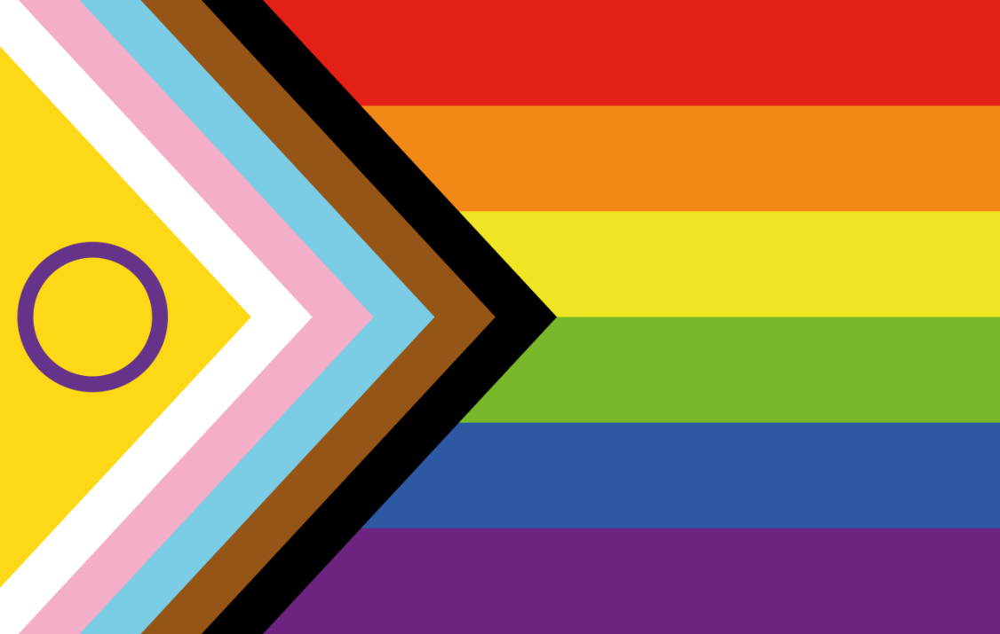

# Genre, Identités, Sexualités

Le **genre** désigne les processus et rapports sociaux qui divisent, polarisent et organisent l'humanité en différentes catégories de « sexe » et de « sexualité » (masculin/féminin, homme/femme, mâle/femelle, cisgenre/transgenre, intersexe/dyadique, homo/hétéro, etc.).

Le **concept de genre** est apparu au milieu du XXe siècle pour distinguer ce qui relèverait des dimensions sociales et culturelles dans la division sociale entre les sexes, en opposition à ce qui relèverait du biologique. C’est la fameuse formule « on ne naît pas femme : on le devient » de Simone de Beauvoir (dans son ouvrage _Le Deuxième Sexe,_ publié en 1949).

Si le terme de genre est encore employé en ce sens, cette dichotomie social/biologique a depuis été remise en cause par plusieurs travaux scientifiques. Le genre est aujourd’hui une notion qui relève d’un champ de savoirs pluridisciplinaires : les **études de genre**.

L’expression « théorie du genre » n’est quant à elle pas utilisée dans le milieu académique. Il s’agit d’une expression popularisée au début des années 2000 par différents mouvements réactionnaires, notamment catholiques, d’opposition au mariage pour tous, à l’homoparentalité et aux transidentités.

## Introduction aux études de genre

Les études de genre constituent un champ de recherche pluridisciplinaire (sociologie, anthropologie, histoire, psychologie, économie, sciences politiques, géographie…) qui étudie les rapports sociaux entre les sexes. Le genre y est considéré comme une construction sociale.

De manière générale, les études de genre proposent une démarche de réflexion, répertorient ce qui définit le masculin et le féminin dans différents lieux et à différentes époques, et s’interrogent sur la manière dont les normes de genre se reproduisent au point de sembler « naturelles ».

Le mot « études » est toujours employé au pluriel pour renvoyer à la diversité des travaux menés dans le domaine. Plusieurs courants de pensées co-existent.

Pour autant, on peut distinguer quatre dimensions analytiques principales, reprises notamment par Laure Bereni, Sébastien Chauvin, Alexandre Jaunait et Anne Revillard dans leur _Introduction aux études sur le genre_.

1. **Le genre est une construction sociale.** Les identités « sexuées » (homme/femme) et « sexuelles » (homosexuel/hétérosexuel) sont le produit non pas de processus biologiques mais la résultante de constructions sociales et culturelles qui varient à travers l’histoire et les sociétés. Ainsi, le genre construit les identités sociales des individus.
2. **Le genre est un processus relationnel.** On ne peut étudier ce qui relève des femmes et du féminin sans articuler l’analyse avec ce qui relève des hommes et du masculin, et inversement. Les caractères associés à chaque sexe sont en effet produits socialement dans une relation d’opposition : est considéré comme féminin ce qui n’est pas considéré comme masculin et inversement.
3. **Le genre est un rapport de pouvoir.** Il n’existerait pas de dominations naturelles. Les études de genre abordent ainsi les rapports entre hommes et femmes sous l’angle de rapports sociaux d’oppression et d’exploitation, constituant ainsi les individus en groupes dominants et dominés.
4. **Le genre est imbriqué dans d’autres rapports de pouvoir.** Les rapports de pouvoir basés sur le sexe s’articulent, parfois de manière dynamique et complexe, avec d’autres rapports de pouvoir (classe sociale, âge, origine ethnique, sexualité …). En 1989, l'universitaire afro-américaine Kimberlé Williams Crenshaw a proposé le terme d'**intersectionnalité** pour parler spécifiquement de l'intersection entre le sexisme et le racisme. Le sens de ce terme s’est ensuite élargi pour inclure les autres rapports de domination.

Le terme de **normes de genre** renvoie de fait aux normes dominantes, dans un contexte social et historique donné, qui définissent les rôles masculins et féminins, à savoir ce qu’est censé être/faire un homme et ce qu’est censée être/faire une femme. Les sociétés étant par nature hétérogènes plusieurs normes de genre peuvent simultanément co-exister.


La mise en évidence de rapports d’oppression basés sur le genre ne signifie pas pour autant, de manière simpliste, que tous les hommes sont des oppresseurs et que toutes les femmes sont des victimes. Les normes de genre s’appliquent tout autant aux hommes qu’aux femmes et peuvent être vécues comme une oppression par des personnes des deux sexes. Pour autant, les études de genre permettent de mettre en évidence les dimensions structurelles, sociales, politiques et culturelles des systèmes de domination.


## Sexe « biologique »

On oppose souvent à la notion de genre celle de **sexe biologique** qui serait « naturel » et universellement défini. Pour autant, en biologie, il n’y a pas de définition unique du sexe biologique. En 2016, le CNRS titrait dans son journal « Combien y a-t-il de sexes ? ».&#x20;



De manière synthétique, le sexe biologique est le résultat d’une histoire développemental de l’individu : ses différents niveaux ne se réalisent pas tous à la même période de la vie. On peut distinguer quatre temps forts :

1. la **fécondation**, quand un spermatozoïde rencontre un ovule, qui détermine le **sexe chromosomique** (deux chromosomes X pour les femmes, un chromosome X et un chromosome Y pour les hommes) ;
2. la **vie intra-utérine** pendant laquelle se développent les différents organes dont les gonades (ovaires pour les femmes, testicules pour les hommes) qui déterminent le **sexe gonophorique** ;
3. la **naissance** où est examiné le **sexe périnéal** (la partie visible des organes génitaux) qui va décider du sexe d’état civil ;
4. la **puberté** où vont se mettre en place différents mécanismes hormonaux, notamment la production d’œstrogènes chez les femmes et de testostérone chez les hommes, qui vont déterminer le **sexe hormonal**.

Mais tous ces mécanismes sont complexes et il n’y a pas forcément concordance entre ces différentes dimensions. Ainsi il peut exister des situations intermédiaires (par exemple les personnes atteintes du syndrome de Klinefelter peuvent avoir trois chromosomes sexuels : XXY). On parle alors de **personnes intersexes**.

Décrite chez de nombreux mammifères, l’intersexuation semble concerner de 1 à 2% des naissances dans l’espèce humaine. Ainsi, des millions d’individus ne correspondent pas aux deux formes types, à savoir la forme femelle (deux chromosomes X, des ovaires, une anatomie favorisant la grossesse et le développement fœtal, une poitrine…) et la forme mâle (un chromosome X et un Y, un pénis et des testicules, des canaux internes chargés d’assurer le transport de l’urine et du sperme…).

Les variations sont nombreuses et recouvrent un ensemble de réalités biomédicales diverses. Toutes les formes d’intersexuation ne sont pas forcément visibles. De nombreuses personnes sont ainsi intersexes sans le savoir.

## Orientation sexuelle

De manière usuelle, l’**orientation sexuelle** désigne un mode durable d’attirance sexuelle pour les personnes du sexe opposé (**hétérosexualité**), du même sexe (**homosexualité**) ou des deux sexes (**bisexualité**). À cela on ajoute parfois l’**asexualité** pour désigner l’absence d’attirance sexuelle.

Le plus souvent, les enquêtes sur la sexualité distinguent trois grandes dimensions de l’orientation sexuelle :

* l’**identité déclarée** correspond à la manière dont les individus se décrivent eux-mêmes (_Comment vous définiriez-vous ?_) ;
* le **pôle d’activité sexuelle** correspond au sexe des partenaires sexuels déclarés sur une période de temps donnée (par exemple les 12 derniers mois ou la vie entière) et rend compte des pratiques des individus ;
* l’**attirance sexuelle** (_Êtes-vous attiré·e uniquement par les hommes, principalement par les hommes mais aussi par les femmes, autant les hommes que les femmes, plutôt par les femmes, exclusivement par les femmes ?_).

.png>)

Ces différentes dimensions de l’orientation sexuelle ne se superposent pas. Les pratiques ne correspondent pas forcément aux attirances que l’on a ou à la manière de se définir. De même, ses différentes dimensions peuvent évoluer au cours de la vie.

On distingue parfois **attirance sexuelle** et **attirance sentimentale ou romantique**. Le fait d’être attiré sexuellement par un genre donné ne signifie pas pour autant que l’on envisage une vie de couple avec une personne de ce genre. Les personnes asexuelles, celles qui n’ont pas d’attirance sexuelle, peuvent tout à fait avoir une attirance romantique pour autrui.

Dans l’enquête _Contexte de la sexualité en France (CSF)_ conduite en 2003, 3,9% des femmes interrogées et 4,0% des hommes interrogés avaient déclaré avoir déjà eu au moins un partenaire de même sexe au cours de leur vie ; respectivement 0,8% et 1,5% sur les douze derniers mois, et seulement 0,4% et 1,2% disaient avoir eu exclusivement des partenaires de même sexe au cours de la dernière année.

Les personnes ayant déclaré être attirées par des personnes de même sexe sans jamais avoir pratiqué sont relativement nombreuses : 3,7% des femmes et 1,5% des hommes.

Les pratiques sexuelles entre personnes de même sexe ont, de tout temps, existé, sur tous les continents. Dans le contexte africain, par exemple, la question de l’homosexualité est longtemps restée invisibilisée dans la réponse à l’épidémie de VIH. Pourtant, des travaux anthropologiques ont mis en évidence l’existence historique de pratiques homosexuelles, avant la période de colonisation, pendant la colonisation puis après les indépendances. Il faudra attendre le milieu des années 2000 pour que se développent des enquêtes quantitatives sur les homosexuels masculins en Afrique.


La situation légale de l’homosexualité varie grandement d’un pays à l’autre. En France, il faudra attendre 1982 pour que l’homosexualité soit dépénalisée, 1999 pour que soient reconnus les couples des personnes de même sexe avec la création du pacte civil de solidarité (PACS) et 2013 pour que le mariage soit ouvert à tous les couples, quel que soit leur sexe.

En 2023, selon l’ILGA ([https://database.ilga.org/](https://database.ilga.org/)), l’homosexualité reste illégale dans 64 pays du monde, dont 7 où cela est punissable de mort (Arabie saoudite, Brunei, Iran, Mauritanie, Nigéria, Ouganda et Yemen).


## Identités de genre et transidentités

Le **genre assigné à la naissance** renvoie au genre attribué à un enfant à sa naissance. Il s’agit du genre déclaré à l’état civil et il est basé, le plus souvent, sur le sexe périnéal évoqué plus haut.

L’**identité de genre** renvoie quant à elle à la catégorie de genre à laquelle la personne estime appartenir, à la manière dont elle expérimente et vit son genre.

Pour une majorité d’individus, identité de genre et genre assigné à la naissance sont alignés : on parle alors de personnes **cisgenres**. À l’inverse, la **transidentité** désigne le non-alignement entre identité de genre et genre assigné à la naissance. On parle alors de personnes **transgenres**.


La transition de genre ne s’accompagne pas systématiquement d’hormonothérapie ou de chirurgie de féminisation ou de masculinisation. Aujourd’hui, la transidentité se définit uniquement par le non-alignement entre identité/expression de genre et genre assigné à la naissance, indépendamment du parcours médical des personnes concernées.


Les **femmes trans** sont des personnes assignées « homme » à la naissance et qui se définissent comme femmes. De manière symétrique, les **hommes trans** sont des personnes assignées « femme » à la naissance et qui se définissent comme hommes.


Le terme _transsexuel_ est un terme d’origine médicale. Il est de plus en plus abandonné, y compris par les médecins, car considéré comme fortement pathologisant.


Certains individus ne se définissent ni strictement homme, ni strictement femme, mais entre les deux, un mélange des deux, ou aucun des deux. Plusieurs sous-identités existent (bigenre, pangenre, _genderfluid_, agenre…) que l’on peut regrouper sous le terme d’**identités non binaires**. L’expression **troisième genre** est également employée.

De manière générale, la non-binarité renvoie à un ensemble de conceptions du genre qui n’est pas limité à deux catégories mutuellement exclusives. Si les termes « transgenre » ou « non binaire » sont relativement récents, des cas de changements d'identité sont documentés depuis des milliers d'années et les identités de genre en dehors de la binarité sont fréquentes dans les civilisations non occidentales.

<table data-view="cards"><thead><tr><th></th><th></th><th></th><th data-hidden data-card-target data-type="content-ref"></th><th data-hidden data-card-cover data-type="files"></th></tr></thead><tbody><tr><td>Accompagner les personnes trans dans une démarche d'affirmation de genre - AFRAPEDIA </td><td></td><td></td><td><a href="accompagner-les-personnes-trans-dans-une-demarche-daffirmation-de-genre.md">accompagner-les-personnes-trans-dans-une-demarche-daffirmation-de-genre.md</a></td><td><a href="../.gitbook/assets/test visuel carte AFRAPEDIA.png">test visuel carte AFRAPEDIA.png</a></td></tr><tr><td>Comprendre les transidentités : un guide à l'usage des personnes cis - DILCRAH</td><td></td><td></td><td><a href="https://www.dilcrah.fr/wp-content/uploads/2022/02/GUIDE_COMPRENDRE-LES-TRANSIDENTITES-TRANSAT-NUMERIQUE-27-12-2021.pdf">https://www.dilcrah.fr/wp-content/uploads/2022/02/GUIDE_COMPRENDRE-LES-TRANSIDENTITES-TRANSAT-NUMERIQUE-27-12-2021.pdf</a></td><td><a href="../.gitbook/assets/Comprendre les transidentités.png">Comprendre les transidentités.png</a></td></tr><tr><td>L'accueil médical des personnes trans - CHRYSALIDE</td><td></td><td></td><td><a href="https://chrysalide-asso.fr/wp-content/uploads/2019/10/Chrysalide-Guide5.pdf">https://chrysalide-asso.fr/wp-content/uploads/2019/10/Chrysalide-Guide5.pdf</a></td><td><a href="../.gitbook/assets/L&#x27;accueil médical des personnes trans.png">L'accueil médical des personnes trans.png</a></td></tr></tbody></table>

## Diversité des identités

Nous l’avons vu, l’**identité de genre** des personnes n’est pas forcément alignée avec leur sexe assigné à la naissance, ce dernier pouvant également non aligné avec le sexe anatomique ou biologique, notamment pour les personnes intersexes.

On distingue également l’**expression de genre** qui renvoie à la façon dont on exprime un genre par sa manière de se comporter ou de s’habiller et la manière dont cela est socialement perçu.

Expression de genre et identité de genre ne sont pas la même chose : par exemple, un homme peut être « efféminé » sans pour autant se définir transgenre.

Identité de genre et expression de genre ne disent rien de l’orientation sexuelle d’une personne, que ce soit en termes d’identités, de pratiques ou d’attirance. Un homme trans peut se définir hétérosexuel, bisexuel ou homosexuel.

Il faut noter néanmoins que les termes homosexuels, bisexuels et hétérosexuels renvoient à une vision binaire du genre, d’où l’émergence du terme de pansexuel. La **pansexualité** se définit comme l'attirance sexuelle, émotionnelle, romantique ou spirituelle pour d'autres personnes sans considération de leur sexe biologique, de leur identité de genre, de leur expression de genre ou de leur orientation sexuelle.

Ainsi, orientation sexuelle et identité de genre renvoient à de multiples dimensions qui s’expriment chacune sous forme de continuums plutôt que de catégories fixes. De même, ces dimensions sont elles-mêmes des constructions sociales qui varient dans le temps et dans l’espace.

Par exemple, l’acronyme LGBT (lesbiennes, gays, bis, trans) a émergé dans les années 1990 dans les milieux militants pour traduire la pluralité des identités. Avec les différents mouvements d’affirmation (notamment en Amérique du Nord et en Europe), cet acronyme s’est élargi.

On peut par exemple croiser aujourd’hui la version 2SLGBTQQIAAP+ (_two spirits_, lesbienne, gay, bisexuel, transgenre, queer, _questioning_, intersexe, asexuel, allié, pansexuel, autre…)_._ Et d’autres sous-groupes identitaires existent.

En 2021, une évolution du _rainbow flag_ (drapeau arc-en-ciel des fiertés LGBT) est apparue, incluant les symboles du drapeau intersexe (rond violet sur fond doré), les couleurs de celui des transidentités (blanc, rose, bleu clair) et deux bandes marrons et noirs symbolisant l’antiracisme.

Enfin, il faut être vigilant, dans un monde globalisé, à **ne pas interpréter toutes les identités de genre et d’orientation au prisme de catégories occidentales** alors que les constructions identitaires de l’orientation sexuelle et du genre peuvent différer d’un pays à l’autre.

Dans des enquêtes menées en Afrique subsaharienne, la distinction entre expression de genre, identité de genre, rôle sexuel et orientation sexuelle restait floue pour une majorité des personnes interrogées. Dans de nombreux pays d’Afrique, il n’y a pas forcément incompatibilité à se définir comme « gay » ou « homosexuel » tout en se déclarant « femme » à une question sur l’identité de genre, là où dans d’autres contextes, une personne assignée « homme » à la naissance, mais se définissant comme « femme » et attirée par des hommes se définirait plutôt comme « hétérosexuelle » (en référence à son identité de genre).

Dans plusieurs pays d’Afrique de l’Ouest, les questions sur l’identité de genre auraient plutôt tendance à refléter une _orientation sexuelle genrée_, c’est-à-dire une distinction du type _ibbi/yoos_ ou _woubi/yossi_, termes wolofs utilisés pour distinguer respectivement celui censé jouer un rôle féminin (par extension, « passif ») et celui censé jouer un rôle masculin (par extension, « actif ») dans une relation homosexuelle masculine. Cela ne signifie pas pour autant que les identités LGBT n’existent pas en Afrique subsaharienne, les constructions identitaires et les mobilisations associatives étant aussi influencées par les échanges avec les communautés européennes et nord-américaines. Les catégories locales et les catégories globales de la sexualité peuvent tout à fait co-exister.

**Les identités de genre et de sexualité sont diverses : elles varient selon les individus, les sociétés et les époques. Pouvoir vivre sereinement sa sexualité selon son/ses identités est une des composantes de la santé sexuelle. Comme le rappelle l’Organisation mondiale de la santé, « la santé sexuelle exige une approche positive et respectueuse de la sexualité et des relations sexuelles, ainsi que la possibilité d’avoir des expériences sexuelles agréables et sécuritaires, sans coercition, ni discrimination et ni violence. » De fait, la reconnaissance des identités de genre et de sexualité fait partie des droits humains fondamentaux. Les droits humains et sexuels de toutes les personnes doivent être respectés, protégés et réalisés.**
