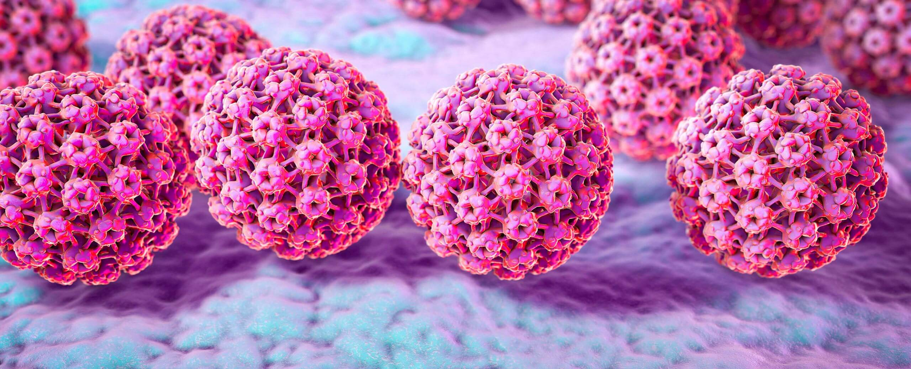

# Les infections à Papillomavirus humain

## **Qu’est-ce que l’infection à Papillomavirus humain (HPV) ?**

L’infection HPV est une infection courante, transmise dès les premières relations sexuelles et qui touche 80% de la population générale.

Les HPV sont des virus à ADN qui s’intègrent dans la cellule infectée et vont y persister.

Il existe 40 types d’HPV (chacun porte un numéro) que l’on trouve au niveau des muqueuses : bouche, anus, muqueuses génitales.

La gravité de l’infection est liée à la capacité de certains HPV d’induire des cancers :

* les **HPV à haut risque** (HPV **16, 18**, 31, 33, 35, 39, 45, 51, 52, 56, 58, 59, 68) vont être responsables de cancers situés là où a eu lieu l’infection ;
* les autres génotypes dits à bas risque (HPV 6 et 11) sont responsables de condylomes et de verrues.

La plupart des infections par HPV sont transitoires, éliminées par les défenses immunitaires et n’occasionnent aucun symptôme.

Par contre, les infections par HPV à haut risque persistant plus de 12-18 mois peuvent conduire à l’apparition de lésions, d’abord précancéreuses (on parle de dysplasies), puis peuvent évoluer vers des lésions cancéreuses au niveau du col de l’utérus, du vagin, de la vulve, du pénis, de l’anus et de l’oropharynx (en particulier des amygdales et de la langue).


**Comment se prémunir contre les HPV à haut risque ?**

La vaccination est un moyen très efficace pour prévenir la survenue de cancers et celle des lésions bénignes. Le vaccin contre HPV est, avec le vaccin anti-hépatite B, le seul vaccin anticancer dont nous disposons !


<figure><figcaption>
Source : Ensemble contre le Papillomavirus
</figcaption></figure>

## **Les cancers liés à HPV**&#x20;

L’infection HPV est habituellement contractée au cours des deux premières décennies de vie. L’infection persistante et les lésions précancéreuses qui en découlent touchent les femmes à partir de 25 ans et, si elles ne sont pas dépistées et traitées, le cancer apparait entre 35 et 45 ans, causant une morbidité et une mortalité inacceptables.

### **Cancer du col utérin**

Le cancer du col utérin est le cancer induit par HPV le plus fréquent dans le monde, avec 570 000 femmes atteintes en 2018 dont 51% habitent dans les pays à ressources limitées, les pays de l’Afrique de l’Ouest et Afrique australe étant les plus touchés. En Afrique subsaharienne, le cancer du col est responsable de 33,2% de la morbidité et la mortalité liées au cancer chez les femmes.

Le nombre de décès annuel de 311 000 dans le monde est le fait le plus souvent de diagnostic à un stade tardif.

L’OMS (Organisation mondiale de la santé) a donc lancé un appel à l’action mondiale en 2018, relayé par ONUSIDA, afin d’éliminer le cancer du col via la mise en place de 4 pôles d’action : l’éducation à la santé sexuelle, la vaccination contre HPV, le dépistage du cancer du col et l’accès aux soins curatifs et palliatifs en cas de nécessité.

Depuis ce premier appel, une journée mondiale de sensibilisation au Papillomavirus (« _International HPV awareness day_ ») est organisée chaque 4 mars.

<figure><figcaption>
Source : International Papillomavirus Society - Journée mondiale de sensibilisation au Papillomavirus le 4 mars
</figcaption></figure>

### **Les autres cancers liés à HPV**&#x20;

Ce sont principalement des cancers de l’anus et des cancers de la sphère ORL (bouche et pharynx). On estime que 4,5% de tous les cancers sont dus à HPV. Cette proportion monte à 15% chez les personnes vivant avec le VIH en raison de l’immunodépression qui va favoriser la persistance de lésions précancéreuses.

Ces cancers touchent bien sûr aussi les hommes : dans le monde, 30% des cancers dus à l’HPV concernent des hommes. Ce sont principalement les cancers de la sphère ORL (bouche et gorge) et le cancer de l’anus, qui atteint surtout les hommes ayant des rapports avec d’autres hommes (HSH) avec une fréquence beaucoup plus élevée que dans la population générale et une sévérité plus importante, ou encore les femmes ayant eu des lésions (pré)cancéreuses du col.

Les facteurs de risque associés à l’apparition de cancers HPV-induits sont :

* le tabagisme,
* l’immunodépression cellulaire en lymphocytes CD4, ce qui rend aussi les patients porteurs de greffe d’organe à plus haut risque de cancer induit par HPV.

A l’inverse, le fait d’être traité efficacement contre le VIH réduit le risque d’infection par HPV et d’apparition de lésions associées chez les personnes vivant avec le VIH.

## **Les lésions dites bénignes à HPV**

**Les HPV à bas risque** sont, quant à eux, responsables de condylomes (appelées verrues génitales, crêtes de coq …) qui sont des tumeurs bénignes le plus souvent de la sphère ano-génitale. Ces condylomes peuvent être traités par résection simple ou par application d’un traitement local comme l’imiquimod, mais les récidives sont fréquentes et on observe souvent des répercussions psychologiques chez les personnes qui les ont développés.

## **Comment dépister les lésions précancéreuses et les traiter ?**

### **Le dépistage**

L’une des opportunités qui existe en matière d’infection HPV est de pouvoir dépister la persistance des virus à haut risque (par PCR) puis de dépister des lésions dysplasiques (précancéreuses) et donc de les traiter avant le stade de cancer.

<figure><figcaption>
Source : e-cancer.fr (République française en partenariat avec l'INCa)
</figcaption></figure>

Les lésions précancéreuses peuvent être dépistées et traitées :

* facilement en ce qui concerne le col de l’utérus,
* avec plus de difficultés pour l’anus et à l’heure actuelle pas du tout pour les néoplasies oro-pharyngées.

L’instauration de programmes de dépistage des lésions précancéreuses du col a prouvé depuis plusieurs décennies son efficacité à réduire l’incidence et la mortalité de ce cancer dans de nombreux pays.

**Pour les pays à ressources limitées** le défi majeur est la mise en place de tels programmes dans des contextes de ressources limitées (humaines et financières).

* La première étape est de **dépister les HPV persistants**_,_ c’est-à-dire ceux qui vont induire des lésions précancéreuses puis potentiellement un cancer.
* La détection des HPV à haut risque (HR) par PCR sur un frottis, suivie d’une l’inspection visuelle, est la méthode de dépistage et de traitement la plus efficace, supérieure aux classiques tests cytologiques (frottis du col avec recherche de cellules anormales) et visuels.
* Cette détection de l’HPV, pour être la plus efficace, doit être réalisée chez les femmes à partir de 30 ans car elle détecte les infections persistantes alors qu’avant cet âge, les infections par HPV HR sont fréquentes mais transitoires.
* Cette approche permet d’avoir un diagnostic dans les 2 heures après l’examen de la patiente et de la traiter le jour même par un traitement local (cryothérapie par exemple).

Depuis 2016, l’OMS recommande ces stratégies dites « _Screen-and-treat_ » (« Dépister-et-traiter ») qui offrent un diagnostic plus rapide et plus précis, associé à un traitement dans le même temps conduisant à une plus grande efficacité et à une diminution des pertes de suivi.

**Dans les pays à revenus élevés**, après 30 ans le dépistage du cancer du col par la détection directes du virus d’HPV à HR (suivie d’un triage par cytologie ou colposcopie en deuxième intention) chez les femmes à partir de 30 ans est le mode de dépistage actuellement recommandé, notamment en Europe.

Avant 30 ans, compte tenu e dépistage doit être réalisé par cytologie associée à la colposcopie en cas de cytologie anormale. La colposcopie, examen indolore, consiste en l’observation du col de l’utérus avec une loupe grossissante après application de différents colorants qui rehaussent les zones précancéreuses, ce qui permet de repérer les zones suspectes à biopsier.

L’intervalle recommandé entre les dépistages par cytologie varie de tous les 3 ans dans la population générale ou chez les femmes vivant avec le VIH ayant eu une première cytologie normale associée à l’absence d’HPV HR et un taux >500 lymphocytes CD4/µl sous traitement anti-VIH, à tous les 6-12 mois dans les autres cas.

Avec les nouvelles techniques de dépistage par recherche d’HPV HR, le dépistage minimal consisterait en un dépistage à 30 ans puis tous les 10 ans.

### **Traitement des lésions HPV du col utérin**

Il est important de traiter les lésions précancéreuses compte tenu de leur potentiel évolutif important. En effet, le potentiel d’évolution de lésions précancéreuses de haut grade du col vers le cancer invasif est estimé à 1/80.

Dans la plupart des cas, il est possible de traiter les lésions précancéreuses de haut grade (CIN II et III) en ambulatoire, à l’aide de techniques non invasives, comme _la cryothérapie_ en cas de lésions de petite taille ou _la résection à l’anse diathermique_ qui permet d’éliminer avec succès les lésions précancéreuses dans plus de 90% des cas.

Pour les lésions qui ne peuvent pas être traitées de cette façon, on peut avoir recours à la conisation à froid. Bien que très efficace, celle-ci peut causer des cicatrices du col, qui pourrait alors devenir moins fermé au cours des grossesses ultérieures et entrainer un risque d’accouchement prématuré.

Dans tous les cas, un suivi rapproché après traitement est recommandé.

### **Traitement des lésions anales**

A la différence des lésions HPV du col utérin, le potentiel d’évolution vers le cancer invasif des lésions précancéreuses de haut grade anales est moindre, estimé à 1/4 000 dans la population générale mais plus fréquent en cas de co-infection par VIH (1/600).

Le dépistage et le traitement des lésions précancéreuses anales a pu prouver son efficacité à diminuer l’incidence du cancer anal, comme c’est le cas pour le cancer du col.


Une large étude clinique chez 4 000 personnes vivant avec le VIH (80% d’hommes et 20% de femmes) a montré le bénéfice du traitement des lésions anales précancéreuses de haut grade, avec une réduction de la survenue du cancer invasif de 402 à 173 cas de cancer/100 000 personnes-années. Dans cette étude, il fallait traiter 167 personnes avec dysplasie de haut grade pour éviter un cancer.


Chez les personnes vivant avec le VIH à haut risque de cancers, un dépistage des lésions précancéreuses anales devrait être proposé à tout homme HSH à partir de 35 ans, et à toute femme présentant d’autres lésions associées à HPV. Cependant, même dans les pays sans limitations économiques majeures, des difficultés techniques et organisationnelles viennent s’ajouter aux questions scientifiques et sont un frein à la mise en place de ce dépistage.

Les dysplasies anales sont souvent asymptomatiques mais elles peuvent donner prurit, irritation, gêne, ou saignement. Un toucher du canal anal peut détecter des cancers de petites tailles donc curables. La cytologie sur frottis est un outil facile d’utilisation à grande échelle mais peut rater jusqu’à 15-25% des lésions de haut grade et est non spécifique ; elle offre pourtant l’avantage d’être indolore, rapide, peu coûteuse et elle peut être réalisée par le patient lui-même, raison pour laquelle elle est utilisée en dépistage primaire. Une examen anuscopique dit de haute résolution est la technique de référence, mais requiert un matériel très spécifique, une formation spécialisée du médecin et une solide expérience pratique. En bref, peu de centres en disposent.

Le traitement des lésions dysplasiques anales de haut grade comporte

* soit une application locale d’imiquimod ou de fluorouracile pour des lésions assez larges (lésions externes ou lésions internes multifocales ou touchant plus de 50% de la circonférence du canal anal)
* soit par des techniques ablatives si les lésions sont inférieures à 50% de la circonférence (photocoagulation au laser, acide trichloroacétique, radiofréquence, etc.)

Il a également été démontré qu’en cas de lésions précancéreuses dues à l’HPV, promouvoir l’arrêt du tabac et, en cas d’infection par le VIH, assurer un contrôle optimal de l’infection par le traitement VIH sont des actions qui diminuent également le risque de dégénérescence vers le cancer invasif.

## **Prévention et vaccination**

Au-delà de la circoncision et de l’usage du préservatif, qui permettent de diminuer les risques de transmission de l’HPV aux partenaires ou son acquisition au niveau pénien, les cancers liés au HPV sont **des maladies hautement évitables grâce à la vaccination.**

### **De quels vaccins dispose-t-on ?**&#x20;

<figure><figcaption>
Exemple du vaccin quadrivalent Gardasil®
</figcaption></figure>

Depuis 2006, plusieurs vaccins prophylactiques ont été développés. Ces vaccins sont à base de pseudovirions (ou _virus like particle)_ synthétiques, qui sont des copies d’enveloppe du virus vide. Ils sont différents pour chaque génotype d’HPV et ne contiennent pas de matériel génétique ; ils sont donc non infectieux.

Trois vaccins ont été commercialisés :

* un vaccin bivalent (Cervarix®, GlaxoSmithKline) protégeant contre les HPV 16 et 18, responsables de 70% des cancers du col dans la population générale ;
* un vaccin quadrivalent (Gardasil®, Merck and Co) protégeant contre les types 6, 11 responsables des condylomes, et contre HPV16/18 ; ce vaccin quadrivalent n’est actuellement plus fabriqué ;
* un vaccin 9-valent (Gardasil9®, Merck and Co), contre les HPV 6/11 et 16/18/31/33/45/52/58, responsables de 90% des cancers du col dans la population générale.

Dans des études qui ont inclus près de 80 000 personnes âgées de 15 à 26 ans (75 000 femmes et plus de 4 000 hommes dont plus de 1 000 HSH), les trois vaccins ont montré leur très haute efficacité (> 80-95%) pour :

* prévenir l’infection par les génotypes d’HPV contenus dans les vaccins,
* prévenir l’apparition de condylomes,
* prévenir les lésions précancéreuses de haut grade induites par les HPV contenus dans les vaccins respectifs, principalement au niveau du col et au niveau anal.

Cependant, ces vaccins ne permettent pas d’empêcher une infection déjà présente, d’où l’importance de vacciner au plus tôt, avant ou au tout début de la vie sexuelle.

### **Qui peut se faire vacciner ?**

Ces vaccins d’abord prescrits chez les filles uniquement dès 9 ans sont aujourd’hui également **recommandés chez les garçons** avec 2 objectifs :

* protéger les futurs hommes qui représentent 30% des personnes qui souffriront un jour d’un cancer HPV-induit
* accroître la couverture vaccinale et diminuer la circulation de l’HPV entre hommes et femmes ; à cet âge le taux de réponse est le meilleur

Les résultats de cette vaccination sont spectaculaires dans des pays tels que l’Australie, la Grande-Bretagne et la Suède, qui ont vacciné près de 80% de leur enfants :

* une diminution voire une disparition des lésions telles que les condylomes chez les jeunes de moins de 22 ans,
* une diminution importante des lésions précancéreuses
* une diminution du cancer du col chez les personnes vaccinées.

La tolérance et le profil de sécurité de ces vaccins sont excellents. Certains pays comme la France, où différentes campagnes de propagande contre un vaccin qui doit être donné chez des enfants ou de jeunes adolescents pour une efficacité préventive maximale, un manque d’implication des professionnels de santé ont un retard à rattraper.

### **Une stratégie mondiale pour accélérer l’élimination du cancer du col de l’utérus**

Les résultats spectaculaires de la vaccination ont conduit à l’élaboration d’une stratégie mondiale pour accélérer l’élimination du cancer du col de l’utérus (objectif d’incidence < 4/100 000 femmes-année), approuvée par l’OMS.


**Objectifs OMS pour 2030**&#x20;

* Une couverture vaccinale anti-HPV de 90% des jeunes filles de moins de 16 ans
* 70% des femmes dépistées par recherche directe d’HPV à haut risque à 35 ans et 45 ans
* 90% des femmes avec des lésions du col identifiées et traitées et suivies


<figure><figcaption>
Source : Organisation Mondiale de la Santé
</figcaption></figure>

### **Vaccination HPV chez les personnes vivant avec le VIH (PvVIH)**

De nombreuses études ont démontré l’excellente a bonne immunogénicité c’est apacité à produire des anticorps neutralisants après vaccination) des vaccins principalement quadrivalent et bivalent lorsque l’infection VIH est contrôlée sur le plan viral. La tolérance et la sécurité de ces vaccins sont excellentes chez les PvVIH.

L’OMS recommande, depuis décembre 2022, de vacciner enfants et les personnes jusqu’à 20 ans avec une seule dose de vaccin au lieu des 2 ou 3 doses recommandées auparavant.

Chez les PvVIH, les recommandations sont maintenues en 3 doses quel que soit l’âge et jusqu’à 26 à 45 ans compris..

Il est important que le coût du vaccin puisse être largement subventionné ou qu’il soit fourni gratuitement.

**Outre la vaccination**, rappelons que la prévention doit associer :

* le conseil et l’éducation à la santé sexuelle,
* la promotion de l’arrêt du tabac,
* la distribution de préservatifs aux adolescents sexuellement actifs (filles et garçons).

_**En conclusion**_

L’infection à HPV et les lésions cancéreuses associées causent une lourde morbi-mortalité.

La prévention de ces affections hautement évitables passe par la vaccination dès la préadolescence jusqu’à l’âge adulte inclus et par le dépistage actif des cancers du col de l’utérus et de l’anus.

Ces interventions représentent une excellente occasion de sensibiliser les patients et les prestataires de soins de santé au risque des cancers liés au HPV. La vaccination contre le HPV devrait être aussi l'occasion de renforcer les services de santé destinés aux pré-adolescents et aux adolescents, notamment par le biais d'interventions plus nombreuses en milieu scolaire.

_**Pour en savoir plus**_



**Rapport de l'Organisation mondiale de la Santé** : Stratégie mondiale en vue d'accélérer l'élimination du cancer du col de l'utérus en tant que problème de santé publique [https://www.who.int/fr/publications-detail/9789240014107](https://www.who.int/fr/publications-detail/9789240014107)
