# Les Infections Sexuellement transmissibles (IST)

Les infections sexuellement transmissibles (IST) ont été identifiées depuis des siècles.

Certaines ont longtemps été graves, comme la syphilis pouvant aller jusqu’à mettre en jeu le pronostic vital. Elles ont de tous temps et dans toutes les sociétés été vécues comme « honteuses », mal diagnostiquées et mal traitées.

Les IST sont liées à des agents infectieux de différentes natures. Il peut s’agir de bactéries, de virus ou de parasites. &#x20;

[Accéder au tableau des IST en grand format.](https://cemagcare.com/wp-content/uploads/2022/09/CEMAG\_IST\_pdf.pdf)

<figure><figcaption></figcaption></figure>

\
\
Mais avec les progrès médicaux et de la recherche, des traitements sont aujourd’hui disponibles pour chaque IST.

Très souvent, ces infections sont silencieuses, asymptomatiques, d’où l’importance de faire des dépistages réguliers pour le VIH et les IST.&#x20;

Être infecté et ne pas le savoir vous fait prendre le risque de transmettre ces infections et d’entretenir la dynamique des épidémies d’IST. Gérer sa sexualité c’est aussi gérer les conséquences potentielles de partenaires occasionnels, multiples…

Comme dans tout phénomène de transmission, il est important d’interrompre les chaines de ces transmissions d’infections souvent silencieuses et « tabous» car sexuelles. D’où l’importance de la notification aux partenaires sexuels, afin qu’eux aussi se fassent dépister et soient traités s’ils en ont besoin. Des applications numériques ont été développées pour aider à la notification aux partenaires.&#x20;

L’IST peut être symptomatique mais attention, certains symptômes peuvent parfois être trompeurs et une IST peut ainsi être confondue avec une autre maladie ou une banale allergie et ne pas être traitée correctement si un dépistage n’est pas fait.&#x20;

La gravité des IST non traitées, c’est leur évolution à bas bruit, avec de l’inflammation des organes génitaux par exemple et des conséquences en particulier chez les femmes sur la fécondité.

## Le parcours de soin

### **Le dépistage régulier**

Dès lors qu’une personne a une vie sexuelle active et plusieurs partenaires (dans l’année), il est nécessaire de faire des dépistages du VIH et des IST (avec prise de sang, prélèvements dans la gorge et dans l’anus, analyse d’urine) régulièrement.

<figure>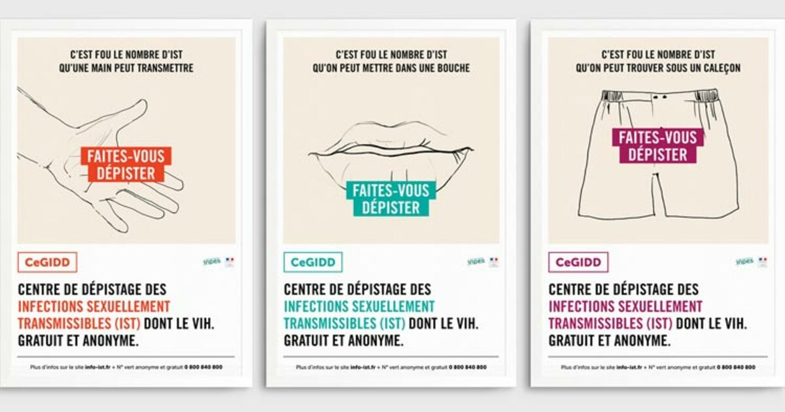<figcaption></figcaption></figure>

Le rythme varie selon les recommandations nationales et/ou les moyens disponibles localement. Il s’agit de réaliser une prise de sang pour dépister la syphilis et une éventuelle infection par le virus de l’hépatite C, et des prélèvements au niveau de la gorge, de l’anus pour les HSH et du vagin pour les femmes, à l’aide d’un écouvillon, et un prélèvement d’urines de 1er jet pour les hommes.&#x20;

« Urines de 1er jet » ne signifie pas forcément les premières urines émises le matin au réveil, il faut un minimum de deux heures sans avoir uriné pour qu’on puisse considérer qui ces urines sont de « 1er jet ». En fait, comme la bactérie se multiplie dans l’urètre, les urines, en passant dans l’urètre, vont chasser les bactéries présentes. Il faut donc laisser un minimum de temps (2 heures) pour pouvoir retrouver des bactéries en quantité suffisante pour être détectées par une technique d’amplification des acides nucléiques (TAAN, ou PCR).

Ces dépistages peuvent être faits dans un laboratoire de ville (avec une ordonnance de votre médecin traitant, et bientôt, en France, sans ordonnance) ou à l’hôpital pour les personnes suivies dans un centre de santé sexuelle (pour la PrEP par exemple), ou en CeGIDD (centre gratuit d’information, de dépistage et de diagnostic du VIH et des IST).

En CeGIDD, les analyses (et le traitement au cas où il y aurait une infection) ne seront pas facturées.

Il faut inciter les partenaires à suivre cette même routine de dépistage : plus il y aura d’IST dépistées et traitées rapidement et moins elles se transmettent. Le dépistage régulier est le meilleur moyen de lutter contre ces épidémies.

### **Les dépistages exceptionnels**

En dehors des dépistages réguliers, en cas de symptômes évocateurs d’IST ou en cas de notification par un partenaire d’une éventuelle exposition à une IST, il faut rapidement consulter un médecin (médecin traitant, médecin en CeGIDD ou aux urgences hospitalières). Il est important pour les médecins de bien questionner l’individu afin de préciser s’il s’agit d’un homme ayant des relations sexuelles avec d’autres hommes pour étendre le dépistage à la gorge et à l’anus.

### **Après une infection**

Si une IST bactérienne est diagnostiquée, un traitement sera prescrit. Environ trois semaines à un mois après ce traitement, il faudra refaire un dépistage de contrôle pour s’assurer que l’IST est bien guérie. Pour la syphilis, le contrôle du test – qui ici mesure des anticorps et non pas l’agent pathogène directement - se fait 6 mois après le traitement.

<figure><figcaption>
Les modes de transmission des IST - source : corevih-sud.org
</figcaption></figure>

## Les IST bactériennes

Les IST bactériennes sont très contagieuses, ce qui explique qu’elles soient très répandues. Leur traitement repose sur des antibiotiques.

Par contre il n’est pas possible actuellement de se protéger contre ces IST bactériennes ni par un traitement préventif ni un vaccin. Mais la recherche est en cours pour en prévenir certaines.

L’usage du préservatif peut limiter le risque de transmission de la majorité de ces IST. Mais le préservatif n’étant en général pas utilisé pour la sexualité oro-génitale, il ne prévient pas de la transmission par cette voie-là.


Un traitement antibiotique contre une IST bactériennes n’est pas un vaccin : une fois l’IST guérie, il est tout à fait possible **de la contracter à nouveau**.

Certaines IST (par exemple le gonocoque et _Mycoplasma genitalium_) peuvent développer des résistances à certains antibiotiques.&#x20;

Prendre des traitements antibiotiques répétés risque de rendre les bactéries résistantes et donc plus difficiles à soigner.&#x20;


### **Le gonocoque**

<figure>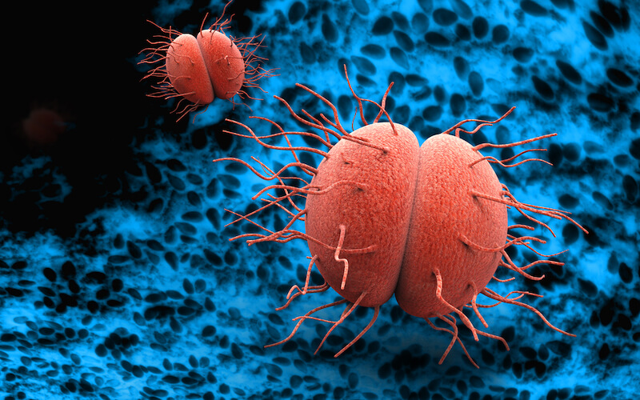<figcaption>
Source : sexoblogue
</figcaption></figure>

#### **Le calendrier**

Période d’incubation entre la contamination et l’apparition des symptomes : courte, 48-72 heures

Moment de la guérison : 7 jours après le traitement

Période contagieuse : entre la fin de l’incubation et la guérison

La période d’incubation d’une infection par un gonocoque est courte, et, pendant celle -ci, il n’est pas possible de dépister l’infection.&#x20;

La période de contagioisité commence dès l’apparition des symptômes – s’ils apparaissent.  En effet, après cette période d’incubation (délais entre l’infection et l’apparition des premiers symptômes), l’apparition de symptômes n’est pas systématique, d’autant si l’infection est localisée au niveau de la gorge par exemple.

#### **Les symptômes**

* Au niveau génital (dans la verge), le gonocoque entraîne une urétrite avec des brûlures urinaires très douloureuses, d’où l’appellation « chaude-pisse ». Habituellement, un écoulement purulent épais (de couleur blanche, jaune ou verte) est retrouvé. C'est d'ailleurs le motif de consultation.
* Au niveau anal, le gonocoque peut provoquer des douleurs et des glaires purulentes dans les selles, mais est souvent asymptomatique.
* Quand il est dans la gorge, le gonocoque est généralement asymptomatique.

#### **Les complications**

Le gonocoque, lorsqu’il n’est pas dépisté, et donc pas traité, peut circuler par voie sanguine et infecter les articulations en provoquant des arthrites à gonocoque. Il peut également provoquer une épididymite. De plus, l’individu continue de le transmettre à ses partenaires sexuels.

#### **Le traitement**

Lorsqu’une infection à gonocoque est diagnostiquée, qu’elle soit symptomatique ou pas, un traitement antibiotique par une injection unique de ceftriaxone (céphalosprorine de 3ème génération, injectable par voie intra-musculaire) est recommandé, sauf en cas d’allergie à cet antibiotique, auquel cas les autres possibilités sont une forte dose d’azythromycine par voie orale (2 grammes en une prise unique) ou une injection intra-musculaire unique d’un antibiotique de la famille des aminosides.&#x20;

Il ne faut plus utiliser les fluoroquinolones (ciprofloxacine) pour le traitement du gonocoque en raison de la forte résistance à cette famille d’antibiotique. Les céphalosporines de 3ème génération par voie orale (cefixime) pénètrent mal notamment le pharynx, et ne doivent donc pas être utilisées. &#x20;

La guérison est obtenue 7 jours après le traitement, il faudra bien demander aux individus de ne pas avoir de rapports sexuels sans préservatif dans les 7 jours suivant le traitement.&#x20;

### **La chlamydia**

<figure><figcaption>
Source : Wikipedia
</figcaption></figure>

#### **Le calendrier**

Période d’incubation : 2 à 3 semaines

Période de guérison : 7 jours ou 3 semaines (LGV) après le traitement

Période contagieuse : entre la fin de l’incubation et la guérison

Après la période d’incubation, l’apparition de symptômes n’est pas systématique.

Lorsque la chlamydia au niveau anal est provoquée un sérovar du groupe L, la maladie est alors appelée LGV (lymphogranulomatose vénérienne). La symptomatologie peut être très bruyante, avec d’importantes douleurs anales, des spasmes.&#x20;

<figure>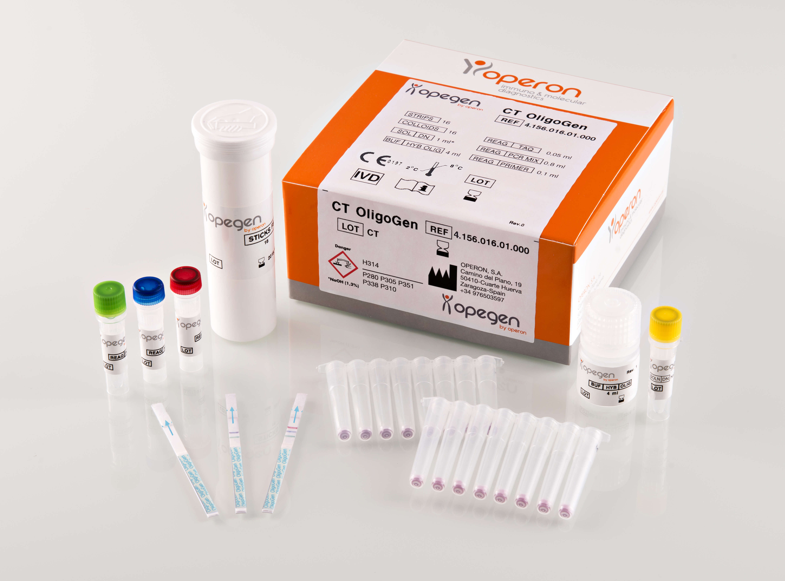<figcaption></figcaption></figure>

#### **Les symptômes**

Au niveau génital, l’infection à chlamydia peut provoquer une gêne ou des brûlures urinaires modérées. Il peut également y avoir un écoulement clair/transparent.

Au niveau anal, la chlamydia sérovar L peut provoquer une LGV, avec parfois des formes pseudo-tumorales au niveau de l’anus. Le sujet se plaint de ténesmes, de fausses envies, de douleurs lors des selles, de glaires dans les selles et de diarrhées.

Quand elle est dans la gorge, la chlamydia est généralement asymptomatique.

<figure><figcaption></figcaption></figure>

 

<figure><figcaption></figcaption></figure>

#### **Les complications**

Outre les douleurs, une chlamydia non traitée peut provoquer des fistules anales.

De plus, tant qu’elle n’est pas traitée, il existe toujours un risque de transmission aux partenaires sexuels.

<figure>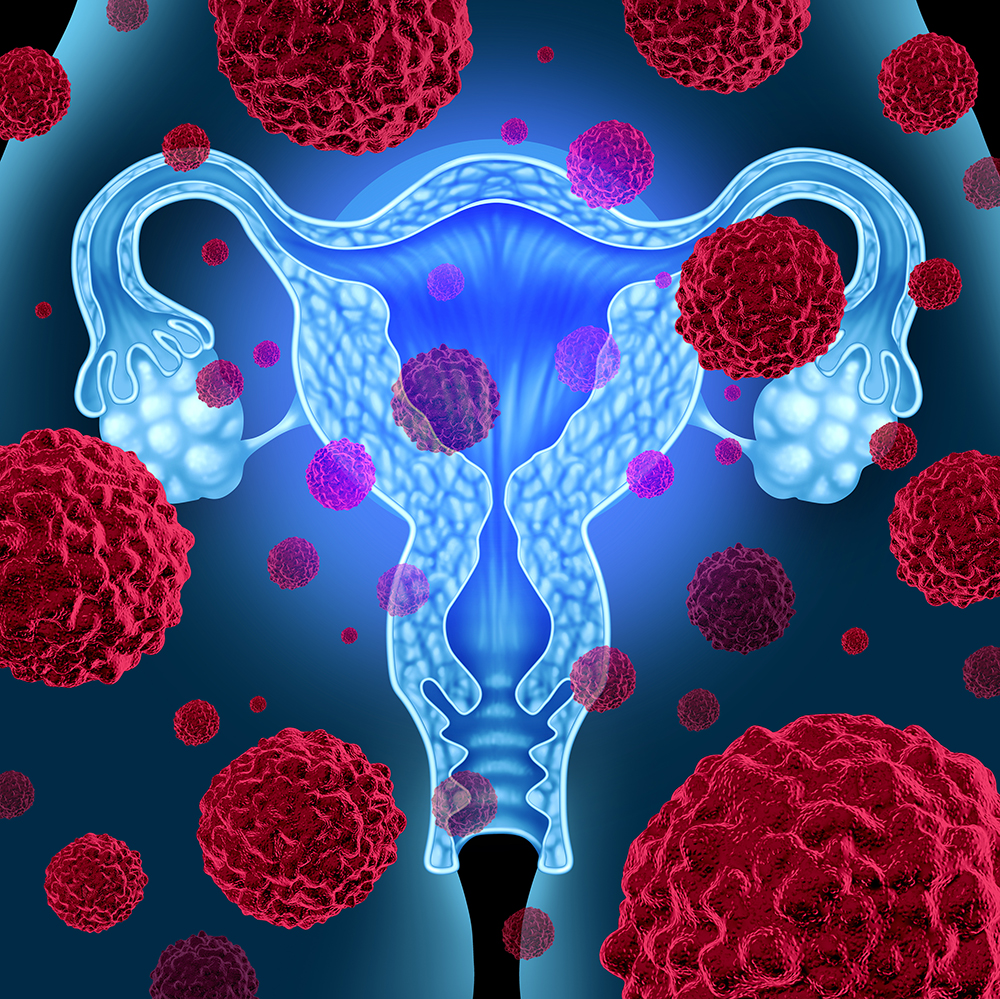<figcaption></figcaption></figure>

 

<figure>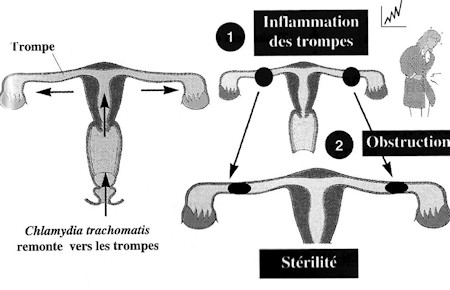<figcaption></figcaption></figure>

#### **Le traitement**

Lorsqu’une infection à chlamydia est diagnostiquée, un traitement antibiotique est recommandé, et on considère que l’individu est guéri 7 jours après la fin du traitement antibiotique. Longtemps, l’infection à chlamydia a été traitée par une dose unique d’azithromycine. L’avantage est la prise unique.

L’inconvénient de cette prescription est la pression de sélection exercée par les antibiotiques de la famille des macrolides sur _Mycoplasma genitalium_, avec une augmentation très importante de la résistance de _M. genitalium_aux macrolides. C’est la raison pour laquelle, aujourd’hui, il est préférable d’utiliser la doxycycline pour le traitement de chlamydia, mais l’inconvénient est que le traitement doit être poursuivi pendant 7 jours, ce qui peut compromettre l’observance.  En cas de LGV, le traitement doit être de 3 semaines.

### **Le mycoplasme**

C’est une bactérie particulière. Il y a quatre type de mycoplames pouvant atteindre l’homme : _Mycoplasma pneumoniae_ qui est responsable de pneumopathies atypiques, et trois autres : _Mycoplasma genitalium_, _Mycoplasma hominis_ et _Ureaplasma urealyticum_.  _Mycoplasma genitalium_ est celui qui est responsable d’IST.&#x20;

<figure><figcaption>
Mycoplasma genitalium - Source : sexoblogue.fr
</figcaption></figure>

#### **Le calendrier**

Période d’incubation : 2 à 3 semaines

Période de guérison : 7 jours après le traitement

Période contagieuse : entre la fin de l’incubation et la guérison

L’infection à _M. genitalium_ est souvent asymptomatique. En raison des difficultés à traiter cette infection du fait d’un haut niveau de résistance de M. genitalium à plusieurs familles d’antibiotiques, il n’est pas recommandé de rechercher cette bactérie, ni lors d’un dépistage systématique, ni lors d’un dépistage en cas de symptômes évocateurs d’IST. Dans ces deux derniers cas, on recherchera uniquement le gonocoque et chlamydia. En cas de découverte fortuite d’une infection à _M. genitalium_ chez un sujet asymptomatique, il ne faut pas traiter cette infection, et ce quel que soit le site prélevé. En cas d’urétrite ou de rectite symptomatique avec identification d’une infection à gonocoque et/ou à chlamydia, il faudra traiter l‘agent identifié de façon approprié selon les recommandations locales. En cas de persistance des symptômes après un traitement bien conduit, on est donc face à un échec de traitement, et dans ce cas-là, on pourra prescrire une recherche de _M. genitalium_. En cas d’une 1èreconsultation pour symptômes évocateurs d’IST mais avec des résultats de prélèvements négatifs pour gonocoque et chlamydia, on prescrira dans un 1er temps un traitement mixte qui couvrira et le gonocoque (une injection de ceftriaxone) et chlamydia (doxycycline par voie orale pendant 7 jours). En cas d’échec de ce double traitement probabiliste, on sera alors amené à prescrire une recherche de _M. genitalium_. Le traitement de _M. genitalium_ repose sur les macrolides, ou les fluoroquinolones, et requiert l’obtention d’un avis spécialisé. La guérison n’étant pas systématiquement obtenue avec un 1er traitement antibiotique, il est nécessaire de faire un test de contrôle un mois après le traitement pour vérifier que le traitement a bien été efficace.

#### **Les symptômes**

Le mycoplasme ne provoque généralement pas de symptôme lorsqu’il est présent dans la gorge ou dans l’anus.

S’il est présent au niveau génital, les symptômes peuvent ressemblent à ceux du gonocoque ou de la chlamydia.

#### **Les conséquences**

Le mycoplasme est l’IST bactérienne que l’on a découverte le plus récemment. Les connaissances à son sujet sont encore incomplètes.

### **La syphilis**

<figure><figcaption>
Syphilis - Albrecht Dürer
</figcaption></figure>

**Petite histoire de la syphilis**\
\
Appelée aussi vérole, la Syphilis serait originaire des Amériques et aurait contaminée l'Europe suite au retour des marins de Christophe Colomb. D'abord introduite en Italie (d'où son surnom de « mal de Naples »), elle gagne la France pendant les guerres d'Italie (1494-1559), puis tout le continent européen.\
\
**Histoire du traitement de la syphilis**

L’usage de la pénicilline, découverte par Flemming en 1928 et qui constitue le premier traitement réellement efficace (ainsi que dénué d’effets secondaires) de la maladie ne se généralise qu’à partir de 1943, soit plus de quatre cents ans après l’apparition des premiers cas de syphilis en Europe. Il est amusant, surtout si l’on tient compte des ravages exercés par la maladie dans le passé, de constater que, depuis les années 1940, le traitement de référence de la syphilis n’a jamais été modifié et qu’aucune résistance significative à la pénicilline n’a été rapportée.

Pour en savoir plus sur l'histoire de la syphilis : [Revue médicale de Liège - Histoire de la syphilis ](https://rmlg.uliege.be/download/3024/2329/H-Jedidi\_2018\_73\_7-8\_0.pdf)


Revue médicale de Liège


#### **Le calendrier**

Stade primaire&#x20;

3 semaines après l’infection : apparition d’un chancre (une ulcération) qui va cicatriser en 10 jours

Stade secondaire

2 à 3 mois après l’infection : roséole (boutons ou rougeurs sur le torse) pendant quelques jours

Puis éruptions sur les paumes des mains et les plantes des pieds et érosions sur la langue pendant quelques jours.

Période de guérison : 10 jours après le traitement

La syphilis est à la fois très contagieuse (elle se transmet par simple contact) et difficile à diagnostiquer parce que ses symptômes ne sont pas douloureux et ne durent pas longtemps.

Il est important de faire dépister la syphilis (par prise de sang) tous les 6 mois : si une infection par la syphilis a moins d’un an, le traitement consiste en une injection unique d’antibiotique de la famille de la pénicilline : la benzyl-benzathine pénicilline (en cas d’allergie à cet antibiotique il faudra prendre des comprimés de doxycycline pendant 15 jours).

Si l’infection par la syphilis a eu lieu il y a plus d’un an ou s’il est impossible de la dater (pas de précédent dépistage) il faudra faire 1 injection par semaine pendant 3 semaines. En cas d’allergie à cet antibiotique, seul un spécialiste pourra définir un traitement alternatif.

Seul l’usage du préservatif permet de limiter le risque de transmission de la syphilis.

#### **Les symptômes**

Suite à une infection par la syphilis, un chancre unique, à fond propre, non douloureux, va apparaître au bout de 3 semaines sur le sexe ou dans l’anus ou dans la gorge. Ce chancre peut transmettre la syphilis par simple contact. Il va cicatriser en 10 jours. Comme il n’est pas douloureux, s’il est dans la gorge ou au fond de l’anus, il passera totalement inaperçu.

Quelques mois après l’infection, si elle n’a pas été traitée initialement, une roséole syphilitique va apparaître pendant quelques jours. Il s’agit de rougeurs légères ou de boutons sur le torse, c’est donc une éruption maculo-papuleuse (lésions légèrement en relief) qui a comme caractéristique de ne pas être prurigineuse. Cette roséole n’est pas douloureuse et ne démange pas. Elle n’est pas contagieuse et peut passer inaperçue. Un médecin peut facilement la confondre avec une allergie ou une irritation.

Après la roséole, des éruptions, les « syphilides », vont apparaître sur les paumes des mains et les plantes des pieds. Ces syphilides sont très caractéristiques de la syphilis à son stade secondaire. La langue peut également se parsemer d’érosions. Ces éruptions et crevasses sont contaminantes par simple contact et vont disparaître en quelques jours.

<figure>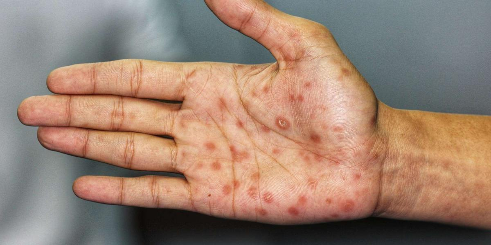<figcaption></figcaption></figure>

#### **Les complications**

Les symptômes de la syphilis sont discrets et peuvent être confondus avec une allergie. En l’absence de dépistage, et donc en l’absence de traitement, la maladie peut évoluer pendant plusieurs années en passant inaperçue. Elle peut atteindre le système nerveux central, les yeux (uvéite). Elle peut provoquer des dégâts parfois irréparables.

## Les IST virales

Outre le VIH (qui ne sera pas abordé ici) les IST virales sont les différentes hépatites, l’herpès et les papillomavirus (HPV).

Contrairement aux IST bactériennes, il existe des vaccins pour prévenir la plupart des IST virales, sauf pour l’hépatite C, qu’il est impossible de prévenir par une vaccination, mais qui est la seule IST virale pour laquelle on dispose actuellement d’un traitement curatif efficace permettant d’en guérir.

Après guérison d’une hépatite A ou B, il n’est plus possible de l’attraper à nouveau.


[hepatites-virales](../hepatites-virales/)


### L’hépatite A

<figure>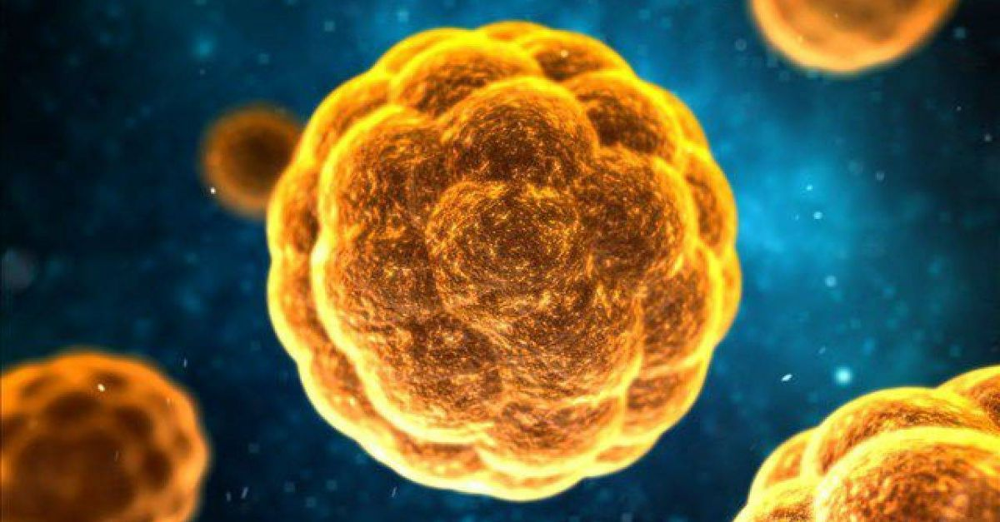<figcaption>
Hépatite A
</figcaption></figure>

#### Les modes de transmission

L’hépatite A (VHA) n’est pas vraiment une IST, mais elle peut se transmettre suite à un contact oro-anal ou digito-anal. La contamination passe forcément par la bouche. Le virus est résistant à l’air et peut survivre sur les doigts le temps qu’on les porte à la bouche. Il peut également passer par de l’eau contaminée, par l’alimentation, le partage de couverts, etc.

Elle est très contagieuse.

#### Le calendrier

Période d’incubation : 15 jours

Période de contamination : avant l’apparition des symptômes et 3 semaines après leur disparition

La plupart du temps, l’hépatite A guérit seule.

#### Les symptômes

Les symptômes sont les mêmes pour toutes les hépatites : urines foncées, selles décolorées, teint de peau jaune, blanc des yeux jaune, grosse fatigue et possibilité de fièvre.

#### Les conséquences

L’hépatite A est généralement bénigne et guérit toute seule. Dans certains cas, elle peut prendre une forme sévère entrainant une fatigue importante nécessitant un arrêt de travail. Et dans des cas extrêmement rares, elle peut être « fulminante », c’est-à-dire que l’infection et la réaction de l’hôte contre l’infection conduisent à la destruction du foie, il faut alors procéder à une greffe en urgence. Dans tous les cas, en cas de diagnostic d’hépatite virale aigue, il faut éviter tout médicament ou aliment hépatotoxiques, comme le paracétamol par exemple, ou la consommation d’alcool.

#### Le vaccin

De véritables épidémie d’hépatite A ont été rapportées chez les HSH, notamment à Montréal dans la fin des années 1990. Ces épidémies ont été contrôlées grâce à la mise en place de campagnes de vaccination massives. Si vous n’avez pas déjà été infecté par l’hépatite A, et que vous n’êtes pas immunisé, il est recommandé de vous faire vacciner. La vaccination comprend deux doses, une 1ère puis une 2éme six mois plus tard.

### L’hépatite B

<figure>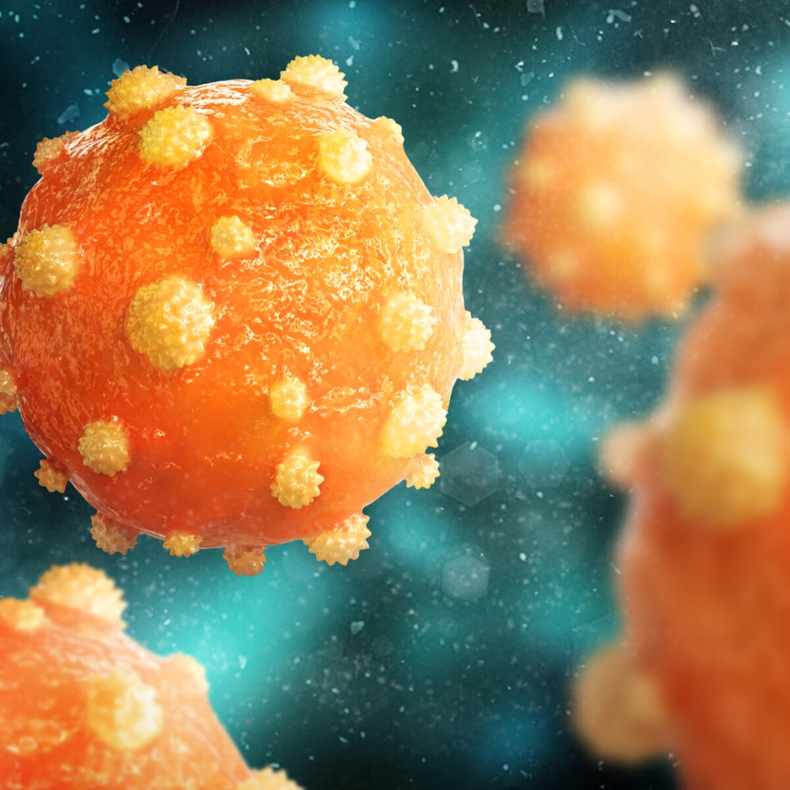<figcaption>
Hépatite B
</figcaption></figure>

#### Les modes de transmission

L’hépatite B (VHB) est très contagieuse et se transmet par voie sexuelle, par la salive, par une eau contaminée, par le partage de couverts, etc.

Il est possible de guérir tout seul d’une hépatite B, vous êtes alors immunisé contre ce virus. La guérison est plus fréquente lorsqu’on est infecté dans l’enfance (80% de chance de guérir) par rapport à une infection attrapée à l’âge adulte (25% de chance de guérir).

Si l’hépatite B ne guérit pas, elle devient chronique. Malheureusement, les traitements actuellement disponibles ne permettent pas de se débarrasser du virus une fois que l’infection chronique est installée. Il faut donc prendre un traitement à vie pour contrôler la maladie, et l’avantage du traitement est (i) d’empêcher l’ évolution de la maladie vers la cirrhose et éventuellement vers le carcinome hépato-cellulaire et (ii) d’empêcher la transmission car lorsqu’elle est traitée, l’hépatite B n’est plus contagieuse.

#### Les symptômes

Les symptômes sont les mêmes pour toutes les hépatites, mais ils sont plus rares pour l’hépatite B : urines foncées, selles décolorées, teint de peau jaune, blanc des yeux jaune, grosse fatigue et possibilité de fièvre. Dans tous les cas, en cas de diagnostic d’hépatite virale aigue, il faut éviter tout médicament ou aliment hépatotoxiques, comme le paracétamol par exemple, ou la consommation d’alcool.

#### Les conséquences

Une hépatite B, lorsqu’elle est devenue chronique, ne peut pas guérir. Elle peut alors provoquer une insuffisance du foie, une cirrhose du foie, voire un cancer du foie si on laisse la maladie évoluer plusieurs années sans traitement. Le traitement stoppe la progression de l’infection et son évolution vers le cancer. Le traitement empêche également la transmission du virus.

#### Le vaccin

Si vous n’êtes pas immunisé contre le virus de l’hépatite B et que vous n’êtes pas infecté, il est recommandé de vous faire vacciner. Le vaccin nécessite 3 injections et vous êtes protégé 10 jours après la seconde injection. Lorsqu’une personne est porteuse du virus de l’hépatite B de façon chronique, tout l’entourage doit se faire vacciner.

### L’hépatite C

<figure>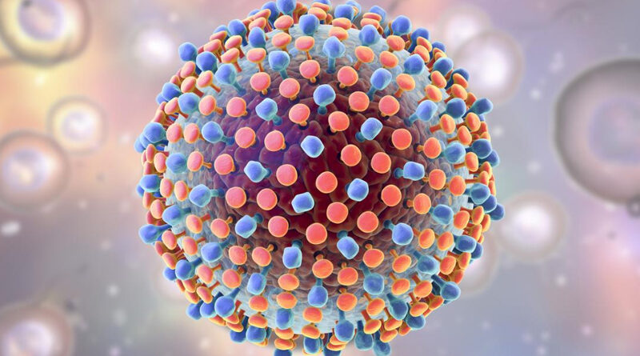<figcaption>
Hépatite C
</figcaption></figure>

#### Les modes de transmission

L’hépatite C (VHC) n’est pas une IST, elle se transmet par contact avec le sang, par exemple avec le partage de matériel de snif (paille) ou de slam (seringue, aiguille) et en cas de traumatisme de la muqueuse anale (fist, partouze, viol, pénétration sans lubrifiant, partage de sextoy…). Une micro lésion suffit pour permettre la contamination. Si vous avez ces pratiques, un dépistage de l’hépatite C est à faire tous les 3 mois.

Les autres IST, si elles provoquent des ulcérations (syphilis, herpès), sont également des portes d’entrée pouvant favorise l’infection par le virus de l’hépatite C.

#### Les symptômes

Les symptômes sont les mêmes pour toutes les hépatites : urines foncées, selles décolorées, teint de peau jaune, blanc des yeux jaune, grosse fatigue et possibilité de fièvre. L’hépatite C ne présente des symptômes que dans la moitié des cas. Dans tous les cas, en cas de diagnostic d’hépatite virale aigue, il faut éviter tout médicament ou aliment hépatotoxiques, comme le paracétamol par exemple, ou la consommation d’alcool.

#### Les conséquences

L’hépatite C peut guérir spontanément, mais vous pouvez vous faire à nouveau infecter, vous ne serez pas immunisé. Même après une guérison, vous serez séropositif à vie au test de dépistage de l’hépatite C. Pour vérifier que vous n’êtes pas recontaminé, il faudra faire un test de la charge virale de l’hépatite C. Si elle ne guérit pas, l’hépatite C devient chronique et peut, en l’absence de traitement et si on laisse la maladie évoluer, provoquer une cirrhose du foie, voire un carcinome hépato-cellulaire.

#### Le traitement

L’hépatite C se traite par la prise quotidienne de comprimés pendant 2 à 3 mois. Après le traitement vous êtes guéri, mais vous pouvez à nouveau être infecté par le virus de l’hépatite C. &#x20;

### L’hépatite E

<figure>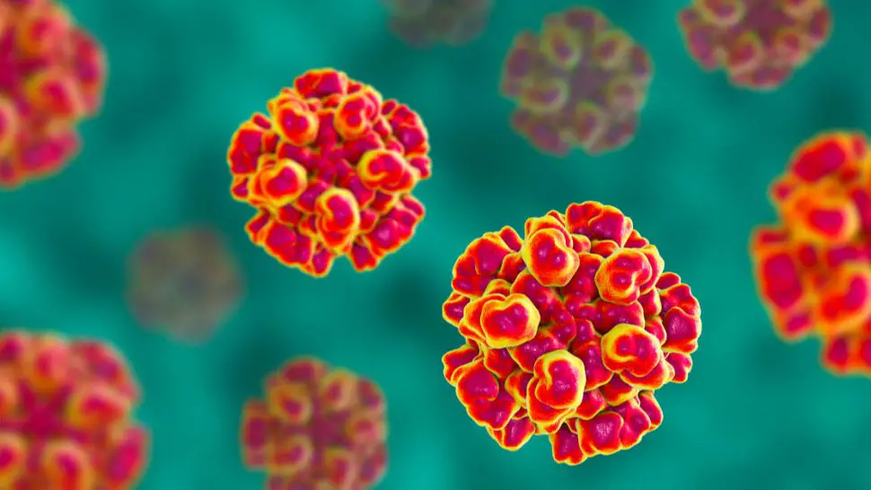<figcaption>
Hépatite E
</figcaption></figure>

#### Les modes de transmission

L’hépatite E (VHE) n’est pas vraiment une IST, mais elle peut se transmettre par contact avec l’anus.

La contamination passe forcément par la bouche. Le virus est résistant à l’air et peut survivre sur les doigts le temps qu’on les porte à la bouche. Il se transmet le plus souvent par de l’eau contaminée, mais peut être dans l’alimentation et se transmettre par voie sanguine.

#### Le calendrier

Période d’incubation : entre 2 et 8 semaines (le plus souvent, 40 jours)

La plupart du temps, l’hépatite E guérit seule en 3 à 5 semaines.

#### Les symptômes

Les symptômes sont les mêmes pour toutes les hépatites : urines foncées, selles décolorées, teint de peau jaune, blanc des yeux jaune, grosse fatigue et possibilité de fièvre. L’hépatite E ressemble beaucoup à l’hépatite A.

Dans la majorité des cas, l’hépatite E n’a pas de symptômes. Elle passe donc inaperçue. Dans tous les cas, en cas de diagnostic d’hépatite virale aigue, il faut éviter tout médicament ou aliment hépatotoxiques, comme le paracétamol par exemple, ou la consommation d’alcool.

#### Les conséquences

L’hépatite E est généralement bénigne et guérit toute seule. Dans certains cas, elle peut prendre une forme sévère (fulminante) entrainant une fatigue importante nécessitant un arrêt de travail. Et dans des cas extrêmement rares, elle peut détruire le foie, il faut alors procéder à une greffe en urgence. Il peut parfois y avoir des atteintes rénales et/ou neurologiques.

Elle peut également devenir chronique, notamment chez les personnes ayant un système immunitaire déficient. Dans ce cas, un traitement antiviral permet de réduire les effets de l’infection.

#### Le vaccin

Un vaccin contre l’hépatite E existe en Chine, mais n’est pas encore homologué dans les autres pays.

### L’herpès

<figure>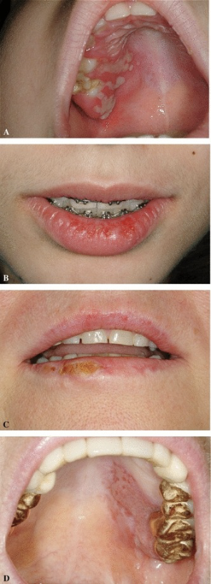<figcaption>
HSV1
</figcaption></figure>

 

<figure><figcaption>
Herpès chronique à HSV2 (courtoisie du Dr Gentiane Monsel)
</figcaption></figure>

 

<figure><figcaption>
Herpès HSV2 pseudotumoral + condylomes (HPV) (courtoisie du  Dr Gentiane Monsel)
</figcaption></figure>

#### Les modes de transmission

L’herpès se transmet par simple contact. L’incubation, très variable, peut durer quelques jours comme quelques années. Le virus peut se trouver au niveau de la bouche, du sexe ou de l’anus. Lorsque l’on a été infecté par le virus de l’herpès, il n’est pas possible de s’en débarrasser et on peut avoir des poussées qui se répètent plus ou moins fréquemment. Il existe un traitement antiviral pour accélérer la cicatrisation des lésions lors d’une poussée, mais il n’est pas possible d’empêcher de nouvelles poussées de revenir au même endroit.

La période de contagion démarre avant les poussées et dure jusqu’à la cicatrisation des lésions.

#### Les symptômes

Avant une poussée, il y a une sensation de picotement ou de démangeaison. Puis la poussée vient sous la forme d’une éruption de vésicules (également appelée bouquet, ce sont de toutes petites cloques regroupées au même endroit). L’éruption dure moins d’une semaine et peut revenir de manière totalement imprévisible au même endroit.

Le diagnostic se fait visuellement par le médecin, il n’y a pas de test de dépistage.

#### Les conséquences

L’herpès ne guérit pas et est contaminant à chaque poussée (la contamination commence quelques jours avant une poussée).

Les éruptions sont inconfortables et peuvent démanger, elles sont parfois douloureuses quand l’atteinte est anale.

Le virus n’a pas d’effet direct sur la santé, mais les érosions engendrées sont de potentielles portes d’entrée pour le VIH et les autres IST.

Si vous sentez qu’une poussée va arriver, vous devez prendre rapidement le traitement pour accélérer la cicatrisation et limiter le temps pendant lequel vous êtes contagieux. Il est donc important, lorsque vous êtes porteur du virus de l’herpès, d’avoir toujours une boîte de traitement d’avance pour pouvoir commencer immédiatement, dès la sensation des 1er symptômes, var le traitement nécessite une prescription médicale et le traitement sera moins efficace si vous attendez d’obtenir un rendez-vous avec votre médecin pour pouvoir le commencer.&#x20;

#### Le traitement

Il existe un traitement antiviral pour accélérer la cicatrisation des lésions lors d’une poussée. Mais aussi, s’il est pris dès le tout début des symptômes, le traitement peut raccourcir, voire freiner, la poussée. Lorsque les poussées sont très rapprochées, ces traitements peuvent aussi être utilisés en préventif de façon continue (un comprimé tous les jours)par les personnes déjà infectées par l’herpès pour limiter le rythme d’apparition des poussées, sans toutefois totalement les supprimer. Toujours en préventif, le médicament limite le risque de transmission. Mais, lors des poussées, l’usage du préservatif et le seul moyen de protéger ses partenaires.

### Les HPV (papillomavirus)

<figure>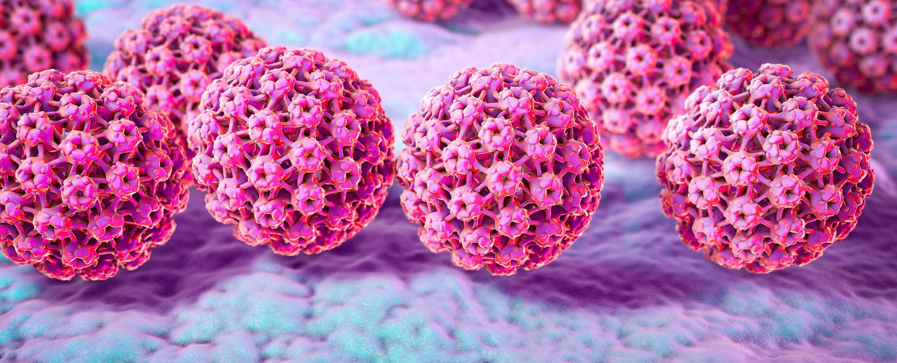<figcaption>
Papillomavirus - Source : Ensemble contre le Papillomavirus
</figcaption></figure>

####


[les-infections-a-papillomavirus-humain.md](les-infections-a-papillomavirus-humain.md)


#### Les modes de transmission

Les papillomavirus (ou HPV) sont une grande famille de virus très contagieux qui se transmettent par simple contact sur la peau. Les papillomavirus créent des verrues.&#x20;

#### Les symptômes

Certains HPV donnent des verrues génitales que l’on appelle aussi « condylomes » ou « crêtes de coq ». On peut les avoir sur le sexe, les testicules, le pubis, sur la vulve, dans le vagin et sur le col de l’utérus, mais également autour ou dans l’anus.

La durée d’incubation du virus est très variable (de quelques semaines à quelques années) et le virus est très contagieux lorsque les verrues apparaissent.

Le diagnostic se fait visuellement par le médecin, il n’y a pas de test de dépistage.

Si on a déjà eu une infection par des HPV, il faut se faire dépister régulièrement pour contrôler qu’il n’y a pas de récidive.

#### Les conséquences

Les HPV peuvent guérir tous seuls ou revenir. Lorsqu’on a des condylomes, il faut les faire enlever ou brûler par un médecin spécialiste (généralement un dermatologue lorsqu’ils sont localisés sur le sexe ou les testicules, et par un proctologue lorsqu’ils sont localisés au niveau anal, un gynécologue lorsqu’ils sont situés au niveau de la vulve ou du vagin ou du col de l’utérus) pour limiter le risque de transmission. Certains HPV peuvent évoluer vers un cancer s’ils ne sont pas traités. Mais la plupart des HPV ne sont pas cancérigènes.

#### Le vaccin

Un vaccin permet d’être protégé contre les HPV les plus dangereux (ceux qui sont le plus à risque d’évoluer vers un cancer). Il est recommandé pour à partir de 11 ans pour les jeunes garçons et les jeunes filles, avec un rattrapage possible jusqu’à l’âge de 19 ans pour les femmes et les hommes hétérosexuels, et pour les HSH jusqu’à l’âge de 26 ans.

## Les IST parasitaires

Les morpions et la gale sont des parasites externes qui se transmettent lors des rapports sexuels.

Il n’y a pas de traitement préventif, mais il existe des solutions pour s’en défaire et ne pas les transmettre.

Ces parasites ne sont pas sensibles au savon : être infecté par les morpions ou la gale n’est donc pas le signe d’une mauvaise hygiène.

### Les morpions

<figure><figcaption>
Pthirus pubis
</figcaption></figure>

#### Les modes de transmission

Les morpions s’attrapent lors des rapports sexuels lorsque deux corps sont en contacts rapprochés et prolongés. Ils s’installent généralement dans les poils du pubis et aux alentours.&#x20;

#### Les symptômes

Les morpions provoquent des démangeaisons, surtout le soir. Les morpions se voient à l’oeil nu (ce sont des acariens proches des poux), il n’y a pas de test de dépistage.

#### Les conséquences

Tant que les morpions ne sont pas éliminés, vous pouvez les transmettre à vos partenaires sexuels. Ils n’ont pas d’effet particulier sur la santé.

#### Le traitement

Comme pour les poux, un traitement avec un insecticide adapté est nécessaire pour éliminer les morpions. Raser ou tondre les poils de la zone infectée peut faciliter le traitement.&#x20;

### La gale

<figure>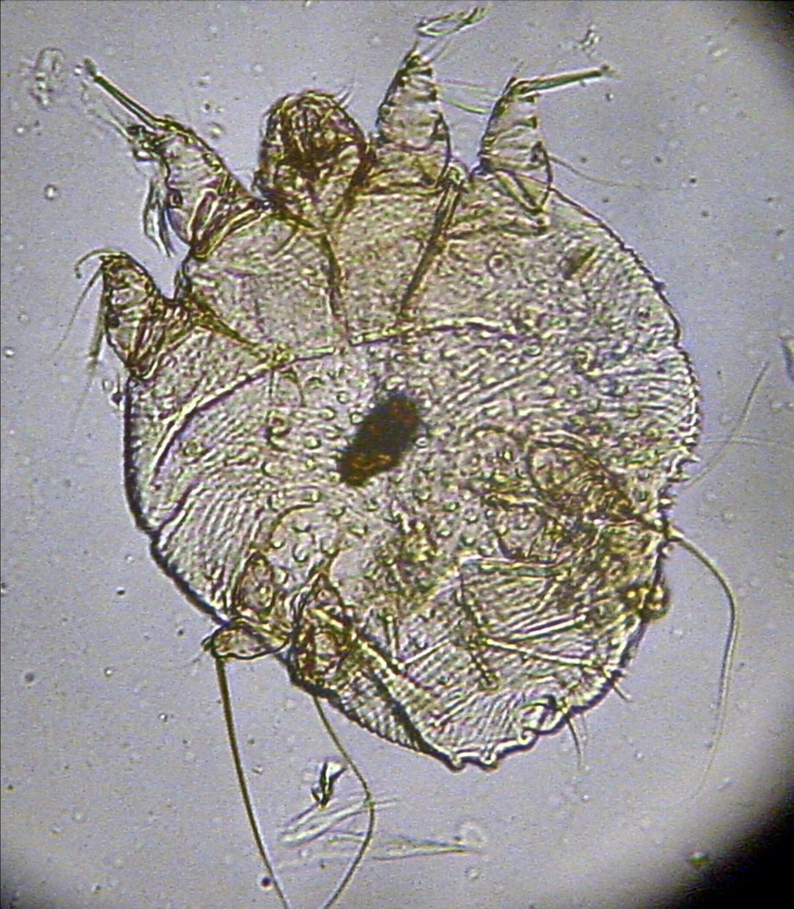<figcaption>
Photomicrographie d'un sarcopte, agent responsable de la gale.
</figcaption></figure>

#### Les modes de transmission

La gale se transmet lors des rapports sexuels lorsque deux corps sont en contacts rapprochés et prolongés. C’est un parasite minuscule, invisible à l’oeil nu, qui se reproduit sous la peau.

La période d’incubation dure 2 à 3 semaines. La personne contaminée est contagieuse dès que les symptômes apparaissent et jusqu’à 10 jours après le traitement.&#x20;

#### Les symptômes

La gale provoque des démangeaisons très fortes, principalement au niveau du sexe et des zones entre les doigts. Elle peut s’installer sur tout le corps, sauf le visage.

Les démangeaisons sont dues aux sillons que creuse le parasite dans la peau.

Il faut faire un prélèvement en laboratoire pour établir le diagnostic.

#### Les conséquences

La gale est très contagieuse et vous risquez de la transmettre à vos partenaires sexuels si vous ne vous traitez pas. Outre les démangeaisons elle n’a pas de conséquence sur la santé, sauf dans de rares cas où il peut y avoir une surinfection bactérienne des lésions de grattage.

#### Le traitement

Il faut prendre 2 fois des comprimés à 15 jours d’intervalle. Tous les habitants de votre foyer doivent prendre le traitement en même temps, même s’ils n’ont pas de symptôme.

Il faut également décontaminer les vêtements, les draps et les serviettes de toilette en les lavant à 60° C, ou en les repassant après lavage si vous les lavez à une température plus faible. Des sprays contre la gale existent pour désinfecter les matelas, les coussins et tout ce que vous ne pouvez pas laver. Après le traitement, les symptômes peuvent durer encore 15 jours. Mais au bout de 10 jours vous ne serez plus contagieux. Si les symptômes durent plus de 15 jours, c’est que vous êtes toujours infecté. Il faut donc à nouveau consulter et éventuellement renouveler le traitement.

<figure>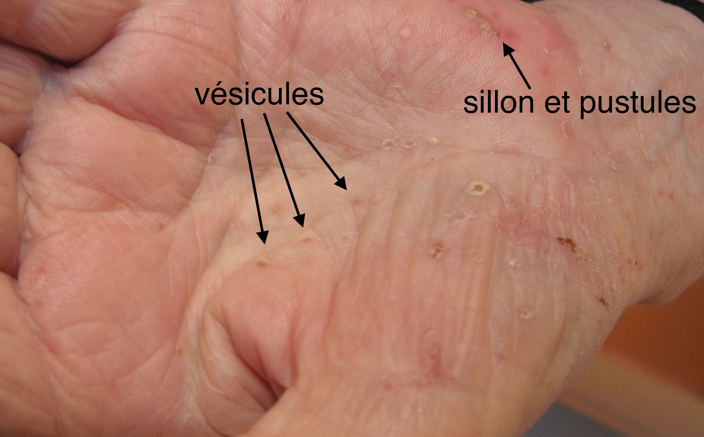<figcaption></figcaption></figure>

&#x20;
