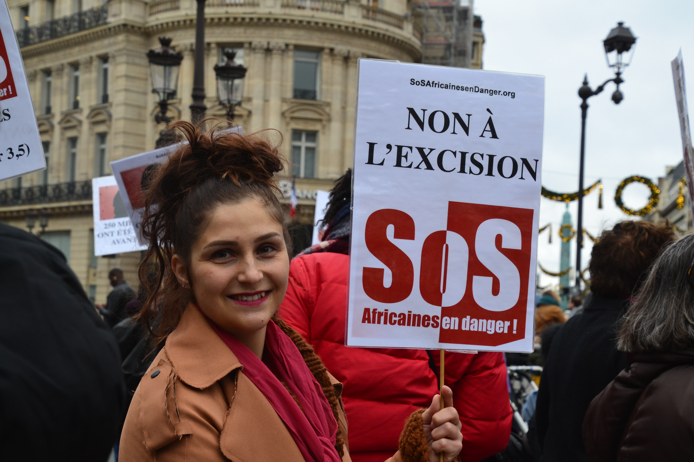

# Mutilations génitales féminines

## Pour bien comprendre de quoi on parle : l’anatomie vulvaire et clitoridienne

La vulve est un organe comprenant le mont du pubis, les grandes lèvres ou lèvres externes et les petites lèvres ou lèvres internes, le vestibule au sein duquel les orifices vaginal et urinaire se trouvent, le clitoris et les glandes vulvaires. Le clitoris est un organe de 10-12 cm au repos constitué de tissu tumescent, à cheval de l’urètre et du vagin. Il est l’homologue embryologique du pénis et se compose d’un gland, seule partie visible au niveau de la vulve, un corps, un coude (ou genou) et deux piliers (_crura_) au-dessous desquels se trouvent les bulbes, appelés par certains vestibulaires et d’autres clitoridiens. Le gland est recouvert par le prépuce.

**Le clitoris est un organe sensitif, innervé par les nerfs dorsaux du clitoris. Plus de 10 000 terminaisons nerveuses ont été récemment comptées au niveau de cet organe, qui est constitué de tissus composés par plusieurs petites cavités capables de s’engorger de sang lors de l’excitation sexuelle : les corps spongieux (les bulbes) et les corps caverneux (les piliers), qui communiquent entre eux à travers des réseaux veineux**.

<figure><figcaption>
Figure 1 : Anatomie de l’appareil génital féminin de face
</figcaption></figure>

<figure><figcaption>
Figure 2 : Anatomie de l’appareil génital féminin en 3D
</figcaption></figure>

## Les mutilations génitales féminines : de quoi s’agit-il ?

Les mutilations génitales féminines ou excisions (MGF/E) sont définies par l’Organisation Mondiale de la Santé comme « toutes les interventions aboutissant à une ablation totale ou partielle » de la vulve ou « toute autre mutilation des organes génitaux féminins pratiquée à des fins non médicales ». Les autres mots utilisés pour appeler ces pratiques sont l’excision, « être coupée » ou encore circoncision féminine.

Il existe quatre types de MGF définis par l’OMS (images diffusées avec permission de l’OMS) :

**Type 1**: l’ablation du prépuce et/ou du gland clitoridien (Type 1a) et éventuellement du corps du clitoris (Type 1a)

 

**Type 2**, l’excision : l’excision des lèvres internes et du gland/corps clitoridien

 

**Type 3**, l’infibulation : la fermeture de la vulve à travers l’apposition après excision des lèvres internes et/ou externes, avec ou sans excision du clitoris

 

<figure><figcaption>
MGF Type 3b ablation et accolement des grandes lèvres avec ou sans excision du clitoris
</figcaption></figure>

**Type 4,** toutes les autres MGF (piercing, piqure du clitoris, stretching des lèvres, incision du prépuce ou du gland du clitoris, etc.)

Si le type 3 (environ 15% des MGF/E) est assez facile à diagnostiquer, les types 1, 2 et 4 sont parfois difficiles à distinguer de variations anatomiques comme, par exemple, des lèvres internes de petite taille, ou d’autres conditions comme la synéchie des lèvres internes.

Un atlas photographique est disponible en accès libre sur ce lien :

[https://link.springer.com/chapter/10.1007/978-3-030-81736-7\_5](https://link.springer.com/chapter/10.1007/978-3-030-81736-7\_5)

## Qui est concerné ?

**Les MGF/E sont une pratique traditionnelle largement répandue** **dans le Monde** puisqu’on estime à plus **de 200 millions le nombre actuel de femmes** **et filles** concernées. Elles concernent certains pays d’Afrique subsaharienne, du Moyen-Orient, d’Asie du Sud-Est, notamment l’Indonésie et l’Inde, et les pays d’immigration (Europe, Canada, Etats-Unis, Australie). Elles sont parfois médicalisées, c’est-à-dire effectuées par du personnel de santé ou en milieu sanitaire.

Aujourd’hui en France, **les MGF/E touchent des personnes migrantes et des filles et des femmes nées en France de parent(s) originaire(s) de pays où les MGF/E sont pratiquées**.

Il a été montré récemment que beaucoup de familles qui ont migré en Europe abandonnent la pratique et aussi que dans certains pays à haute prévalence, les taux de MGF/E diminuent avec le changement générationnel, les campagnes d’information et de prévention et les lois interdisant la pratique.

Cependant, les MGF/E peuvent être pratiquées lors d’un retour au pays pour les vacances notamment, même si les parents sont opposés à la pratique. Tous les pays du Monde sont donc concernés et doivent s’impliquer dans la prévention de la pratique et de ses conséquences.

<figure><figcaption>
Figure 4 : Prévalence des MGF dans le Monde
</figcaption></figure>

## Que dit la loi ?

Les MGF/E sont illégales dans plus de 38 pays d’Afrique. Au Sénégal par exemple, des programmes de lutte existent depuis les années 1970. En 1999, la loi a précisé que la pratique est punie de 6 mois à 5 ans de prison pour l’exciseuse ou les parents, toujours 5 ans si médicalisée et de travaux forcés à perpétuité en cas de décès de l’enfant. Malgré cela, entre 1999 et 2018, seules huit affaires ont été jugées. A ce jour, 23% des femmes et filles au Sénégal sont excisées, soit 2 millions de personnes. Les familles n’osent pas toujours avoir recours à la police de peur d’être jugées ou stigmatisées, ou bien qu’on ne les écoute pas.

En France, les MGF/E constituent un crime depuis 1983. La loi s’applique pour tous les enfants français, que la mutilation ait lieu en France ou à l’étranger. La sanction est de 15 ans de réclusion criminelle et 150 000 euros d’amende pour la personne pratiquant l’acte. Dans certaines situations, les parents peuvent être incriminés, notamment s’ils sont informés sur la Loi et qu’ils pratiquent une excision sur leurs enfants. Les professionnel.le.s de santé constatant une excision sont tenus de réaliser un signalement auprès du Procureur de la République. En pratique, très peu de signalements sont réalisés.

Malgré les lois, les MGF/E perdurent car cela est au-delà de la norme juridique : il s’agit d’une norme sociale, une pratique traditionnelle imposée aux familles et aux enfants. Cela peut-être garant d’un bon mariage pour certaines filles et familles, parfois signe de pureté, virginité prénuptiale, propreté, beauté et aptitude à la prière selon certains. Cependant, l’excision n’est prônée par aucun texte religieux et notamment pas par le Coran contrairement à ce qui est parfois dit. Seule la branche Dawoodi Bohra de l’islam chiite considère la MGF/E appelée _khatna_ ainsi que la circoncision masculine comme religieuses.

## Quelles sont les conséquences des MGF ?

**Les conséquences psychologiques, physiques et sexuelles sont différentes selon le type, les modalités et l’âge auquel la MGF/E a été pratiquée.**

Certaines personnes disent ne pas avoir de problème lié à la MGF/E, ont développé des stratégies efficaces pour surmonter l’ancien traumatisme et ne ressentent pas le besoin d’être accompagnées par des professionnel.les de santé. D’autres décrivent des complications ou souhaitent des informations sur ce qui leur est arrivé malgré l’absence de complications.

**Chez l’enfant,** il existe des complications aiguës au moment de l’excision (hémorragie, infection, douleur, traumatisme psychologique …) et des complications chroniques : dysuries, infections urinaires et gynécologiques, manque de confiance en soi, cauchemars où on revit son excision, anxiété. Les complications chez les adolescentes peuvent être des douleurs pendant les règles qui parfois entrainent des absences prolongées à l’école, des infections urinaires, la peur d’aborder les premières relations amoureuses, de premiers rapports sexuels difficiles voire impossibles en cas d’infibulation.

**Chez l’adulte,** les complications sont les douleurs au niveau de la cicatrice avec une sensation de picotement, de grattage, de frottement des vêtements sur la peau.

Il peut y avoir des infections urinaires ou vaginales, une difficulté à uriner, des complications à l’accouchement surtout pour les MGF/E de type 3.

Les MGF/E n’entrainent pas de problème d’infertilité mais la personne peut présenter des douleurs pendant les rapports sexuels, ce qui va entraver une sexualité épanouie, ou des infections génitales chroniques qui se compliquent d’une infertilité.

Des dysfonctions sexuelles du désir, plaisir, excitation et orgasme peuvent aussi exister ainsi que des complications psychologiques liées au traumatisme de l’excision (cauchemars, flash-backs, dépression, trouble anxieux).

## Comment aborder le sujet avec les familles ?

**Il est important de briser le tabou.**

Beaucoup de femmes et filles sont concernées dans le Monde, et beaucoup d’hommes aussi ne souhaitent pas que leurs femmes et filles subissent une excision. Peu osent en parler avec leurs proches, leurs maris, leurs familles.

<figure><figcaption></figcaption></figure>

Les communautés, les politiques des pays, les soignants doivent être informés et pouvoir orienter et soutenir les familles.

Le Burkina Faso est un pays dans lequel la pratique a diminué fortement ces dernières années grâce aux efforts conjoints de l’État et de professionnel.le.s de santé.

_Il est important pour les professionnel.le.s d’être formé.e.s_ sur cette question et notamment de travailler sur les outils de communication. Les MGF/E constituent un sujet sensible puisqu’il touche à l’intimité et sexualité, à la violence et aux traditions qui peuvent différer selon les communautés.

Comme pour d’autres sujets de santé sexuelle, le/la professionnel.le de santé doit pouvoir travailler sa posture et avoir suffisamment de connaissances théoriques pour se sentir lui/elle-même à l’aise pour aborder le sujet. Il/elle devra s’interroger avant tout sur ses propres représentations des MGF/E et sur ses croyances. Les mettre en lumière lui permettra de les mettre de côté et d’accompagner les familles avec professionnalisme.

Trop souvent, ce sont les professionnel.le.s qui n’osent pas en parler mais les femmes concernées sont demandeuses de briser le tabou, de poser des questions et d’avoir de l’information sur le sujet.

_**Il est important d’adopter une posture bienveillante, non jugeante et de demander le consentement de la personne pour aborder le sujet avec elle.**_

L’anamnèse sera adaptée à l’intention d’accompagnement de la personne : est-ce que je veux faire passer un message de prévention pour les enfants à l’occasion d’un voyage ? Est-ce que je veux savoir si la femme que j’ai en face de moi est excisée et si cela est un problème pour elle et si elle souhaite être orientée ? Est-ce que je voudrais l’informer des possibilités d’accompagnement ? Est-ce que je souhaite informer cette famille sur la Loi ? En fonction de cela, je mènerai mon anamnèse, éventuellement mon examen clinique si cela a un intérêt pour la femme, etc.

De nombreux outils peuvent être utilisés comme une carte de la répartition épidémiologique, des flyers d’information, des dessins de vulves et MGF/E, des vulves en silicone.

Pour réaliser un message de prévention, le/a professionnel.le peut **évaluer le risque en posant la question directement aux parents et en demandant à la mère si elle-même est concernée et/ou au père si il est originaire d’un groupe ethnique qui pratique la MGF/E,** en s’appuyant par exemple sur une carte de répartition épidémiologique comme celle présentée dans l’article.

**Si la réponse est oui, il/elle pourra lui demander si c’est un problème pour elle et si elle est désireuse ou non d’un accompagnement.** Toutes les femmes ne sont pas intéressées par un accompagnement car certaines n’ont pas de complications identifiées liées à la MGF/E.. Néanmoins, le/a professionnel.le ouvre le dialogue et transmet une information dont elle se saisira ou non.

Dans un second temps, il/elle pourra poser la question pour l’enfant et l’ensemble de la fratrie. Dans certains pays et notamment la France, si le/la professionnel.le estime qu’il existe un risque de MGF/E chez une enfant avant un départ en vacances par exemple, il/elle réalisera un signalement de l’enfant aux autorités de protection de l’enfance afin que les parents soient reçus, reçoivent un rappel à la loi et que l’enfant soit examinée avant le départ et au retour par les autorités compétentes.

## Que peut on proposer ?

**L’accueil et l’information respectueux et professionnels sont le point de départ.**

Les femmes et filles concernées, tout comme leurs partenaires et entourage sont souvent intéressé.es par des informations sur leur anatomie et leur santé. En fonction du type de MGF/E, des besoins et d’éventuelles complications, les personnes seront orientées pour leur prise en charge. Il est primordial de rester centré sur la demande et les besoins des personnes.

Les accompagnements proposés dans les structures spécialisées ont une démarche holistique c’est-à-dire pluriprofessionnelle, avec psychologues et psychiatres formés sur le traumatisme, sexologues, gynécologues, urologues, et chirurgien.ne.s.

**La chirurgie de désinfibulation** (ouverture de l’infibulation avec ré-exposition du vestibule et donc des orifices vaginal et urinaire) améliore et souvent résout les problèmes génito-urinaires, sexuels et obstétricaux. Elle peut être effectuée à tout moment de la vie de la personne sous anesthésie locale, loco-régionale ou générale, y compris pendant la grossesse et l’accouchement.

**La chirurgie clitoridienne** consiste à enlever la cicatrice sus-clitoridienne et exposer, régénérer et /ou réinnerver le corps du clitoris déjà présent sous la cicatrice. Elle est pratiquée sous anesthésie régionale ou générale, en ambulatoire le plus souvent. Un accompagnement psychosexuel est souvent systématiquement proposé pour améliorer la santé sexuelle et parce que le parcours chirurgical et la période post-opératoire peuvent rappeler le traumatisme de l’excision.

Voici deux films utilisés en pratique clinique et qui ont été élaboré par le GAMS Belgique (Groupe d’Abolition des Mutilations Sexuelles et mariage forcé) :

Celui-là présente l’accompagnement pluridisciplinaire proposé en France et en Belgique :



Celui-ci présente la désinfibulation :



**En conclusion**, les personnes qui ont vécu ou sont à risque d’une MGF/E sont présentes dans le monde entier. La MGF/E est une pratique traditionnelle qui s’inscrit dans le champ des violences faites aux femmes et aux enfants et fait partie d’une norme sociétale qui rend le combat pour certaines familles difficile. Les prfoessionnel.les de santé doivent être sensibilisé.es et formé.es pour aborder le sujet, accueillir les personnes concernées dans la bienveillance et la non-discrimination, prendre en charge les éventuelles complications et prévenir la pratique dans les générations futures.


**Les messages clés**

La lutte contre les MGF/E concerne tous les pays du Monde.

La pratique n’est pas limitée au continent africain.

Il peut exister des complications somatiques, sexologiques et psychologiques chez la femme et l’enfant et cela diffère d’une personne à l’autre.

Le/a professionnel.le doit être formé.e pour avoir une écoute professionnelle, bienveillante, non jugeante et s’ouvrir à écouter profondément ce que dit l’autre, en mettant de côté ses préjugés et ses croyances pour permettre un dialogue.

Créer un espace d’écoute est indispensable pour recueillir le récit des personnes concernées et briser le tabou autour de cette pratique.

Les accompagnements spécialisés doivent être holistiques et pluriprofessionnels, pour prendre en charge la personne et pas seulement ses organes génitaux.


**Où trouver des outils ?**

Planches anatomiques des organes génitaux externes

[**https://www.unige.ch/ssi/ressources/ressources-pedagogiques-ssi/planches-anatomiques/planches-anatomiques/**](https://www.unige.ch/ssi/ressources/ressources-pedagogiques-ssi/planches-anatomiques/planches-anatomiques/)

Organes génitaux externes en silicone

[**https://positivesexed.org/a-propos/**](https://positivesexed.org/a-propos/)

Carte épidémiologique, flyer patient, support de formation

[**http://milleparcours.org/outils/**](http://milleparcours.org/outils/)

Outils pour les professionnels et pour les familles

[**https://gams.be/**](https://gams.be/)

**Ressources bibliographiques**

**A propos des complications**

Sylla F, Moreau C, Andro A. A systematic review and meta-analysis of the consequences of female genital mutilation on maternal and perinatal health outcomes in European and African countries. BMJ Glob Health. 2020 Dec;5(12):e003307.

Binkova A, Uebelhart M, Dällenbach P, Boulvain M, Gayet-Ageron A, Abdulcadir J. [A cross-sectional study on pelvic floor symptoms in women living with Female Genital Mutilation/Cutting.](https://pubmed.ncbi.nlm.nih.gov/33581732/) Reprod Health. 2021 Feb 12;18(1):39.

O'Neill S, Pallitto C. The Consequences of Female Genital Mutilation on Psycho-Social Well-Being: A Systematic Review of Qualitative Research. Qual Health Res. 2021 Jul;31(9):1738-1750.

**Concernant le signalement en France**

[https://solidarites-sante.gouv.fr/IMG/pdf/MSF.pdf](https://solidarites-sante.gouv.fr/IMG/pdf/MSF.pdf)

[https://www.has-sante.fr/upload/docs/application/pdf/2014-11/outil\_interactif\_reperage\_maltraitance\_enfants.pdf](https://www.has-sante.fr/upload/docs/application/pdf/2014-11/outil\_interactif\_reperage\_maltraitance\_enfants.pdf)

**A propos de focus groupes réalisés avec les femmes concernées**&#x20;

Azadi B, Tantet C, Sylla F, Andro A. Women who have undergone female genital mutilation/cutting's perceptions and experiences with healthcare providers in Paris. Cult Health Sex. 2022 Apr;24(4):583-596. doi: 10.1080/13691058.2021.1982010. Epub 2021 Nov 9. PMID: 34751634.

**Conditions d’abandon de la pratique**

Doucet MH, Delamou A, Manet H, Groleau D. Correction to: Au-delà de la volonté: les conditions d'empowerment nécessaires pour abandonner les mutilations génitales féminines à Conakry (Guinée), une ethnographie focalisée. Reprod Health. 2020 Jul 23;17(1):113.

[https://reproductive-health-journal.biomedcentral.com/track/pdf/10.1186/s12978-020-00951-6.pdf](mailto:https://reproductive-health-journal.biomedcentral.com/track/pdf/10.1186/s12978-020-00951-6.pdf)

**Déconstruire les idées reçues**

[https://gams.be/wp-content/uploads/2021/07/Idees-recues\_FR-2021\_v9.pdf](https://gams.be/wp-content/uploads/2021/07/Idees-recues\_FR-2021\_v9.pdf)

**Reconnaitre les MGF : outils photo**

Abdulcadir J, Catania L, Hindin MJ, Say L, Petignat P, Abdulcadir O. Female Genital Mutilation: A Visual Reference and Learning Tool for Health Care Professionals. Obstet Gynecol. 2016 Nov;128(5):958-963. doi: 10.1097/AOG.0000000000001686. PMID: 27741194.

**Article guide sur la désinfibulation**

Abdulcadir J, Marras S, Catania L, Abdulcadir O, Petignat P. Defibulation: A Visual Reference and Learning Tool. J Sex Med. 2018 Apr;15(4):601-611. doi: 10.1016/j.jsxm.2018.01.010. Epub 2018 Feb 17. PMID: 29463476.

**Atlas sur les MGF/E chez l’enfant et adolescent**

[https://link.springer.com/book/10.1007/978-3-030-81736-7](https://link.springer.com/book/10.1007/978-3-030-81736-7)
