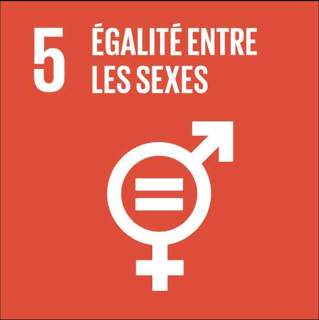

# Santé sexuelle et reproductive féminine

Telle que definie par l'OMS la santé sexuelle et reproductive est un état de bien-être physique, affectif, mental et social, concernant tous les aspects de la sexualité et de la reproduction, et pas seulement l'absence de maladie, de dysfonctionnement ou d'infirmité.

La santé reproductive implique la possibilité d'avoir une sexualité responsable, satisfaisante et sûre ainsi que la liberté pour les personnes de choisir d'avoir des enfants si elles le souhaitent et quand elles le désirent.

L’enjeu en matière de contraception est de permettre à chacune et chacun d’accéder à une contraception adaptée à sa situation.

Au contraire des Objectifs du Millénaire pour le Développement (OMD), l’agenda 2030 en France des Objectifs de Développement Durable (ODD) fait de la promotion de l’égalité femmes-hommes un thème central du développement durable. L’ODD 5 lui est totalement consacré et plusieurs autres objectifs l’intègrent également dans le cadre de leurs cibles.



<figure><figcaption></figcaption></figure>

**ODD 5 : Réaliser l’égalité des sexes et autonomiser toutes les femmes et les filles**

Le cinquième objectif est spécifiquement dédié à l’autonomisation des filles et des femmes. Il concerne l’égalité entre les sexes et vise à mettre fin à toutes les formes de discriminations et de violences contre les femmes et les filles dans le monde entier. Les cibles définies concernent : la lutte contre les discriminations et contre les violences faites aux femmes, l’accès des femmes à des fonctions de direction et de décision et l’accès universel aux droits sexuels et reproductifs. Il agit en interrelation avec les 16 autres ODD : il permet la conception et la mise en œuvre de toutes les politiques publiques au prisme du genre et encourage la mise en place de politiques dédiées à la lutte contre les inégalités qui subsistent et nécessitent des mesures positives en faveur des femmes.



**Garantir les droits et la santé sexuels et reproductifs (DSSR)** : de nombreuses associations féministes tout comme d’autres acteurs de la société civile considèrent les DSSR comme la « clef de voûte » de l’émancipation féminine et du développement durable. Il s’agit d’un concept englobant qui repose sur le droit de disposer de son corps et de pouvoir décider librement pour tout ce qui relève de la sexualité et de la procréation. Il ne se limite donc pas au seul champ de la santé maternelle et recouvre d’autres aspects fondamentaux comme l’information et l’éducation à la sexualité, l’accès à la contraception, la prévention et le dépistage des maladies sexuellement transmissibles, etc.&#x20;


**Définition des « DSSR »**&#x20;

« Les droits et la santé sexuels et reproductifs » (DSSR) sont les droits de toute personne de prendre des décisions libres, informées et responsables et d’exercer un contrôle entier sur les aspects élémentaires de sa vie privée - corps, sexualité, santé, relations avec autrui, liberté de se marier ou non, d’avoir ou non des enfants, et le cas échéant, choix du moment et du partenaire - sans s’exposer à quelle que forme de discrimination, de stigmatisation, de contrainte ou de violence que ce soit. Ceci recouvre le droit de jouir de sa propre sexualité et de l’exprimer, de pouvoir - sans ingérence extérieure - prendre des décisions personnelles concernant sa sexualité et la procréation, ainsi que d’avoir accès à l’information, à l’éducation et aux services en matière de santé sexuelle et procréative.


**Une Moitié de l'humanité souvent depourvues de ses droits humains**&#x20;

* Violences et pratiques néfastes : au cours de leur existence, on estime que jusqu’à 70% des femmes dans le monde sont confrontées à la violence physique ou sexuelle.
* Sur la planète, 1 fille sur 5 est mariée avant ses 18 ans. Dans les pays les moins avancés (PMA), cette proportion atteint 40%.
* 200 millions de femmes et de filles dans le monde ont subi des mutilations génitales féminines.&#x20;

**La fréquence trop élevée des grossesses non désirées**&#x20;

* **Dans le monde**&#x20;

Les besoins non satisfaits des populations en matière de santé sexuelle et reproductive demeurent aujourd’hui immenses. Dans les pays en développement, près de 214 millions de femmes désireuses de prévenir une grossesse n’ont toujours pas accès à une contraception efficace ni à des services de qualité.&#x20;

Ce manque d’accès aux services de planification familiale aboutit chaque année à 89 millions de grossesses non désirées dont plus d’1/4 (25 millions) sont interrompues dans le cadre d’avortements à risque. Ces interruptions de grossesse réalisées dans de mauvaises conditions sont à l’origine de près de 50 000 décès chaque année.

* **En France**

En France, le taux annuel d’IVG, reflet seulement partiel des grossesses non désirées, est de 234 000 en 2022.&#x20;

## **La contraception**&#x20;

.jpeg>)

Subir une grossesse non désirée a toujours été un drame pour les femmes, motivant la mise en œuvre de nombreuses méthodes souvent folkloriques et peu efficaces pour s’en prémunir. Douches spermicides à base de vinaigre, thé vert, ciguë… Certaines étaient létales, d’autres pouvaient rendre les femmes infertiles. Les Égyptiennes auraient même, 3000 ans avant notre ère, utilisé des ovules spermicides à base de levain et d’excréments de crocodiles ; c’est également en Égypte que l’on trouve les premières références au préservatif masculin.

Les méthodes contraceptives ont évidemment évolué et on peut les classer aujourd’hui en méthodes contraceptives masculines et féminines, hormonales et non hormonales.

_Pour les hommes,_ le préservatif reste la méthode la plus utilisée, mais on peut également pratiquer une stérilisation définitive en ligaturant les canaux déférents (conduits utilisés par le sperme) ou agir sur la synthèse des spermatozoïdes par la prise d’hormones ou le port de slips chauffants.


[sante-sexuelle-et-reproductive-masculine.md](sante-sexuelle-et-reproductive-masculine.md)


L’arsenal féminin est plus développé, et la charge mentale de la contraception incombe le plus souvent aux femmes.

* _Méthodes locales_ : diaphragme, opérationnel depuis la fin du 19e siècle, préservatif féminin, ovules et éponges spermicides sont les méthodes dites barrières.
* _Le stérilet,_ qu’il soit au cuivre ou hormonal, est une méthode mécanique dont le principal effet secondaire est d’augmenter le volume des règles.
* La pilule hormonale développée dans les années 1950, déclinée désormais sous de nombreuses formes : normo, mini, ou micro. Il s’agit de comprimés à avaler, avec ou sans oestrogènes ; patchs à coller ; anneaux vaginaux ou encore implants sous-cutanés.
* La pilule d’urgence, disponible depuis 1999, est une bonne alternative lorsqu’aucune précaution n’a pu être prise en amont, même si son efficacité n’est pas garantie. On peut également insérer un stérilet en urgence dans les 48h qui suivent un rapport non protégé.

<figure><figcaption></figcaption></figure>

* Enfin, tout comme les hommes, les femmes peuvent, en France depuis 2001, bénéficier d’une contraception définitive par ligature des trompes. Cet acte est accessible à toutes les femmes majeures, après un délai de réflexion de 4 mois.

Une bonne connaissance des antécédents des patientes permet de limiter les complications rares et graves de la pilule (embolie pulmonaire, AVC).

Effectivement la pilule hormonale souffre aujourd’hui d’un désamour de la part des jeunes, qui lui reprochent son caractère non naturel et ses complications, notamment ses effets sur le poids et la libido. De nombreuses jeunes femmes pensent qu’une grossesse ne peut survenir à l’occasion du premier rapport sexuel, ou en l’absence de pénétration ce qui est évidemment faux. Une grossesse non désirée peut aboutir à un avortement, source d’opprobre dans certaines familles, ou à une poursuite de la grossesse, sans que la jeune femme ou le jeune couple n’aient pris la mesure de l’impact de l’arrivée d’un enfant sur leurs vies.

Les rapports non protégés, notamment en cas de partenaires multiples, favorisent la transmission de maladies « sexuelles » comme le VIH, les hépatites ou les chlamydiae. Certaines de ces affections requièrent un traitement à vie, d’autres peuvent provoquer une infertilité ou certains cancers tels que le cancer du col de l’utérus. Heureusement, la vaccination des jeunes, filles et garçons, contre les papillomavirus (HPV) permet depuis plusieurs années de faire reculer cette affection.

## **L’avortement**

Le recours à l’avortement est une pratique aussi ancienne que l’usage de la pilule, validé par certains médecins de la Grèce antique tels Soranos d’Ephèse, et c’est bien plus tard que les médecins catholiques ont condamné cet acte au motif que seul Dieu pouvait donner et reprendre la vie.

Cet anathème n’a pas empêché les femmes d’y recourir au risque de leur vie, auprès de matrones « faiseuses d’anges » (car les fœtus qui n’avaient jamais péché ne pouvaient que se retrouver au paradis) dans un premier temps, puis avec le soutien de médecins engagés auprès du MLAC (Mouvement pour la liberté de l’avortement et de la contraception) en toute illégalité.

.jpeg>)

Grâce à la pugnacité de Simone Veil, bien décidée à endiguer l’hécatombe due aux avortements clandestins, l’avortement est autorisé en France depuis la loi Veil de 1975, et les procédures se sont progressivement simplifiées (suppression du délai de réflexion et de l’obligation de rencontrer une conseillère conjugale) tandis que les délais légaux augmentaient. On peut aujourd’hui avorter jusqu’à 14 semaines de grossesse (16 semaines d’aménorrhée), et l’avortement est anonyme pour les mineures qui n’ont pas besoin de l’autorisation de leurs parents mais simplement de la présence d’un adulte de leur choix. L’IVG et tous les examens qui y sont liés sont pris en charge à 100%.

Différentes techniques sont proposées dans les centres d’orthogénie :

* _Méthode médicamenteuse,_ qui repose sur l’utilisation de la pilule RU 480 et d’une prostaglandine telle que le Gymiso. Cette méthode est possible à domicile ou en établissement de santé jusqu’au terme de 9 semaines d’aménorrhée
* _Méthode chirurgicale_ : elle consiste à aspirer le contenu de l’utérus au moyen d’une canule reliée à un appareil qui produit du vide, et peut être réalisée jusqu’à 16 semaines d’aménorrhée. En fonction du choix de la patiente et de l’organisation du centre, elle peut être réalisée sous anesthésie générale ou locale.

Avorter avec un accompagnement médical est une méthode sûre aux très rares complications. Mais dans les pays où l’avortement est réalisé clandestinement, dans un contexte non médicalisé, la mortalité des femmes reste préoccupante, et environ 30 à 50 000 femmes décèdent chaque année des suites de cet acte.

## **Procréation médicalement assistée (PMA)**

.jpeg>)

Avoir du mal à concevoir au sein d'un couple a toujours été une véritable malédiction pour les femmes, qui en étaient rendues responsables. En effet ce n’est que récemment que l’infertilité masculine a commencé à être reconnue, explorée et traitée.

Être infertile pouvait vous valoir d’être répudiée, surtout en l’absence d’héritier mâle. C’est pourquoi de très nombreuses méthodes n’ont cessé de fleurir pour tenter de contrer ce mal : sources miraculeuses, fortifiants, talismans, sorcières…

La médecine a longtemps été très démunie, jusqu’à ce qu’en 1884 la première insémination artificielle avec donneur aboutisse à une naissance aux USA.

Les progrès se sont rapidement enchainés par la suite :

* utilisation de sperme congelé et création de banques de sperme à partir de 1970,
* début de la fécondation _in vitro_ à la même époque aboutissant à la naissance en 1978 de Louise Brown au Royaume Uni, premier bébé né par cette technique, c’est-à-dire conçu dans une éprouvette à partir d’un ovule maternel et d’un spermatozoïde paternel, puis réimplanté au stade d’embryon dans l’utérus maternel,
* nous avons ensuite appris à injecter de force un spermatozoïde dans l’ovule en cas d’infertilité masculine sévère (ICSI), à congeler les embryons, puis les ovocytes, et les résultats de ces techniques n’ont cessé de s’améliorer : 30% de chances de grossesse par tentative en moyenne.

Ces progrès ont également permis de développer le diagnostic pré-implantatoire (DPI) qui permet de détecter des maladies génétiques graves avant de réimplanter un embryon, évitant ainsi de nombreux drames aux futurs parents.

L’assistance médicalisée à la procréation est une avancée médicale spectaculaire, mais pose désormais des problèmes éthiques difficiles à résoudre, notamment en ce qui concerne la gestation pour autrui (GPA), et la greffe d’utérus suscite de nombreux espoirs.

**Pour en savoir plus**

[https://www.respadd.org/wp-content/uploads/2022/12/Livret-patient-sante-sexuelle-BAT.pdf](https://www.respadd.org/wp-content/uploads/2022/12/Livret-patient-sante-sexuelle-BAT.pdf)

[https://www.questionsexualite.fr](https://www.questionsexualite.fr/) &#x20;

[www.sexosafe.fr](http://www.sexosafe.fr/)

[IVG.gouv.fr](https://ivg.gouv.fr/)

Pour trouver la contraception la plus adaptée :

[Comment choisir sa contraception ? (questionsexualite.fr)](https://questionsexualite.fr/choisir-sa-contraception/ma-contraception-et-moi/comment-choisir-la-contraception-qui-vous-convient)

Pour savoir que faire en cas d’oubli de pilule :

[Outil contraception (questionsexualite.fr)](https://questionsexualite.fr/choisir-sa-contraception/ma-contraception-et-moi/que-faire-en-cas-d-oubli-de-pilule)
