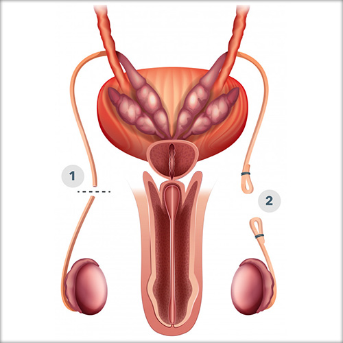

# Santé sexuelle et reproductive masculine

La santé sexuelle et reproductive masculine concerne le fonctionnement et les dysfonctionnements sexuels et reproductifs, ainsi que les préoccupations sexuelles spécifiques à la population masculine. La définition de la santé sexuelle proposée par l’OMS (encadré 1) insiste sur la notion de possibilité à vivre des expériences sexuelles.

Ce chapitre vise à fournir aux lecteurs une meilleure compréhension de la santé sexuelle et reproductive masculine, en mettant l'accent sur les meilleures pratiques cliniques.


**Définition de la santé sexuelle par l’OMS**&#x20;

_La santé sexuelle, lorsqu'elle est considérée de manière positive, s'entend comme une approche positive et respectueuse de la sexualité et des relations sexuelles, ainsi que comme la possibilité de vivre des expériences sexuelles agréables et sûres, exemptes de coercition, de discrimination et de violence._


## **Les principales dysfonctions sexuelles**

_Dysfonction érectile_ : Également connue sous le nom « d'impuissance » (terme à ne plus utiliser), la dysfonction érectile se caractérise par l'incapacité à obtenir ou à maintenir une érection suffisante pour une activité sexuelle satisfaisante.

_Éjaculation précoce ou rapide_ : Il s'agit d'une situation dans laquelle l'éjaculation survient de manière persistante et répétée avant ou peu de temps après la pénétration sexuelle, entraînant une insatisfaction pour le patient et sa ou son partenaire. Elle a été abordée dans le chapitre Dysfonctions sexuelles.

_Diminution de la « libido » ou « appétit sexuel »_ : Une diminution de la libido ou du désir sexuel peut entraîner une baisse de l'intérêt pour l'activité sexuelle et une diminution de la fréquence des rapports sexuels (voir le chapitre Dysfonctions sexuelles).

_Troubles de l'orgasme_ : Cela peut inclure l'incapacité à atteindre l'orgasme malgré une stimulation sexuelle adéquate (anorgasmie), ou l'orgasme douloureux (dysorgasmie) (voir le chapitre Dysfonctions sexuelles).


[dysfonctions-sexuelles.md](dysfonctions-sexuelles.md)


Enfin, deux situations rares :

_Priapisme_ : Il s'agit d'une érection prolongée et douloureuse qui survient sans stimulation sexuelle et peut durer plusieurs heures. C’est une urgence médicale.

_Courbure du pénis_ : La maladie de La Peyronie ou les courbures congénitales de la verge sont deux situations dans lesquelles le pénis se courbe de manière anormale lors de l'érection en raison de la formation de plaques fibreuses dans les tissus du pénis ou suite à un mauvais développement de la verge.

Enfin il existe de nombreuses autres dysfonctions sexuelles, beaucoup plus rares, qui ne seront pas abordées ici par souci de clarté.

**Chaque dysfonction sexuelle peut avoir des causes et des traitements spécifiques, et il est recommandé de consulter un professionnel de la santé qualifié pour un diagnostic précis et un plan de traitement approprié.**

## **La dysfonction érectile**

La dysfonction érectile (DE) est un problème courant qui affecte la santé sexuelle des hommes, entraînant des difficultés à obtenir ou à maintenir une érection suffisante pour des rapports sexuels satisfaisants.

### **Comprendre l’érection pour comprendre la dysfonction érectile**

Les mécanismes physiologiques de l'érection sont complexes et impliquent une interaction entre le système nerveux, le système vasculaire et les structures anatomiques du pénis.

Lorsqu'un homme est stimulé sexuellement (stimulus visuel, auditif, olfactif, tactile, fantasme…), des signaux nerveux sont transmis de la région génitale au cerveau, entraînant la libération de neurotransmetteurs tels que l'oxyde nitrique (NO) au niveau du pénis. Ceci déclenche alors une cascade de réactions biochimiques qui permettent la relaxation des muscles lisses des vaisseaux sanguins et des corps caverneux du pénis.

 

<figure><figcaption></figcaption></figure>

Tout dysfonctionnement dans ce processus complexe peut entraîner une dysfonction érectile.

### **Faire le diagnostic d’une dysfonction érectile**

Ce dysfonctionnement préoccupant pour nombre d’hommes doit faire l’objet par le praticien expert d’une histoire détaillée, étape fondamentale pour résoudre au mieux le problème :

* Quelle est la fréquence de ?
* Quelle capacité à maintenir une érection ?
* Y-a-t-il douleur ou inconfort lors des rapports sexuels ?

Bien sûr, il faudra recueillir les antécédents médicaux, les maladies chroniques, les traumatismes pelviens ou les interventions chirurgicales antérieures, documenter les traitements en cours car certains médicaments peuvent influencer la fonction érectile (antihypertenseurs …)

* Quelles sont les habitudes de vie ? Tabac, alcool, prise de drogues
* Contexte psychologique, cadre de vie, stress ?

L'examen physique approfondi permet d’identifier d'éventuelles anomalies anatomiques, des problèmes vasculaires, neurologiques ou hormonaux, en particulier au niveau des organes génitaux externes.

### **Traitement de la dysfonction érectile**

Il existe des traitements médicaux qui permettent d’améliorer la DE. Ce sont des **médicaments** administrés par voie orale tels que le sildénafil, le tadalafil et le vardénafil, qui agissent en augmentant le flux sanguin vers le pénis, favorisant ainsi une érection. La différence entre ces molécules réside surtout dans leur délai d’action et dans la durée de leur action.

Ils doivent être pris avant l'activité sexuelle et sont le plus souvent efficaces. Attention à ne pas combiner ces médicaments avec des drogues ou des poppers en raison d’une potentialisation dangereuse.

<figure><figcaption></figcaption></figure>

En cas de contre-indication ou d'échec des médicaments oraux, d'autres options médicales peuvent être envisagées. Les **injections intra-caverneuses** de médicaments tels que l'alprostadil directement dans le pénis entraînent une dilatation des vaisseaux sanguins et une érection. Cette méthode peut être efficace chez les patients qui ne répondent pas aux médicaments oraux.

<figure><figcaption></figcaption></figure>

Les **dispositifs à vide**, également appelés pompes à vide ou vacuum créent une dépression autour du pénis, ce qui permet l'afflux de sang et la formation d'une érection. Ils peuvent être utilisés en combinaison avec des anneaux de constriction pour maintenir l'érection pendant une trentaine de minutes.

<figure><figcaption></figcaption></figure>

Lorsque les options médicales ne sont pas efficaces ou appropriées, la **chirurgie** peut être envisagée pour traiter la dysfonction érectile. L'implantation de prothèses péniennes est une option chirurgicale.

<figure><figcaption></figcaption></figure>

Il existe deux types de prothèses péniennes : les prothèses gonflables et les prothèses semi-rigides.

Les prothèses gonflables sont composées de cylindres implantés dans les corps caverneux du pénis, ainsi que d'une pompe placée dans le scrotum et d'un réservoir de fluide placés dans l’espace prévésical. Lorsqu'un homme souhaite obtenir une érection, il actionne la pompe pour remplir les cylindres de fluide, créant ainsi une érection.

Les prothèses semi-rigides sont des tiges flexibles implantées dans les corps caverneux, ce qui permet au pénis d'être positionné vers le haut ou vers le bas selon les besoins. La littérature rapporte une satisfaction moins grande avec ce dernier dispositif.

### **Approche globale et prise en charge multidisciplinaire et sexologique**

La DE comporte de nombreux aspects psychologiques et relationnels, et une approche sexologique complète permet de prendre en compte ces éléments importants.

L'évaluation sexologique de la DE implique une compréhension approfondie de la dynamique relationnelle du patient, de ses antécédents sexuels, de son expérience émotionnelle et de son bien-être psychologique. Le sexologue aide à identifier les éventuels facteurs psychologiques, tels que le stress, l'anxiété de performance, les traumatismes passés ou les conflits relationnels, qui peuvent contribuer à la DE.

Le sexologue peut recommander une thérapie sexuelle, individuelle ou de couple, pour aider le patient à explorer les pensées, les émotions et les comportements liés à la DE. Cette thérapie vise à améliorer la communication entre les partenaires, à réduire l'anxiété de performance et à identifier les schémas de pensée négatifs qui peuvent contribuer au maintien de la DE.

En plus de la thérapie sexuelle, le sexologue peut également recommander des techniques de gestion du stress, de relaxation ou de méditation pour réduire l'anxiété et favoriser un état d'esprit plus « positif » et « détendu ». Il peut également fournir des informations et des conseils sur l'éducation sexuelle, l'exploration de la sensualité et de l'intimité, et l'adaptation des pratiques sexuelles en fonction des besoins spécifiques du patient.

### **En conclusion**

La dysfonction érectile est un problème courant qui nécessite une compréhension approfondie et une approche personnalisée. En adoptant une approche holistique et multidisciplinaire, nous sommes mieux équipés pour répondre aux besoins de nos patients et les accompagner dans leur parcours vers une santé sexuelle satisfaisante.

## **Les courbures de verge (maladie de La Peyronie)**

Cette maladie se caractérise par la formation de plaques fibreuses dans les tissus du pénis, entraînant une courbure anormale de la verge en érection. On ne sait pas très bien ce qui engendre ce phénomène. Il pourrait s’agir de traumatismes répétés ou de micro-lésions du tissu pénien responsables d’une inflammation entrainant de la fibrose qui durcit les tissus, provoquant une courbure du pénis lors de l'érection.

La maladie évolue classiquement en deux phases pendant 12 à 18 mois. Une phase inflammatoire (douleurs à l’érection, déformation qui se fait assez rapidement…) de 3 à 12 mois, puis une stabilisation, avec parfois une calcification de la plaque et arrêt de la déformation.

### **Prise en charge**

Elle comporte :

**Un temps d’évaluation :**

* histoire médicale détaillée,
* examen physique pour déterminer l'étendue de la courbure du pénis, la présence de plaques fibreuses palpables,
* recherche de complications telles que la dysfonction érectile, la perte de longueur du pénis, déformations complexes.

**Le temps du traitement :**

La prise en charge de la maladie de La Peyronie doit être individualisée en fonction des besoins spécifiques de chaque patient. La prise en charge globale peut inclure des conseils sur la communication avec la/le partenaire, l'adaptation des pratiques sexuelles et des thérapies psychologiques pour surmonter les difficultés émotionnelles associées.

Dans les premiers stades de la maladie, lorsque les symptômes sont légers, on peut avoir recours aux médicaments oraux déjà cités (sildenafil ...) et au stretching de verge (vacuum ou extenseur de verge). Les ondes de choc de basse intensité peuvent aider à diminuer la douleur.

Plusieurs options chirurgicales existent pour traiter la maladie de La Peyronie, dont le choix dépendra de la gravité de la courbure, de la présence de plaques fibrotiques, des symptômes du patient et des préférences individuelles.

## **Le priapisme**

Il s’agit d’une érection prolongée et douloureuse qui survient en l'absence de stimulation sexuelle et qui dure plus de 4 heures. Cette situation est une urgence médicale car elle peut entraîner des complications graves si elle n'est pas traitée rapidement. Nous aborderons ici le priapisme en général, en faisant un focus sur son lien avec une maladie génétique du sang, la drépanocytose, qui provoque une hémoglobine anormale responsable d’une obturation des petits vaisseaux, dont ceux du pénis.

Le priapisme peut être classé en deux catégories principales :

* le priapisme veineux, également appelé priapisme à bas débit, est le type le plus courant. Il est généralement dû à une accumulation de sang « piégé » dans les corps caverneux du pénis, créant une privation d'oxygène.
* le priapisme artériel, quant à lui, n’est généralement pas douloureux et est souvent associé à des traumatismes pelviens ou iatrogènes.

### **Prise en charge**

Il est important d'identifier la cause sous-jacente du priapisme si elle existe, qu'elle soit liée à la drépanocytose ou à d'autres facteurs (prise de cocaïne, de neuroleptiques…)

Le traitement du priapisme dépend du type et de la durée de l'épisode.

Devant un priapisme veineux ischémique, le plus fréquent, les premières mesures de traitement consistent généralement en l'application de glace (ou douche froide), la réalisation d’un effort physique ou l’obtention d’une éjaculation. Si ces mesures ne sont pas efficaces, une aspiration du sang « piégé » dans les corps caverneux peut être réalisée. En cas d’échec, un lavage des corps caverneux avec du sérum physiologique peut être réalisé.

Dans certains cas graves ou récurrents, une intervention chirurgicale peut être nécessaire.

Il est essentiel de prendre en compte les aspects psychologiques et émotionnels du priapisme, en offrant un soutien adéquat aux patients et à leurs partenaires…

Un priapisme qui a duré longtemps (24h) expose à une séquelle grave : la fibrose complète des corps caverneux avec comme conséquence une dysfonction érectile majeure, requérant le plus souvent la pose de prothèse.

En conclusion, le **priapisme est une urgence**.

**Dans le cas de la drépanocytose**, il est important de sensibiliser les patients à leur risque accru de priapisme, notamment les enfants et les jeunes adultes chez qui parfois la sexualité et le sexe sont tabous, et de mettre en place des stratégies de prévention et de traitement adaptées.

## **Santé reproductive masculine**

### Prise en charge de l'infertilité masculine

En France, environ un couple sur huit consulte en raison de difficultés à concevoir un enfant. Pour les trois quarts d’entre eux, l’infertilité est d’origine masculine, féminine, ou elle associe les deux sexes. Dans 10 à 25% des cas, elle n’est pas attribuable à un défaut spécifique d’un des deux partenaires. Une prise en charge médicale peut résoudre un certain nombre de cas d’infertilité et la procréation médicalement assistée permet de contourner la plupart des difficultés. Mieux comprendre les facteurs génétiques et environnementaux sous-jacents est un enjeu majeur pour prévenir les problèmes d’infertilité (perturbateurs endocriniens…).



### Évaluation de l'infertilité masculine

Plusieurs étapes sont nécessaires :

* Préciser l’histoire médicale complète : antécédents médicaux et chirurgicaux, médicaments pris, habitudes de vie, facteurs de risque pour l'infertilité, vie sexuelle, pratiques contraceptives éventuelles précédentes et les tentatives antérieures de conception seront abordées.
* Examen physique : caractéristiques sexuelles secondaires, recherche de varicocèle (dilatation des veines du scrotum), d’anomalies testiculaires ou génitales…
* L’analyse du sperme (spermogramme), est une évaluation essentielle de la fertilité masculine. Des échantillons de sperme seront recueillis et examinés en laboratoire pour déterminer la qualité et la quantité des spermatozoïdes, leur morphologie, leur mobilité.
* En complément peuvent s’avérer nécessaires : dosages hormonaux, analyses génétiques pour détecter d'éventuelles anomalies chromosomiques, échographies pour visualiser les organes génitaux, ou d'autres tests spécifiques en fonction des cas.

<figure><figcaption>
Évolution de la fertilité chez l'homme avec l'âge
</figcaption></figure>

### Approches médicales pour le traitement de l'infertilité masculine

Quelques unes des approches médicales couramment utilisées :

**Traitements hormonaux** : certains déséquilibres hormonaux peuvent contribuer à l'infertilité masculine. Des traitements peuvent être proposés sous forme d’injections de substances stimulant la production d’hormones comme les gonadotrophines ou de testostérone.

**Médicaments pour améliorer la qualité du sperme** : ce peuvent être des antioxydants, la L-carnitine, des vitamines ou des minéraux (vitamine E, vitamine C, zinc ou sélénium), en particulier pour améliorer la mobilité des spermatozoïdes.

**Techniques d'assistance à la reproduction** : en cas d'infertilité sévère, des techniques d'assistance à la reproduction peuvent être envisagées. Celles-ci incluent la fécondation in vitro (FIV), l'injection intracytoplasmique de spermatozoïdes (ICSI, où un spermatozoïde est directement injecté dans l'ovule pour faciliter la fécondation).

### Approches chirurgicales pour le traitement de l'infertilité masculine

Lorsque des causes « anatomiques » spécifiques sont identifiées comme étant responsables de l'infertilité masculine, des interventions chirurgicales peuvent être envisagées pour traiter ces conditions.

**Réparation de varicocèle** : la varicocèle est une dilatation des veines (« varices ») situées dans le scrotum. Elle peut entraîner une augmentation de la température des testicules, un stress oxydatif et une altération de la production de spermatozoïdes. La réparation de la varicocèle consiste en la ligature chirurgicale ou l'embolisation des veines dilatées pour rétablir un flux sanguin normal, et donc améliorer la qualité du sperme et augmenter les chances de conception.

**Chirurgie des voies spermatiques** : dans certains cas, une obstruction des voies spermatiques (après vasectomie par exemple) peut empêcher le déplacement normal des spermatozoïdes. Une intervention chirurgicale, appelée vaso-vasostomie, peut être réalisée pour rétablir la continuité des voies spermatiques. Cela permet aux spermatozoïdes d'être éjaculés normalement pendant les rapports sexuels.

**Biopsie testiculaire** : dans les cas où il y a absence totale de spermatozoïdes dans le sperme (azoospermie), une biopsie testiculaire peut être réalisée pour prélever des échantillons de tissu testiculaire. Ces échantillons sont ensuite examinés en laboratoire pour récupérer les spermatozoïdes qui pourraient être utilisés dans des techniques d'assistance à la reproduction (FIV ou ICSI).

### Approche multidisciplinaire et soutien psychologique

La prise en charge de l'infertilité masculine nécessite souvent une approche multidisciplinaire, impliquant des urologues, des endocrinologues, des gynécologues et des psychologues, voire sexologues. Nous soulignons l'importance de fournir un soutien psychologique aux couples confrontés à l'infertilité masculine.

En effet, l'infertilité peut entraîner de nombreux défis émotionnels pour les couples, allant de la détresse émotionnelle à l'impact sur l'estime de soi, la relation de couple et la pression sociale. Il est important de reconnaître ces défis et d'offrir un soutien psychologique adapté aux couples infertiles tout au long de leur parcours de fertilité.

### Conclusion

La prise en charge de l'infertilité masculine est complexe et nécessite une évaluation approfondie, une connaissance des options de traitement et une approche multidisciplinaire. Elle doit être centrée sur le couple avant tout.

La prise en charge globale de l'infertilité masculine, combinant approches médicales, chirurgicales et psychologiques, est essentielle pour fournir des soins de qualité et soutenir les couples tout au long de leur parcours vers la parentalité.

## Contraception masculine

La contraception est un aspect crucial de la santé reproductive et, traditionnellement, la responsabilité de la contraception repose principalement sur les femmes. Cependant, il existe également des options de contraception pour les hommes qui offrent une alternative efficace et pratique.

### Méthodes de contraception masculine non hormonales

* **Préservatif masculin** : le préservatif est largement utilisé et accessible aujourd’hui. Il est également efficaces pour prévenir les infections sexuellement transmissibles (MST/IST) (voir chapitre IST).


[les-ist.md](les-ist.md)


* **Coït interrompu** : cette méthode, également connue sous le nom de "retrait", consiste à retirer le pénis de la partenaire avant l'éjaculation. Cependant, cette méthode est peu fiable et présente un risque de grossesse élevé, car des spermatozoïdes peuvent être présents dans les sécrétions pré-éjaculatoires. De plus, une impression de rapport sexuel inabouti est parfois ressentie.
* **Méthodes basées sur la chaleur** : la modification de la température du scrotum va réduire la production de sperme (bain chaud régulier ou utilisation de sous-vêtements serrés, anneaux qui bloquent les testicules au niveau inguinal). Cependant, ces méthodes ne sont pas très fiables et ne doivent pas être considérées comme des méthodes de contraception principales.
* **La vasectomie** : elle consiste à ligaturer les canaux déférents des testicules, bloquant la circulation des spermatozoïdes. Elle est davantage une « stérilisation » qu’une contraception. Elle est aujourd’hui la technique de « référence », avec plus de 98% d’efficacité.

### Recherche et développement en matière de contraception masculine

Les domaines clés de recherche et de développement en matière de contraception masculine :

* **Contraception hormonale masculine** : des études sont en cours pour évaluer leur efficacité, leur innocuité à long terme et leur acceptabilité auprès des hommes.
* **Contraception non hormonale** : cela comprend des approches telles que les dispositifs intra-urétraux, les dispositifs de blocage des canaux déférents et les techniques de stérilisation réversible (notion « d’interrupteur déférentiel »). La finalité de ces méthodes est de bloquer physiquement le passage des spermatozoïdes
* **Vaccins contraceptifs** : ces vaccins induisent une réponse immunitaire contre des protéines spécifiques présentes dans les spermatozoïdes, ce qui les rend incapables de fécondation.

Comprendre les attentes, les préoccupations et les besoins des utilisateurs potentiels est essentiel pour concevoir des méthodes contraceptives qui soient acceptables, pratiques et adaptées aux différentes populations, tout en intégrant la notion de coût.

La contraception masculine soulève des questions psychosociales distinctes qui nécessitent une approche de counseling/conseil appropriée et individuelle.

### Conclusion

La contraception masculine offre aux hommes l’opportunité de participer activement à la planification et à la gestion de leur fertilité et celle du couple. En comprenant et se formant sur ces les différentes méthodes de contraception masculine, les soignants peuvent offrir à leurs patients des conseils efficaces et adaptés à leurs besoins.

En encourageant un dialogue ouvert et bienveillant, les médecins (et les soignants) jouent un rôle essentiel dans la pédagogie et le changement des mœurs.
