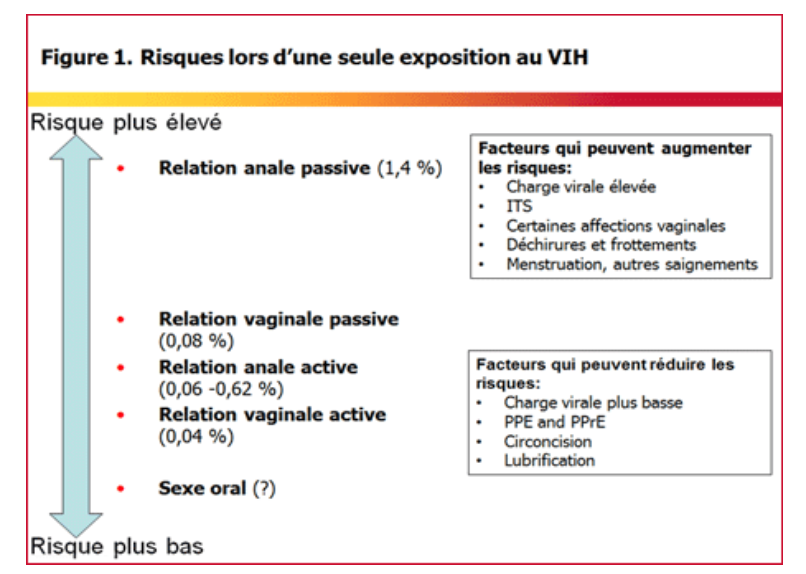
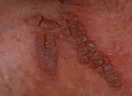

# Sexe anal et santé

## Introduction

La sexualité anale englobe toute pratique sexuelle de pénétration ou de stimulation de l’anus (sodomie, anulingus, massage prostatique, « pegging », fist-fucking, etc.).

Le sexe anal peut donc concerner tout être humain quel que soit son sexe biologique et la nature de ses organes génitaux. Il peut s’agir aussi bien d’une pratique hétérosexuelle qu’homosexuelle, d’une pratique solitaire comme de rapports sexuels à deux ou plus. A toutes celles et ceux qui douteraient de la dimension « naturelle » du sexe anal, notons que celui-ci, tout comme l’homosexualité, concerne également une partie du règne animal.

Sans surprise, la pratique anale la plus documentée dans les textes anciens et contemporains et la plus significativement associée au sexe anal est la sodomie. Si cette pratique a toujours existé dans les sociétés humaines, elle a souvent été pénalisée ce qui explique un certain nombre de tabous qui l’entourent aujourd’hui encore.

C’est également une de celles qui comporte le plus de risques infectieux, elle est donc la plus discutée dans le monde médical et scientifique. Pour toutes ces raisons cette pratique sera davantage évoquée ici que les autres pratiques sexuelles anales.

Selon l’OMS « _la santé sexuelle s'entend comme une approche positive et respectueuse de la sexualité et des relations sexuelles, ainsi que comme la possibilité de vivre des expériences sexuelles agréables et sûres, exemptes de coercition, de discrimination et de violence_ ». C’est la raison pour laquelle nous aborderons ici non seulement les risques du sexe anal et les façons de les prévenir ou de les réduire, mais aussi le plaisir et des clés pour l’atteindre en toute sécurité.

## Le sexe anal dans les sociétés

### La sodomie dans l’Histoire : une pratique longtemps (mais pas toujours) pénalisée

Pratique parfois considérée comme déviante puisque ne menant pas à la reproduction et entourée des tabous liés aux fonctions excrétrices, surtout dans les civilisations où ces fonctions naturelles sont jugées honteuses, **la sodomie est perçue de manière très diverse selon les sociétés et les religions**.

La sodomie entre hommes, si elle ne fut pas la pratique sexuelle privilégiée, fut pratiquée dans la Grèce antique comme dans la Rome antique, dans le cadre d'un rapport sexuel entre un homme plus âgé, le maître, actif, et son élève, passif, plus jeune. Elle était alors considérée comme une façon de transmettre le savoir.

**En Occident, il faut attendre les 13e et surtout 14e et 15e siècles** pour assister à une condamnation de la sodomie et des rapports homo-érotiques, en général par les Églises, en parallèle des débuts de la sacralisation du mariage. Cependant, cette condamnation essentiellement morale ne débouche que rarement sur une pénalisation active des pratiques, sauf dans les cas aggravés (viol, pédophilie, utilisation politique ou en cas de trouble avéré à l'ordre public). Une des premières lois la réprimant est la « loi de 1533 sur la Bougrerie » introduite par Henri VIII en Angleterre.

**Sous l'Inquisition espagnole des 16e et 17e siècles,** la sodomie est considérée comme un « péché abominable », qualifiée de « parfaite » si elle est le fait de deux hommes et « imparfaite » (donc moins grave) si elle est le fait d'un homme et d'une femme.

Le terme inclut secondairement d'autres pratiques sexuelles, telles que fellation, cunnilingus, masturbation, etc. La sodomie peut valoir à ses auteurs le bûcher, les galères, la prison à vie ou pour plusieurs années, le bannissement, des pénitences diverses ou simplement le fouet en public, selon la gravité de l'acte soigneusement pesée par les inquisiteurs. Cependant, dans ce domaine, la justice civile est encore plus sévère et plus expéditive.

En 1750, l'affaire « Diot-Lenoir » voit la dernière peine capitale appliquée contre des « sodomites » en France : Jean Diot et Bruno Lenoir, pris en flagrant délit de sodomie en pleine rue, sont étranglés et brûlés publiquement en place de Grève, à Paris. Cette affaire fait cependant figure d'exception, car dans les faits la plupart des procédures pour sodomie à l'époque se soldent par une simple remontrance et les procès aboutissant à une condamnation sont extrêmement rares et généralement le fait de circonstances aggravantes.

En 1791, en pleine Révolution, la France est le premier pays à décriminaliser l'homosexualité, l'Assemblée nationale législative ne retenant pas le « crime de sodomie » dans la loi.

Au Canada, la loi anti-sodomie est révoquée en 1969 par Pierre Elliott Trudeau ; elle demeure néanmoins régie par le code criminel (article 159) où il est stipulé que la sodomie est interdite entre personnes âgées de moins de 18 ans et que sa pratique doit avoir lieu dans l'intimité. Plusieurs états des États-Unis ont des lois prohibant la sodomie jusqu’à notre époque, tandis qu'en Inde elle est réprimée par la section 377 du Code pénal de 1860.

**De nos jours, certains pays criminalisent toujours la sodomie entre adultes consentants**, allant même jusqu’à requérir la peine de mort (un peu moins d'une dizaine de pays encore à ce jour). D'autre part, ces interdictions peuvent être remplacées par celle de l'homosexualité de manière générale.

### La sodomie aujourd’hui : une pratique de moins en moins marginale

En 2007, quinze ans après la deuxième enquête nationale sur le comportement sexuel des Français (ACSF, 1992), l'Inserm, l'ANRS et l'Ined ont réalisé une enquête « Contexte de la sexualité en France » auprès des 18-69 ans. Selon celle-ci, **37 % des femmes et 45 % des hommes avaient une expérience de la sodomie** (contre respectivement 24 % et 30 % en 1992. Toutefois, la pratique restait marginale puisque 12 % des femmes de 25-49 ans disaient la pratiquer souvent ou parfois. L'analyse détaillée de l'enquête ACSF montrait que la sodomie n'était pratiquée qu'avec une fréquence de 1 à 3 % au cours d'un rapport sexuel.

**Le principal déterminant de la pratique de la sodomie est la « précocité » sexuelle.**&#x20;

_En France,_ l'enquête ACSF a montré que la sodomie est d’autant plus pratiquée que les rapports sexuels ont été plus précoces : parmi les femmes de 25 à 34 ans, 44 % des « précoces » ont expérimenté cette pratique, contre 25 % des « tardives ».

_Aux États-Unis,_ la sodomie n'est pas non plus entrée dans les pratiques régulières des Américains : 9 % des personnes interrogées lors de l'enquête nationale _National Health and Social Life Survey_ (NHSLS, conduite en 1992) disaient avoir eu un rapport anal au cours de l'année écoulée, et seulement 2 % des hommes et 1 % des femmes lors de leur dernier rapport sexuel. Des chiffres similaires à ceux de l'étude nationale australienne [ASHR](https://fr.wikipedia.org/w/index.php?title=ASHR\&action=edit\&redlink=1) conduite en 2001-2002 : 0,9 % des hommes et 0,7 % des femmes âgés de 16 à 59 ans avaient pratiqué la sodomie lors de leur dernier rapport sexuel.

Dans l'enquête américaine NHSLS, parmi les 18-44 ans, 5 % des femmes trouvaient la sodomie (réceptive) attractive ; chez les hommes, 14 % étaient attirés par la sodomie insertive et 11 % par la sodomie réceptive. Toujours chez les 18-44 ans, 18 % des femmes (22 % des hommes) trouvaient attirant le fait d'avoir leur anus stimulé par le doigt de leur partenaire, cependant que 13 % des femmes et 26 % des hommes étaient attirés-es par le fait de stimuler l'anus de leur partenaire.

_Au Royaume-Uni,_ selon l'étude National Survey of Sexual Attitudes and Lifestyles répétée en 1990, 2000 et 2010, la sodomie est une pratique en nette augmentation dans la population hétérosexuelle. La part des personnes interrogées ayant pratiqué la sodomie au cours de l'année écoulée était respectivement de 7,0 %, 12,2 % puis 17,0 % chez les hommes, et de 6,5 %, 11,3 % puis 15,1 % chez les femmes. Cette augmentation était plus importante chez les plus jeunes.

Contrairement à une idée reçue, **la sodomie n'est pas une pratique banale ou systématique au sein de la population homosexuelle masculine**. Dans une étude de 2011, menée par l'université de l'Indiana et la George Mason University aux Etats-Unis, seules 35 % des personnes homosexuelles interrogées affirmaient avoir pratiqué la sodomie au cours de leur dernier rapport sexuel. La fellation (pratiquée à 72,7 %) et la masturbation mutuelle (pratiquée à 68,4 %) seraient des pratiques nettement plus courantes.

## Protéger et prendre soin de son anus

### Les risques

La pratique du sexe anal comporte un certain nombre de risques infectieux et physiques qu’il importe de bien connaître pour les éviter au maximum ou y faire face lorsqu’on y est confronté.

#### **Des risques infectieux non spécifiques mais renforcés**

Toutes les IST se transmettent par voie anale, qu’ils s’agissent de virus (VIH, VHB, VHC, HPV, herpès, Mpox) ou de bactéries (syphilis, gonocoque, chlamydia, LGV).

Ces agents infectieux ne sont pas spécifiquement lié au sexe anal, ils se transmettent aussi par voie vaginale, parfois même buccale.

En revanche, **le risque d’infection au niveau anal est renforcé**, surtout dans les relations anales réceptives (ou passives) comme indiqué ci-dessous pour le VIH

_**Pourquoi ce risque augmenté** ?_ Parce que la muqueuse anale est beaucoup plus fine que la muqueuse vaginale, qu’elle est fortement vascularisée (présence de nombreux vaisseaux sanguins), elle est donc facilement sujette aux lésions et aux micro-coupures qui laissent passer les agents infectieux dans l’organisme.

Les infections au niveau anal, lorsqu’elles ne sont pas traitées rapidement, peuvent parfois se compliquer en fistule ou en abcès.

#### Des risques spécifiques aux relations bucco-anales : Hépatite virale A, Shigella

Il existe également des infections **spécifiques à la sexualité anale** : l’**hépatite A** (causée par le VHA) et la **shigellose** (causée par les bactéries shigella). Elles sont causées par des agents infectieux qui se transmettent généralement par voie fécale-orale, c’est-à-dire lorsqu’une personne non infectée ingère de l’eau ou des aliments contaminés par les matières fécales d’un sujet infecté. Ainsi, les pratiques oro-anales comme l’anulingus - même si l’anus est en apparence propre - peuvent être vectrices de transmission.

Dans la très grande majorité des cas, les symptômes de ces deux maladies sont comparables à une tourista ou à une gastro-entérite et passent en quelques jours. Pendant cette période, il est recommandé de bien s'hydrater, de manger des aliments qui ralentissent le transit comme le riz et, bien entendu, d’éviter les parties de jambes en l’air.&#x20;

#### Les complications spécifiques du HPV au niveau anal : cancer et condylomes

Les Papilloma Virus Humains (HPV) sont des virus très fréquents, il en existe plus de 150 types. Ils peuvent infecter la peau et les muqueuses et être responsables de lésions bénignes ou malignes. La transmission se fait quasiment exclusivement par contact sexuel.


[les-infections-a-papillomavirus-humain.md](les-infections-a-papillomavirus-humain.md)


**La plupart des infections par les papillomavirus ne donnent aucune lésion**. Dans 90 % des cas, l’infection est transitoire et s’élimine naturellement en une à deux années après la contamination sexuelle.

Dans 10 % des cas, l’infection persiste et peut entraîner des anomalies (lésions) au niveau de la muqueuse du col de l'utérus et de l’anus. On parle alors de lésions précancéreuses. Ces lésions peuvent évoluer vers un **cancer** 10 à 15 ans après l’infection par le virus.

Le HPV sont également responsables de **condylomes**. Les condylomes sont de petites excroissances qui ressemblent à des verrues sur les organes génitaux, le périnée et l’anus mais aussi la bouche, l’urètre, le vagin ou sur le col de l’utérus. Les condylomes se manifestent parfois plusieurs années après la contamination et ne sont pas toujours visibles à l'œil nu. Lorsqu'ils le sont, ils peuvent être plats, surélevés en forme de crêtes de coq (d’où le nom qu’on donnait à cette IST), de couleur rosée ou grisâtre. Ils entraînent parfois des démangeaisons ou des saignements lors des rapports sexuels.&#x20;

<figure><figcaption>
Condylomes
</figcaption></figure>

#### Le risque physique principal : la fissure anale

Le principal risque physique d’une sexualité anale est la fissure anale.

Il s’agit d’une dégradation de la peau autour de l'anus. Une fissure peut apparaître à la suite de pratiques sexuelles réalisées trop rapidement, trop violemment et sans lubrifiant, par exemple. Dans certains cas, la fissure peut être hémorragique si elle touche le système hémorroïdaire, provoquant ainsi de grosses douleurs.

Les hémorroïdes ne sont pas provoquées par le sexe anal. Si on a une maladie hémorroïdaire un peu développée, la sexualité anale peut déclencher des symptômes (douleurs, saignements). Mais en l’absence de maladie hémorroïdaire, il n’y a aucun problème.

### La prévention : pour éviter certains risques

La prévention ou la réduction des risques dans la sexualité anale recoupe largement la prévention sexuelle générale. Ce chapitre se concentrera donc davantage sur les spécificités de la prévention dans le sexe anal.

#### Préservatifs, gel lubrifiant, digue dentaire, gants, etc.

Comme dans les rapports vaginaux ou oraux, l’utilisation de **préservatifs externes ou internes** pour les rapports anaux réduit de façon importante les risques de transmission des différentes IST. Le préservatif interne (parfois appelé « préservatif féminin ») peut en effet s’utiliser pour les pratiques anales. Il suffit pour cela d’enlever l’anneau intérieur.

En cas d’anulingus il est possible d’utiliser une **digue dentaire** ou un **carré de latex**, cela peut notamment réduire les risques de transmission de la syphilis ou de l’hépatite A.

Pour la pratique du fist, les **gants en latex** permettent d’éviter la transmission du VIH ou de l’hépatite C en cas de saignement. Dans cette pratique les gants ont également l’avantage de recouvrir les ongles. Là encore, l’utilisation de gel (spécial fist de préférence) est indispensable pour éviter douleur et saignement. Eviter l’utilisation de pots de gel collectif (préférer d’autres types de conditionnement ou avoir son propre lubrifiant).


Le [**fist-fucking**](../glossaire.md#f) (terme argotique anglais signifiant « foutre avec le poing ») est une pratique sexuelle consistant à pénétrer (_fuck_) le vagin ou le rectum avec le poing (_fist_).


Pour les mêmes raisons, il est préférable d’éviter le partage de jouets sexuels (ou d’y mettre un préservatif que l’on change à chaque changement d’utilisateur) et d’utiliser son propre embout de douche ou sa propre poire pour faire un lavement anal.

Le gel lubrifiant : l’anus ne se lubrifiant pas naturellement en cas d’excitation, il est particulièrement important d’utiliser du gel lubrifiant en cas de pénétration anale pour éviter toute rupture de préservatif mais aussi pour prendre plus de plaisir.

Sans préservatif, le gel permet également de réduire les risques de transmission en limitant les micro-saignements qui peuvent être à l’origine de la transmission d’IST.

Si la salive est communément utilisée, son efficacité réduite dans le temps n’en fait pas le lubrifiant idéal. Une attention particulière doit donc être portée au choix du produit. Gras, il aura l’inconvénient d’altérer l’étanchéité et la résistance des préservatifs ou, parfumé, celui d’irriter les muqueuses.

**Les meilleurs produits sont les gels à base d'eau, incolores et inodores ou ceux à base de silicone**. Sont déconseillées les crèmes lubrifiantes anesthésiantes. Il en existe plusieurs sur le marché. L'anesthésie de la zone, pour confortable qu’elle soit, interdit de percevoir les signaux d'alerte et fait courir des risques dont les conséquences fâcheuses ne se révèleront qu’une fois son action dissipée. Par ailleurs, ces crèmes sont conçues pour annihiler toutes sensations, ce qui dans le cadre d'une quête de plaisir est par principe contreproductif.

En tout état de cause, la douleur doit questionner le désir de sodomie et ou la qualité de sa préparation ou de sa réalisation.

#### Se regarder, se toucher&#x20;

S’observer et se toucher c’est important. Pour prendre du plaisir certes, mais aussi et surtout pour vérifier si tout va bien. On peut ainsi découvrir une excroissance, une tache, une douleur qui n’est pas habituelle et qui peut être le symptôme d’une maladie ou d’une infection.

Cela s’applique à de nombreuses parties du corps que nous avons l’habitude de voir tous les jours. L’emplacement de l’anus fait qu’on y pense moins et que c’est moins facile. Mais avec un miroir et un peu de souplesse c’est possible !

Certaines associations distribuent de petits miroirs portatifs appelés « Mat’Anus » qui permettent de se regarder l’orifice sans avoir à se tordre le cou. Ça marche aussi avec un petit miroir de retouche maquillage !

Au toucher on peut également se rendre compte que quelque chose cloche. Des petits boutons en nombre peuvent être synonymes de condylomes, une ulcération ferme et indolore évoquera plutôt le chancre d’une syphilis et une excroissance douloureuse plutôt une hémorroïde…

Bien sûr **rien ne vaut le diagnostic d’un médecin** mais cela peut vous mettre sur la piste et vous alerter pour prendre un rendez-vous médical et faire un check-up.

#### TasP et PrEP pour le VIH&#x20;

Pour éviter la transmission du VIH dans les rapports anaux, la **PrEP** et le **TasP** ont largement prouvé leur efficacité. ( RENVOYER

#### Vaccination : VHA, VHB, Mpox

Il serait dommage de se priver des rares vaccins dont nous disposons dans le champ de la santé sexuelle !

Quand on a une sexualité très active et/ou qu’on fait partie des publics les plus exposés, **il est recommandé de faire certains vaccins en plus de ceux déjà recommandés pour la population générale** : VHA, VHB (désormais obligatoire pour les enfants), Mpox et HPV (voir ci-dessous).

#### La vaccination HPV

Les préservatifs protègent imparfaitement contre l’infection à HPV car ils ne couvrent pas l’intégralité des parties génitales. **Seule la vaccination des jeunes filles et garçons (idéalement avant l’âge du premier rapport sexuel) protège contre les HPV**.

<figure><figcaption>
Tableau des vaccinations
</figcaption></figure>

La vaccination HPV ne fait pas partie des 11 vaccinations obligatoires mais est fortement recommandée pour :

* Toutes les jeunes filles (depuis 2007) et également tous les garçons (depuis 2021) âgés de 11 à 14 ans révolus. Le vaccin est d'autant plus efficace que les jeunes filles et les jeunes garçons n'ont pas encore été exposés au risque d'infection par les HPV.
* En rattrapage, pour les personnes des deux sexes de 15 à 19 ans révolus non encore vaccinées.
* Les hommes ayant des relations sexuelles avec des hommes (HSH), jusqu’à l’âge de 26 ans révolus en prévention des lésions précancéreuses anales, des cancers anaux et des condylomes (petites verrues).

Deux vaccins sont utilisables :

* un vaccin bivalent (qui protège contre les virus de types 16 et 18) : Cervarix® ;
* un vaccin nonavalent : Gardasil 9®, qui protège contre les HPV de type 6, 11, 16, 18, 31, 33, 45, 52 et 58,  en cause dans 90 % des cancers du col de l'utérus, 80 % des cancers de l’anus et 90 % des verrues anogénitales (condylomes).

Ces vaccins ne sont pas interchangeables et toute vaccination initiée avec l'un d'eux doit être achevée avec le même.

Le Haut Conseil de la santé publique (HCSP) recommande que toute nouvelle vaccination soit initiée avec le vaccin Gardasil® 9 pour les personnes non antérieurement vaccinées.

La prescription et la vaccination contre le HPV (papillomavirus) peuvent être réalisées par les pharmaciens, sages-femmes et infirmiers.

La France accuse un retard important en terme de vaccination des enfants mais aussi des jeunes adultes.

### Le dépistage : passage obligé 

#### Des dépistages réguliers, même sans symptômes

Lorsqu’on est régulièrement exposé aux risques sexuels (multi partenariat, appartenance à des publics fortement exposés) **il est important de faire des dépistages réguliers des IST, même sans symptômes**.

En effet beaucoup d’infections au niveau rectal sont asymptomatiques. En se faisant dépister régulièrement on accroit la probabilité de détecter des infections plus précocement, donc de pouvoir les traiter et ainsi éviter d’éventuelles complications pour les personnes concernées mais également leur transmission à d’autres personnes.

A titre d’exemple, pour le VIH, la Haute Autorité de Santé recommande un dépistage tous les 3 mois chez les HSH et tous les ans pour les personnes usagères de drogues ou nées dans des zones à forte prévalence comme l’Afrique sub-saharienne.

#### Des dépistages complets : prise de sang + prélèvement locaux sur les « 3 sites »

En plus de la régularité il est important que le dépistage soit complet : il ne doit pas se limiter à la prise de sang car celle-ci ne peut pas détecter certaines infections courantes comme la gonorrhée ou la chlamydiose.

**Le dépistage doit donc également se faire par prélèvement ou auto-prélèvement local sur les 3 sites (gorge, anus, organes génitaux).**

Pour anus et gorge il faut autant que possible favoriser l’auto-prélèvement. Pour les organes génitaux on sait désormais que l’analyse du premier jet d’urine suffit : pas besoin de prélèvement intra-urétraux douloureux et pénibles.

En cas d’infection, le prélèvement rectal est souvent révélateur chez les HSH, plus que le prélèvement pharyngé ou le premier jet d’urine. On peut ici citer le Pr Charles Cazanave (Smit CHU Bordeaux) _« C’est l’anus qui parle le plus »._

### La consultation de proctologie

La proctologie est une spécialité de la gastro-entérologie qui s’intéresse aux **maladies de l’anus et du rectum.**

**La consultation de proctologie est recommandée chez les publics les plus exposés au risque de cancer lié au papillomavirus, même en l’absence de symptômes**. Cette consultation préventive permet de détecter précocement la présence de souches d’HPV cancérogènes.

La consultation de proctologie peut être réalisée par un médecin généraliste formé à cette pratique (par exemple dans un Cegidd ou un centre de santé sexuelle).

Evidemment il est également possible d’avoir recours à un-e médecin spécialisé en proctologie ou « proctologue ».

## Le plaisir

### Les préalables à toute pratique sexuelle : le désir et le consentement

Le sexe anal peut être aussi douloureux qu’intensément agréable. Le désir est un facteur primordial de réussite de cette expérience. En préambule de toutes recommandations devrait s'énoncer que l'**on ne s'essaie pas à la sodomie dans la crainte et uniquement pour contenter un partenaire particulièrement demandeur**, mais que l'on s'y livre sur la base d'une excitation pleine et entière ou d'une curiosité authentique.

Une publication, parue dans « The Journal of Sexual Medicine », a montré que les qualités de confiance, de connexion émotionnelle, d’intimité et de curiosité sont les principaux déterminants d'une perception positive de la sodomie.

Le sexe anal fait partie du registre des possibles, mais jamais des obligatoires. Il serait trompeur de prétendre que l’accomplissement érotique se joue à l’aune de cette pratique. La réussite du projet érotique est avant tout liée à la complicité et la capacité des amants-es à s'émouvoir. C’est à chacun de trouver en conscience la voie qui convient pour que les vécus érotiques soient équitablement porteurs de jouissance et de satisfaction émotionnelle.

### **C**omprendre l’anatomie de l’anus

Pour ressentir plus de plaisir et éviter les risques, il peut être utile de bien comprendre l’anatomie de l’anus.

**L’anus** est situé à l’extrémité du canal anal, dans le prolongement de l’intestin, et se compose de nombreuses couches de tissu extrêmement fin. L’intérêt majeur, c’est que ces couches sont remplies de terminaisons nerveuses et de vaisseaux sanguins. C’est d’ailleurs l’une des zones les plus riches en terminaisons nerveuses, dans le corps masculin comme dans le corps féminin, en dehors bien sûr du clitoris et du frein du pénis. L’anus est au moins aussi sensible que le vagin ou la hampe du pénis.

Deux muscles, **les** **sphincters**, contrôlent l’ouverture de l’anus. Le premier est situé à l’extérieur, permettant ainsi de contrôler l’ouverture et la fermeture de l’anus. Le second, le sphincter interne fonctionne de lui-même, de manière mécanique et en dehors de notre propre volonté. Les sphincters font partie du plancher pelvien, tout comme les muscles du périnée et les muscles PC (pubo-coccygiens). Les sphincters sollicitent donc ces derniers et vice-versa. Les muscles PC se contractent involontairement au moment de l’orgasme. Ce sont eux qui permettent de faire bouger son pénis lorsqu’il est en érection, ou encore de serrer son vagin. Le **périnée**, lui, améliore le niveau de plaisir et d’orgasme grâce au travail de ses muscles.

Concernant le **canal anal**, il est composé de ces mêmes tissus et se déploie sur 3 à 5 cm. On trouve ensuite le rectum qui prolonge le canal anal sur une quinzaine de centimètres. Le rectum est de forme courbée et ne sert que de canal pour faire transiter les selles. C’est le côlon sigmoïde qu’on trouve dans le prolongement du rectum qui se charge de retenir les selles.

### Apprendre le relâchement_,_ explorer en solo et stimuler en douceur

Quand, malgré une bonne lubrification, un partenaire attentionné et un désir véritable, les sensations douloureuses font obstacle, il est conseillé de pratiquer quelques exercices de dilatation : quelle que soit la méthode choisie (doigté, godemichet, sextoy) **la douleur ne doit jamais s’inviter**. L’idée n’étant pas d’apprendre à la supporter, mais à trouver le relâchement psycho-physique qui conduit à la volupté. Pour ce faire, il est essentiel d'adopter une respiration lente et profonde. L’idéal est sans doute de s’exercer en solitaire, de manière à garder une totale maîtrise de l’approche et de la gestuelle. Il peut aussi être envisagé d’utiliser ses doigts ou un sextoy afin d’habituer l’anus à recevoir un corps étranger.

Les préliminaires à la sodomie ne doivent être ni négligés ni réalisés en mode porno. À défaut d'une mise en condition _ad hoc,_ l'expérience a de fortes chances d'être traumatisante tant sur le plan physique (microfissures anales) que psychique. C'est à chaque personne/couple d'inventer le mode opératoire qui convient pour stimuler le désir et favoriser le relâchement. L’anulingus fait partie des possibles préparatifs à la sodomie. Les réactions du-de la partenaire sont des indicateurs précieux, il-elle ne doit pas hésiter à exprimer clairement ses ressentis, sauf à ce que son amant-e soit en mesure de déchiffrer sa communication implicite.

### Le lavement, un préalable largement apprécié

Le lavement fait partie des préparatifs pour la pratique de la sodomie. Les personnes dites « passives » le réalisent souvent. Pourtant, on trouve rarement d’indications techniques et pratiques pour optimiser cet aspect de votre hygiène intime.

Que vous soyez adepte de la sodomie ou que vous pratiquiez le fist-fucking, l’hygiène anale et rectale aide à se sentir à l’aise pendant l’acte et vous permet de vous concentrer sur votre plaisir et sur celui de votre partenaire.

Ce n’est cependant pas un passage obligé ni une méthode scientifique de réduction des risques sexuels : certaines personnes peuvent avoir d’autres envies et préfèreront une sexualité anale sans lavement.&#x20;


On considère qu’il y a deux types de lavements pour deux types de rapports sexuels :&#x20;

* le lavement anal dit rapide, entre 10 et 30 minutes, lorsque vous avez l’intention de pratiquer une sodomie. Il assure une bonne hygiène de l’anus et du rectum ;
* le lavement complet de plus de 30 minutes, quand vous pensez recevoir un fist-fucking ou utiliser de gros modèles de godemichets. Le lavement complet ira nettoyer au-delà du sigmoïde (le dernier segment du côlon avant le rectum), dans l’ordre dans les côlons descendant, transverse et ascendant. Pour ce lavement, mieux vaut utiliser un tuyau de douche (avec ou sans canule), plutôt qu’une poire à lavement : c’est plus efficace et plus rapide.

Selon le professeur Laurent Abramowitz (gastro-entérologue), **un bon lavement est un lavement qui se fait en douceur**. Le côlon est fragile. Inutile de forcer ou d’être violent : les conséquences peuvent être graves. Quelle que soit la méthode ou le type de lavement choisi, le bon lavement obéit à quelques règles :

* prévoir de faire votre lavement deux heures avant le rapport. Il faut absolument éviter de le faire juste avant le début d’un acte sexuel ;
* pour un lavement anal, introduisez le jet et comptez quelques secondes : l’organisme expulsera naturellement l’eau. Renouvelez l’opération jusqu’à ce que l’eau soit limpide ;
* si vous utilisez une poire à lavement, une seule pulvérisation est suffisante ; l’eau ne doit être ni trop chaude ni trop froide. L’idéal est que la température soit proche de celle du corps, à savoir 37°C ;
* le jet de la douche doit être à basse pression. Lorsque vous retournez le tuyau en hauteur, le jet doit être d’environ 10 centimètres ;
* si vous utilisez une canule vissée sur le tuyau, il faut la lubrifier et, surtout, ne pas l’enfoncer entièrement dans le rectum ;
* pour un lavement complet, introduisez le jet et comptez 30 secondes. Une partie de l’eau va se coincer dans les côlons. Il vous faudra alors expulser cette eau en poussant de l’intérieur et en prenant une position accroupie ou allongée dans votre baignoire (sur le côté gauche), de manière à faire descendre l’eau qui pourrait stagner dans le côlon. Il est important d’avoir en tête l’image de son appareil digestif pour faciliter l’évacuation de l’eau.

**Quand sait-on que son lavement est terminé ?** Les premiers signes de l’efficacité d’un lavement sont d’abord visibles à la fin de celui-ci :&#x20;

* l’eau expulsée doit être claire et limpide ;
* vous ne devez sentir aucune odeur désagréable.

La présence dans les derniers jets d’expulsion de mucus intestinal est normale : elle est le signe de la fin du lavement. Il peut également arriver que vous ayez des flatulences après un lavement. Si une odeur de selles se dégage, c’est que le lavement n’est pas terminé.&#x20;

Il est possible d’utiliser des suppositoires laxatifs pour évacuer ses selles, sans passer par un lavement aqueux. Ce médicament est efficace — il est d’ailleurs utilisé pour préparer les examens endoscopiques rectaux. Il convient de ne pas avoir recours à ce type de traitement pour chaque lavement afin de ne pas créer de dysfonctionnement dans l’expulsion normale des selles et ne pas irriter les muqueuses du rectum.

&#x20;Si vous pratiquez souvent le lavement, favorisez une alimentation riche en fibres. Les fibres jouent un vrai rôle de « nettoyant » des intestins. Ce sont les légumes (lentilles, petits pois, soja…) et les fruits secs qui en contiennent le plus. Certains utilisent du psyllium (déconseillé si vous souffrez de diabète). Le psyllium est disponible en magasin bio ou en pharmacie.




Cette petite BD sur le lavement est libre de droit, elle a été créée par « Blindjaw » et traduite en français par @Sidasol et @David\_Disparos

### La pratique du fist en toute sécurité

Dans le fist-fucking, ce n’est pas la douleur qui est recherchée. Les amateurs de « fist », selon le docteur Michel Ohayon, médecin sexologue, ne se situent pas dans la culture du [BDSM.](https://www.sexosafe.fr/ma-sexualite/pratiques-sexuelles/bdsm-entre-hommes-attache-moi)

Celui qui est pénétré peut certes ressentir des douleurs, comme pour la sodomie, mais contrairement au BDSM, ce ne sont pas elles qui déclenchent le plaisir.&#x20;

Voici quelques recommandations pour allier plaisir et prévention :

* le fisteur doit avoir les ongles bien coupés ;
* ce qui pénètre dans le rectum d’un fisté ne pénètre que dans le sien ;
* lors d’une séance collective de fist, chaque fisteur porte un gant ;
* lors d’une séance collective de fist, chaque fisté dispose de son propre pot de crème lubrifiante ;
* une seule personne met les doigts dans le pot de crème lubrifiante.

&#x20;**La pénétration par la main demande patience et douceur.**

« Le fist est un plaisir qui s’apprend, vient se chercher et peut être subtil, bien plus que la pénétration classique. La recherche n’est pas la dilatation, mais plutôt d’avoir quelque chose à l’intérieur de soi. » - Docteur Michel Ohayon, médecin sexologue

Sources :

* Sexosafe.fr&#x20;
* Sida-info-service.org
* Ameli.fr
* Santé.fr
* Tetu.com
* Wikipedia.org
* Catie.ca
