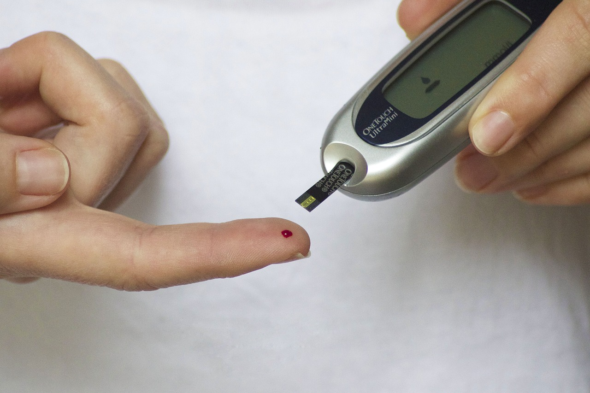

# Sexualité et maladies chroniques, sexualité et handicap

Dans le monde, une personne sur cinq serait affectée par une maladie chronique (ou un handicap).

Les maladies chroniques peuvent être réparties en plusieurs groupes : les maladies cardiovasculaires, le diabète, les cancers et les affections psychiatriques de longue durée en représentent 75%. Un cinquième groupe est composé des affections respiratoires, des insuffisances rénales, des maladies neurodégénératives et des autres maladies.


**Maladies chroniques : définition**

Selon l’OMS (Organisation Mondiale de la Santé), une maladie chronique est une maladie nécessitant des soins à long terme, pendant une période d’au moins plusieurs mois.

On distingue les maladies transmissibles par un agent viral, bactérien ou autre (les maladies infectieuses) et les maladies non transmissibles, telles que le cancer, les maladies cardiovasculaires, le diabète, etc.


Toutes ces maladies peuvent avoir des répercussions, directes ou indirectes, sur la santé sexuelle.

Par leur atteinte sur la fonction sexuelle, qu’elle soit biologique, psychologique ou sociale, les maladies chroniques peuvent altérer les relations affectives et la satisfaction sexuelle des patients et de leurs partenaires. Ainsi, les **troubles sexuels** sont en moyenne **2 à 6 fois plus fréquents** en cas de maladie chronique que dans la population générale.

**Une règle à retenir :**

Il n’existe pas d’exception, toute maladie chronique peut impacter négativement la santé sexuelle. Le simple fait de prendre conscience du caractère faillible et fragile de son corps peut entrainer des troubles du désir, de l’excitation, du plaisir. Ainsi, chez un homme, un excès de cholestérol traité par un comprimé quotidien peut sembler anodin, mais parfois, le doute qu’il installe sur la « performance » du corps et la prise tous les jours du traitement qui rappelle cette vulnérabilité suffisent à installer une dysfonction érectile. A laquelle peut s’ajouter l’effet « mécanique » de la maladie athéromateuse si le cholestérol n’est pas bien équilibré.

**Les maladies agissent de multiples manières sur la santé sexuelle :**

* sur la sphère génitale directement en cas d’atteinte du système hormonal, vasculaire, neurologique...,
* sur le désir/ le plaisir en cas d’atteinte du système nerveux central,
* sur les fonctions corporelles permettant la sexualité (par exemple, altération de la fonction respiratoire ou trouble de la motricité rendant l’activité sexuelle plus difficile à réaliser),
* sur l’image corporelle et l’apparence physique avec le deuil du « corps parfait », prise ou perte de poids, perte d’intégrité physique ou d’autonomie, handicap, marques visibles de la maladie...,
* sur l’estime de soi avec la perte de la capacité à avoir confiance en soi et se considérer comme désirable,
* sur l’intimité avec un corps « à disposition des soignants », notamment en contexte d’hospitalisation ou de séjour en établissements médicalisés,
* sur la disponibilité mentale et émotionnelle compte tenu des nombreux rendez-vous médicaux empêchant la personne de se détendre et d’être en situation de désirer,
* sur la relation avec la/le partenaire avec une lassitude du partenaire aidant, peur face à la maladie du conjoint, réflexe de fuite...

**Ces effets peuvent être liés à la maladie même, aux médicaments et soins reçus, à l’environnement médical imposé par la maladie.**

**Il s’agit véritablement d’une double peine pour les personnes malades :** à la difficulté de vivre avec une condition chronique s’ajoutent des difficultés intimes et/ou affectives, alors même que la sexualité devrait être la zone de liberté de ces personnes, leur terrain de jeu donnant l’opportunité de jouir d’un corps malmené par la maladie et, parfois, les traitements.


**Documenter les maladies chroniques et leurs traitements**

Quand une personne rapporte une dysfonction sexuelle, il est essentiel de documenter son état de santé, de comprendre si elle vit avec des maladies chroniques, les contraintes imposées par celles-ci, de noter scrupuleusement tout médicament reçu (susceptible d’avoir des effets délétères sur la sexualité) et de discuter avec elle des répercussions de son état de santé sur sa sexualité.


<figure><figcaption></figcaption></figure>

**Il faut briser le cercle vicieux**

* **de la maladie entrainant des problèmes sexuels qui entrainent une perte d’estime de soi entrainant une moindre motivation pour se soigner et donc une détérioration de la santé,**
* **et instaurer un cercle vertueux avec une écoute et une prise en charge des problèmes sexuels pour augmenter l’estime de soi elle-même augmentant l’envie de bien se soigner pour augmenter la santé générale, dont la santé sexuelle.**

## **L’exemple du diabète**

<figure><figcaption></figcaption></figure>

Le diabète, quel que soit son type, peut affecter la sexualité de différentes manières. S’il est possible d’avoir une vie sexuelle tout à fait satisfaisante en vivant avec un diabète, il est fréquent, au cours de l’évolution de la maladie, de devoir surmonter certains obstacles pour maintenir une bonne santé sexuelle.

Voici quelques conséquences possibles de la maladie diabétique sur la vie sexuelle et affective :

**- Dysfonction érectile :** les hommes atteints de diabète peuvent être plus susceptibles de développer une dysfonction érectile en raison des dommages causés aux vaisseaux sanguins et aux nerfs.

L’existence d’un diabète, en particulier s’il est mal équilibré, orientera davantage vers une cause organique pour expliquer une dysfonction érectile. A l’inverse, la dysfonction érectile est parfois le symptôme qui permet de découvrir un diabète qui n’était pas connu jusqu’à présent, agissant en véritable signe précurseur ou « sentinelle » de cette maladie (voir chapitre « Dysfonctions sexuelles »).&#x20;


[dysfonctions-sexuelles.md](dysfonctions-sexuelles.md)


La prise en charge d’une dysfonction érectile chez une personne diabétique est comparable à celle de la population générale, mais il existe des études cliniques évaluant des médicaments facilitateurs d’érection spécifiquement dans cette population, ce qui peut conforter le prescripteur (et le patient) dans son choix.

**- Ejaculation rétrograde :** le diabète peut entraîner chez l'homme une éjaculation rétrograde. Au moment de l'éjaculation, le sperme, au lieu de sortir par l'urètre, remonte dans la vessie. L’absence de sperme visible au moment de l’orgasme peut être très perturbante pour certains patients. Il faut insister sur le fait que cette éjaculation rétrograde ne pose aucun problème physiologique et n’altère en rien le désir et le plaisir.

**- Problèmes de lubrification vaginale :** les femmes atteintes de diabète peuvent avoir des problèmes de lubrification vaginale, ce qui peut rendre les rapports sexuels inconfortables voire douloureux. L'utilisation de lubrifiants ou de traitements de fond gynécologiques (selon le contexte) peut aider à résoudre ce problème.

**- Infections génitales** : les personnes atteintes de diabète sont plus susceptibles de développer des infections génitales, telles que les mycoses.

**- Diminution du désir :** certaines personnes atteintes de diabète peuvent éprouver une diminution de la libido, probablement due à des facteurs psychologiques tels que le stress, la fatigue ou la dépression liés à la gestion de la maladie. Cette conséquence des maladies chroniques sur la sexualité est classique et doit être recherchée dans l’entretien avec le patient.

**- Difficultés au sein du couple :** parfois, le conjoint ou la conjointe d’une personne diabétique peut être lassé.e des traitements, des restrictions diététiques ou de l’intrusion de la maladie dans l’intimité du couple. De manière générale, les partenaires de personnes vivant avec une maladie chronique doivent pouvoir exprimer leurs difficultés auprès d’un thérapeute ou d’un sexologue, afin d’être également accompagnés si besoin.

Au-delà de la prise en charge spécifique de la dysfonction sexuelle, le bon équilibre du diabète et le traitement adapté de cette maladie sont les meilleurs remparts contre une altération de la santé sexuelle. Les dysfonctions sexuelles motivent parfois les personnes pour mieux se prendre en charge globalement : ainsi, une dysfonction érectile peut conduire un homme à respecter scrupuleusement les conseils d’hygiène de vie car la préservation de cette fonction est particulièrement motivante pour lui.

<figure><figcaption></figcaption></figure>

Les maladies cardiovasculaires type hypertension artérielle, maladie athéromateuse et événements vasculaires (infarctus du myocarde, accident vasculaire cérébral, artériopathie des membres inférieurs...) peuvent également avoir des conséquences sur la santé sexuelle, et être associées à un diabète. Dans tous les cas, le parfait contrôle de ces maladies est nécessaire pour préserver la fonction sexuelle.

## **L’exemple du cancer**

Si, parce qu’ils touchent des organes importants dans la sexualité, le cancer du sein et le cancer de la prostate vont affecter, à un moment du parcours de soin, la sexualité d’une grande majorité de personnes, il ne sont pas les seuls : tous les cancers peuvent avoir un impact, direct ou par leur traitement, sur la sexualité.

D’une part, le cancer véhicule encore une image mortifère malgré les immenses progrès faits dans les traitements et les chances de guérison. Cette image est aux antipodes de la pulsion de vie qui sous-tend la sexualité.

D’autre part, les traitements prescrits ont souvent des effets directs sur les organes génitaux (notamment sécheresse voire atrophie vaginale, ou dysfonction érectile suite à une chimiothérapie ou une radiothérapie). Des référentiels ont été publiés par l’Association Francophone pour les Soins Oncologiques de Supports (AFSOS – lien en bas de ce chapitre) et soulignent que **tous les patients, tous les cancers, tous les traitements sont potentiellement concernés quand il s’agit de fonction sexuelle.**

.png>)

Souvent, les personnes touchées par le cancer n’osent pas évoquer avec leur oncologue les dysfonctions sexuelles qui sont apparues. Elles craignent son jugement sur des préoccupations qui pourraient sembler futiles - ce qui est infondé, les oncologues étant de plus en plus conscients de l’importance de préserver le mieux possible une bonne santé sexuelle.

Un accompagnement sexologique devrait, en théorie, pouvoir être proposé à ces patients, afin de préserver une bonne estime de soi et mieux tolérer les traitements et leurs effets indésirables potentiels sur les organes génitaux.

## **L’exemple des maladies mentales**

Les maladies mentales ont souvent de lourdes répercussions sur la sexualité.

Le développement de la sexualité chez les patients atteints de **schizophrénie**, particulièrement lorsqu’il y a prédominance de symptômes négatifs, de troubles du contact et de retrait social, peut être entravé. Dans le cadre des symptômes positifs de la schizophrénie, on peut observer des délires érotomaniaques ou des délires liés à l’identité sexuelle, ainsi que des hallucinations cénesthésiques (sens du toucher) de nature sexuelle. Les antipsychotiques engendrent des troubles sexuels à travers plusieurs mécanismes, tels que l’hyperprolactinémie et leur effet antidopaminergique, mais également par leur effet antiadrénergique, antihistaminique, et antimuscarinique. Les hommes relatent surtout des troubles érectiles ou une éjaculation retardée, mais aussi une diminution du désir. Les femmes rapportent surtout des troubles du désir et de l’orgasme, mais aussi des dyspareunies (douleurs lors de la pénétration).

**Les épisodes dépressifs** sont caractérisés notamment par une réduction du désir sexuel. Les antidépresseurs peuvent présenter des effets secondaires sur la sexualité, dont les plus connus sont l’éjaculation retardée, l’anorgasmie, le trouble érectile et la diminution du désir sexuel. Dans les **épisodes maniaques,** une désinhibition sexuelle peut mettre la personne en danger, physiquement et psychiquement.

**L’anxiété** concernant la performance sexuelle ou les enjeux relationnels associés, tels que l’intimité ou le rejet de la part du partenaire, peut induire des troubles sexuels et l’évitement de la sexualité.

Enfin, pour citer un dernier exemple, les **troubles des conduites alimentaires** s’accompagnent souvent de dysfonctions sexuelles : par exemple, une absence de désir voire un dégoût pour la sexualité chez les personnes souffrant d’anorexie.

**Ainsi, les conséquences des maladies mentales sur la sexualité présentent plusieurs caractéristiques :**

* elles sont très fréquentes,
* elles sont souvent autant liées à la maladie qu’au traitement prescrit,
* elles couvrent tout le champ des dysfonctions sexuelles,
* elles posent parfois la question de la sexualité en institution, chez les personnes hospitalisées à répétition en service psychiatrique ou lieux de soins pour la santé mentale.

## **L’exemple du VIH**

Les effets délétères de la vie avec le VIH sur la santé sexuelle sont connus depuis plusieurs décennies, mais l’urgence vitale de contrôler le virus avait fait passer cette dimension au second plan. Avec les traitements efficaces disponibles aujourd’hui et une espérance de vie non-entravée par l’infection lorsqu’elle est parfaitement contrôlée, les soignants intègrent de plus en plus la dimension « santé sexuelle » dans leur prise en soin globale.

Ainsi, la **perte d’estime de soi** parfois consécutive à la découverte d’une séropositivité pour le VIH peut s’accompagner de troubles du désir, de dysfonction érectile ou d’absence de plaisir. Il est important de pouvoir rassurer les personnes sur leur avenir, notamment intime, affectif et sexuel. Le fait de pouvoir leur expliquer qu’**une personne vivant avec le VIH correctement traitée ne peut en aucun cas transmettre le virus** (résumé en I = I, soit une charge virale Indétectable rend le virus Intransmissible) aide souvent à lever des blocages et des craintes dans les rapports amoureux.

L’une des caractéristiques du VIH étant sa transmission sexuelle, il est compréhensible de voir des liens s’établir implicitement dans l’esprit des personnes vivant avec ce virus (et notamment chez celles l’ayant contracté par voie sexuelle) entre **sexualité, maladie et danger**. Ces questions doivent pouvoir être discutées pour **rétablir une vision optimiste de la sexualité.**

Enfin, des **craintes sur les effets indésirables des traitements antirétroviraux sur la sexualité** sont parfois exprimées. Il faut donner de l’information, savoir écouter et déceler une « perte de confiance » envers le traitement, même si celui-ci n’a pas d’effet néfaste, car cette croyance peut entrainer des défauts d’observance du traitement, avec pour conséquence une mise en danger de la personne et de ses partenaires ?.

## **Les effets indésirables des médicaments**

Dans les chapitres précédents ont été donnés des exemples de médicaments dont les effets indésirables potentiels sur la fonction sexuelle sont clairement identifiés.

Voici quelques « classiques » dans ce domaine :

**- Médicaments cardiovasculaires :** certains médicaments utilisés pour traiter l'hypertension artérielle, tels que les bêta-bloquants et les diurétiques, peuvent causer des problèmes d'érection chez les hommes et réduire la libido chez les hommes et les femmes.

**- Hormones :** les contraceptifs oraux, les traitements hormonaux substitutifs et les médicaments contre le cancer de la prostate ou du sein peuvent affecter la libido, la lubrification vaginale et la fonction érectile.

**- Médicaments psychotropes :** _voir le paragraphe « Exemple des maladies mentales »_.

Certains antidépresseurs, en particulier ceux de la classe des inhibiteurs sélectifs de la recapture de la sérotonine (ISRS), peuvent entraîner une diminution de la libido, des difficultés à atteindre l'orgasme ou des problèmes d'érection chez les hommes.

Cependant, il existe d'autres classes d'antidépresseurs qui peuvent avoir moins d'effets indésirables sexuels, et il est souvent possible de trouver un médicament qui convient mieux sur le plan sexuel. Certains antipsychotiques utilisés dans la schizophrénie peuvent causer des problèmes sexuels tels qu’une diminution de la libido, des problèmes d'érection et des troubles de l'éjaculation.

**- Médicaments contre le cancer :** les chimiothérapies et l'hormonothérapie peuvent entraîner des effets indésirables sexuels tels que la diminution de la libido, la sécheresse vaginale, des problèmes d'érection.

N’oublions pas qu’un effet indésirable qui semble anodin peut gravement nuire à la qualité de vie sexuelle de la personne : ainsi, l’éjaculation rétrograde induite par certains médicaments (prescrits par exemple dans l’hypertrophie bénigne de la prostate) est parfois très mal vécue par les patients**.**


**Effets indésirables des médicaments sur la fonction sexuelle ?**

Dans tous les cas, il faut :

* faire la liste de tous les traitements pris par la personne, quelle que soit leur voie d’administration, sans oublier les médicaments achetés librement en pharmacie ou sur internet,
* retracer la chronologie des troubles sexuels par rapport au début de la prise de ces traitements,
* chercher et donner en toute transparence l’information disponible sur l’impact, direct ou indirect, du traitement sur la fonction sexuelle,
* si la personne reste convaincue d’un lien direct entre le médicament et ses difficultés sexuelles malgré l’absence de preuve formelle sur un plan scientifique, s’efforcer d’adapter le traitement pour en favoriser l’observance.


## **Handicap et sexualité**

Il faut évidemment distinguer maladie chronique et handicap, l’une pouvant entrainer l’autre, mais une personne handicapée n’est évidemment pas malade du fait de son handicap.

Commençons par nous poser la question : qu’est-ce qu’un handicap ? En France, la loi pour l’égalité des droits et des chances, la participation et la citoyenneté des personnes handicapées du 11 février 2005 définit le handicap de la façon suivante :

> _« Constitue un Handicap, toute **limitation d'activité ou restriction** de participation à la vie en société subie dans son environnement par une personne en raison d’une **altération** substantielle, durable ou définitive d’une ou plusieurs fonctions physiques, sensorielles, mentales, cognitives ou psychiques, d'un polyhandicap ou d'un trouble de santé invalidant. »_

On distingue différents types de handicaps : physiques, moteurs, liés aux sens (visuel, auditif), mentaux, psychiques... et certains handicaps sont dits invisibles : le handicap invisible est un handicap non détectable, qui ne peut pas être remarqué si la personne concernée n'en parle pas. Le trouble dont elle souffre impacte pourtant sa qualité de vie. Le handicap invisible est un concept complexe et s'applique dans bien des situations de handicap (sensoriel, psychique, cognitif).

On retient donc dans le handicap _la notion de limitation ou restriction d’activité,_ et la santé sexuelle peut évidemment en être impactée, de multiples manières.

Dans le cadre d’une paraplégie (paralysie des membres inférieurs et supérieurs si l’on parle de tétraplégie) liée à une atteinte de la moëlle épinière, le niveau lésionnel conditionnera les conséquences physiologiques sur la sexualité. Erections et lubrifications vaginales sont plus facilement obtenues lors de lésions médullaires incomplètes et/ou hautes, supérieures à D10-L2 avec un centre sacré préservé. Tous niveaux lésionnels confondus, on estime qu’un homme sur deux peut avoir une érection sans aide médicale. Il faut dans tous les cas que le sujet soit abordé, que tous les détails pratiques soient envisagés (peur de ne pas retenir ses urines ou ses selles pendant un coït, pose du préservatif chez une personne tétraplégique par exemple).

Il faut aider la personne à se réapproprier son corps, à se sentir désirable, à parler ouvertement de ses craintes avec son conjoint ou sa conjointe. Rencontrer un.e partenaire pour les personnes handicapées célibataires est parfois compliqué : la reprise d’une vie sociale, des annonces sur internet ou des associations sérieuses, comme Handiclub, peuvent aider.

En fonction du corps de la personne handicapée, de son handicap spécifique, un sexologue peut l’informer sur les possibilités d’excitation, de plaisir et lui donner conseils et « astuces » bien utiles dans l’intimité.

Dans le cadre des handicaps dits invisibles, l’abord des sujets liés à la vie sexuelle et affective est important, pour lever les tabous. Comment faire comprendre à un.e partenaire potentiel.le ce handicap, qu’il s’agisse par exemple de fatigue, de douleurs, de troubles cognitifs rendant la sexualité compliquée ?

Il y a aussi beaucoup à apprendre de la part des personnes handicapées elles-mêmes, qui développent des stratégies et des habiletés sexuelles souvent originales et inspirantes pour les personnes dites « valides » : il existe mille et une façons d’avoir des rapports sexuels, et le dialogue entre personnes handicapées et valides peut permettre d’ouvrir des horizons sur le désir, le plaisir et le jeu avec le corps.

_**Pour en savoir plus :**_

**Référentiels cancer et sexualité disponibles sur** [**https://www.afsos.org/fiche-referentiel/cancer-vie-sante-sexuelle/**](https://www.afsos.org/fiche-referentiel/cancer-vie-sante-sexuelle/)

**Sexualité et séropositivité :** [**https://www.doctissimo.fr/html/sexualite/mag\_2002/mag0621/se\_5655\_sexualite\_seropositifs.htm**](https://www.doctissimo.fr/html/sexualite/mag\_2002/mag0621/se\_5655\_sexualite\_seropositifs.htm)

**Cancer du sein et sexualité :**



**Médecine sexuelle, fondements et pratiques.** Frédérique Courtois, Mireille Bonierbale. Edition Lavoisier, 2016.

**Manuel de sexologie.** Elsevier édition. Patrice Lopès, François-Xavier Poudat. 4ème édition, 2021. Notamment les chapitres sur Handicap et sexualité.

Ressources disponibles sur [https://sexoblogue.fr/](https://sexoblogue.fr/)
