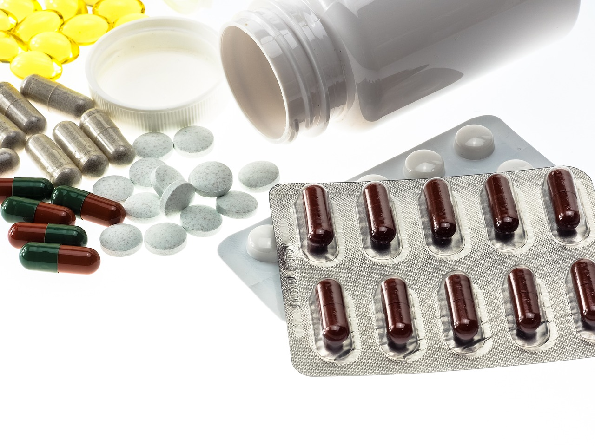

# Sexualité et produits psychoactifs


**En cas d’urgence vitale, appelez un service médical d’urgence**

[Accéder aux numéros de services médicaux d’urgence dans le monde](https://www.europ-assistance.fr/fr/conseils/les-numeros-d-urgence-l-etranger\&sa=D\&source=docs\&ust=1687366794930574\&usg=AOvVaw2F67HR4zddGD2H\_16gualo)


## De quoi allons-nous parler ?

Il s’agit ici d’aborder les enjeux de santé liés à l’association entre pratiques sexuelles et consommation de produits psychoactifs, à des fins notamment de recherche de sensations, de plaisirs, de désinhibition, d’endurance et de performances. Nous ne traiterons pas de consommation de drogues ou de sexualité en général, mais bien de l’articulation et l’interaction entre les deux, tout en rappelant certains grands concepts clés tels que la réduction des risque, dans l’objectif de donner à tout professionnel de santé les clés pour échanger avec une personne qui a des pratiques associant sexe et produits psychoactifs.


### **Définitions**

**Produits psychoactifs (drogues, psychotropes)** : selon l’Organisation Mondiale de la Santé (OMS), un produit psychoactif est “toute substance psychotrope ou psychoactive qui, en raison de leur nature chimique, perturbe le fonctionnement du système nerveux central (sensations, perceptions, humeurs, sentiments, motricité) ou qui modifie les états de conscience.” L’OMS ne fait pas de distinction entre produit licite et illicite. Ces produits peuvent être naturels, synthétiques, ou semi-synthétiques. Leurs effets peuvent être stimulants, dépresseurs, anxiolytiques, neuroleptiques, tranquillisants, empathiques, hallucinogènes ou encore relaxants.

**Chemsex** : terme né dans la communauté gay pour désigner l’usage de produits dans un cadre sexuel au sein de la communauté ainsi que ses conséquences, notamment psychosociales.

**Slam** : terme utilisé au sein de la communauté chemsex pour désigner l’injection de produits psychoactifs.


**Et si on utilisait les bons mots avec les personnes !**

| Expressions à éviter              | Expressions utilisées par les personnes                                             |
| --------------------------------- | ----------------------------------------------------------------------------------- |
| Stupéfiants, drogues, narcotiques | 
Produits (psychoactifs)

Prods’

Chems’ (dans le cadre du chemsex)
 |
| Se droguer                        | Consommer (un produit)                                                              |
| Drogué, délinquant                | Consommateur                                                                        |

## **Sexe & Drogues : une histoire vieille comme le monde !**

Nous disposons de données qui témoignent de l’usage de produits psychoactifs dès la préhistoire. Dans un article publié en 2014 et intitulé “_The Origins of Inebriation_” (Aux origines de l’ébriété, en français), Elisa Guerra-Doce indique que des traces relatives à l’usage de boissons fermentées ou alcoolisées et de plantes psychotropes sont retrouvées dans de nombreuses recherches archéologiques sur la période préhistorique. L’usage tant médicinal que récréatif ou encore de l’ordre du sacré (rituels) de produits psychoactifs peut être constaté à toutes les époques et dans toutes les civilisations. L’opium faisait l’objet d’un commerce dès l’Antiquité et on retrouve d’ailleurs des traces de son usage en Mésopotamie, en Egypte, dans la Grèce et la Rome antiques, d’abord pour un usage médical mais aussi avec des consommations récréatives et des situations d’abus. Au fil des siècles, l'utilisation médicale de l’opium fait référence pour alléger les souffrances des malades.

<figure><figcaption></figcaption></figure>

Or, la consommation de produits s’accompagne très souvent d’une désinhibition pouvant jouer un rôle précurseur dans l’activation du désir sexuel, voire être utilisée à cette fin même. De nombreux écrits de l’époque moderne mentionnent l’usage d’aphrodisiaques à base d’opium, de cocaïne ou de MDMA (ecstasy). L’usage des drogues est peu à peu associé aux “vices” dès le 19e siècle et l’avènement de l’hygiène publique et de la morale. On parle des “morphinomanes” ou des "morphinées" pour désigner ces femmes consommatrices de morphines “esclaves de leur corps”. Dans le conflit racial qui divise les Etats-Unis, l’usage de la cocaïne et de majijuana est associé dès le début du 20e siècle aux hommes noirs, accusés de consommer ces drogues et de les utiliser pour détourner et violer des femmes blanches, ou encore aux immigrés mexicains. Le mouvement contre-culturel hippie des années 1960-1970 est caractérisé par un désir de libération sexuelle et d’un usage récréatif des drogues, notamment les hallucinogènes tels que le LSD. La lutte contre les drogues devient alors un enjeu de lutte raciale et réactionnaire face à un modèle de société jugé décadent et dépravé. Une lutte qui alimente durablement les politiques de pénalisation et de répression des usagers.

Les discours réactionnaires font également une part belle à l’association entre drogues et homosexualité, entre autres, auxquels se rajoutera plus tard le sida. A partir des années 1990 les pratiques d’usages de drogues dans un cadre sexuel commencent à être documentées de manière plus scientifique. On retrouve ainsi des enquêtes auprès de travailleuses du sexe. A la fin des années 2000 émerge également le concept de “chemsex” (ou party’n’play en Amérique du Nord) pour caractériser l’usage de produits psychoactifs chez les gays dans un cadre sexuel, en groupe ou non, notamment du GHB/GBL ou des nouveaux produits de synthèse tels que la méphédrone ou encore le crystal meth. De nombreuses enquêtes témoignent de la diffusion, dans les années 2010, de leur usage en contexte sexuel, avec la description de pratiques de “slamming” (injection) de ces produits ou encore la multiplication des accidents liés aux overdoses de GHB/GBL - drogue parfois associée à des pratiques de viols et de soumission sexuelle.

Du rapport sexuel en état d'ébriété après une soirée arrosée à des pratiques de slam à plusieurs chez les gays, de l’usage d’opium en aphrodisiaque à la prise de Viagra pour stimuler l’érection, les produits psychoactifs sont aujourd’hui installés dans le paysage des pratiques sexuelles. Pour autant, comme en témoignent les nombreux articles, écrits et enquêtes, cela n’a rien de nouveau et on peut dire qu’il en a toujours été ainsi. Et bien que les acteurs de santé ont souvent fait une distinction entre sexe et produits, leur association est très fréquente.

## Produits et modes de consommation

Les usages et pratiques en matière de consommmation de produits évoluent très rapidement, avec notamment des effets de modes. Tout produit psychoactif peut à un moment donné être consommé dans un cadre sexuel. Cela va dépendre des personnes, de leur environnement et de leur histoire. Il est donc utile de rappeler toute la palette de produits psychoactifs qui existent. Le tableau ci-dessous tente de reprendre de manière exhaustive la liste des drogues connues, utilisées. Son intérêt est qu’il dresse également les interactions entre elles et leur niveau de dangerosité. En effet, un produit est rarement consommé seul et la polyconsommation et la multiplicité des modes d’administration sont fréquentes chez les consommateurs. C’est notamment ce que l’on constate dans un cadre festif ou sexuel.

**Tableau 1. Guide des combinaisons de drogues**

<figure><figcaption>
Source : https://tripsit.me
</figcaption></figure>

[**Accéder à l’image en grand format**](https://www.psychoactif.org/forum/image-reelle.php?code=1600/guide-de-combinaisons-de-drogues-par-tripsit.png)

L’appellation NPS (pour « nouveaux produits de synthèse ») désigne depuis les années 2010 les produits dont la composition chimique évolue pour s’adapter aux restrictions de vente et ainsi contourner les législations répressives. On y retrouve notamment les cathinones (méphédrone, 3-MMC, 3-CMC, 4-MEC, 2-MMC) utilisés dans un contexte de chemsex. Avant d’être interdits, certains produits étaient appelés “Legal highs”.

Dans un cadre sexuel, les principaux modes de consommation sont :

* **par voie orale :** généralement le produit liquide ou la poudre est mélangé avec une boisson et ingéré. Il est aussi parfois enrobé dans un papier fin de type feuille à rouler, avant d’être gobé,
* **par aspiration nasale (“sniff”) :** à l’aide d’une paille (en métal, papier, carton, plastique), le produit est déposé sur une surface plane et aspiré par voie nasale,
* **par inhalation buccale :** notamment à l’aide d’un dispositif artisanal ou non qui permet de chauffer le produit et d’inhaler la fumée qui s’en dégage,
* **par injection intraveineuse :** avec une seringue et une aiguille, directement dans une veine. Au sein de la communauté chemsex, le terme “slam” est communément utilisé pour désigner cette pratique. Il n’est pas rare que divers sites d’injection soient utilisés, notamment lorsque le capital veineux est fortement dégradé. Des tentatives d’injections intraveineuses peuvent aussi manquer la veine et amener à l’injection de produit psychoactif à côté, avec un risque d’abcès et d’infection.
* **par voie anale (ou “plug”)** : le produit est déposé avec un doigt, un objet sexuel (dildo) ou le sexe pour être absorbé directement.

Dans le tableau 2 ci-après nous détaillons les produits psychoactifs qui font à ce jour l’objet d‘un usage dans un contexte sexuel, ainsi que leurs modes de consommation les plus couramment identifiés.

**Tableau 2. Principaux produits psychoactifs utilisés dans un cadre sexuel en 2023**

<figure><figcaption></figcaption></figure>

## Enjeux et réponses en santé

### Les principaux risques associés à l’usage dans un cadre sexuel

* Urgences vitales (overdoses) : elles surviennent notamment avec le GHB/GBL dont le dosage et la fréquence rendent difficile la maîtrise des effets. Les services médicaux d’urgence ou de réanimation toxicologique font régulièrement le constat d’un nombre élevé d’overdoses de GHB/GBL chez les chemsexeurs, avec des décès liés à une insuffisance respiratoire.
* Complications somatiques (intoxications, dégradation du capital veineux, plaies, irritations, déchirures dans le cadre de pratiques sexuelles hard, etc.)
* Complications psychosociales : au sein de populations souvent déjà fortement précarisées et avec une prévalence de problématiques de santé mentale élevée, la consommation de produits dans un contexte sexuel ou seule, peut être associée à une dégradation de la santé mentale, du bien-être ou encore du lien social, du niveau de vie et du parcours professionnel de la personne. L’inscription des personnes dans un parcours qui englobe les dimensions somatiques, sociales et mentales est donc essentielle.
* Violences sexuelles et rupture du consentement,
* Infections transmissibles sexuellement ou par le sang,
* Risques juridiques liés à l’usage, la détention, la revente ou la mise à disposition de produits illicites.

### La réduction des risques (RdR)

**Un concept général, une déclinaison individuelle**

Dès les années 1980, face à l’incidence élevée d’overdoses liées aux opiacées et d’infections au VIH puis au virus de l’hépatite C, ont été pensés un ensemble de programmes, d’interventions et de pratiques de réduction des risques (RdR). Ils ont notamment permis de faire grandement chuter le nombre d'infections au VIH chez les usagers de drogues par voie intraveineuse, dans les pays qui ont mis en place des programmes d’échange de seringues (PES). Parmi les autres interventions de RdR, on peut également citer les traitements de substitution aux opiacés (TSO), les salles de consommation à moindre risque (SCMR) ou encore l’accompagnement et l’éducation aux risques liés à l’injection (AERLI).

La RdR repose sur le principe d’une réponse individualisée, bienveillante et non jugeante, avec l’adhésion pleine et entière de la personne et qui prend notamment en compte trois grandes dimensions, résumées dans le tableau ci-après :

| **Usages et pratiques**                                                                                                               | **Contexte de vie**                                                                                                                                                                                                                 | **Histoire individuelle**                                                                                                                                                     |
| ------------------------------------------------------------------------------------------------------------------------------------- | ----------------------------------------------------------------------------------------------------------------------------------------------------------------------------------------------------------------------------------- | ----------------------------------------------------------------------------------------------------------------------------------------------------------------------------- |
| <ul><li>Types de produits consommés</li><li>Qualité du produit et produits de coupe</li><li>Fréquence et quantité consommée</li></ul> | <ul><li>Environnement de consommation (lieu, communauté, pratiques)</li><li>Législation en vigueur sur la consommation et répression des consommateurs</li><li>Appartenance à une communauté exposés au risque VIH et IST</li></ul> | <ul><li>Consentement, volonté et envies</li><li>Vécu, histoire personnelle</li><li>Niveau de revenu et précarité</li><li>Vécu avec le VIH et/ou une hépatite virale</li></ul> |

La RdR laisse une large place au savoir expérientiel développé par les consommateurs et partagés au sein des communautés. Ce savoir est indispensable pour diffuser des pratiques de consommation adaptées aux personnes pour réduire les risques, notamment face à l’absence de données de pharmacovigilance et dans un contexte de politiques répressives qui limitent la communication sur les pratiques et les dosages.

**Stratégies de réduction des risques de consommation dans un cadre sexuel**

<table data-header-hidden data-full-width="true"><thead><tr><th></th><th></th><th></th><th></th></tr></thead><tbody><tr><td>Usage unique de matériel d’injection stérile ou de sniff</td><td>Usage individuel du petit matériel de consommation de produits (cuillère, filtre, etc.)</td><td>Usage individuel d’objets sexuels et ustensiles utilisés dans un cadre sexuel (bouteille de lubrifiant, etc.)</td><td>Testing et analyse des produits</td></tr><tr><td>Désinfection des surfaces ayant pu être en contact avec des muqueuses, du lubrifiant ou des liquides contaminants (sang, sperme, sécrétions sexuelles, etc.)</td><td>Dépistages réguliers du VIH, des hépatites et des IST</td><td>Préservatifs internes et externes</td><td>Espacement des prises, réduction de la fréquence et des dosages, arrêt de consommation</td></tr><tr><td>Les mélanges accentuent les risques. Certains mélanges peuvent être mortels.</td><td>Réduction du nombre de partenaires sexuels</td><td>A chacune et chacun sa RdR !</td><td></td></tr></tbody></table>

L’arrêt de la consommation fait partie de la palette de RdR. Cela doit cependant rester une décision libre et éclairée de la personne, sans quoi le risque d’échec ou de retour vers une consommation vécue comme problématique est élevé. Les politiques de répression ou d’injonction au soin n’ont pas prouvé leur efficacité à lutter contre la consommation.


[reduction-des-risques-usage-de-drogues.md](../vih/reduction-des-risques-usage-de-drogues.md)



**Quelques liens pour aller plus loin sur la RdR !**

* [https://www.medecinsdumonde.org/action/reduction-des-risques/](https://www.medecinsdumonde.org/action/reduction-des-risques/)
* [https://www.aides.org/reduction-des-risques-lies-usage-de-drogues](https://www.aides.org/reduction-des-risques-lies-usage-de-drogues)
* [https://sante.gouv.fr/prevention-en-sante/addictions/article/la-reduction-des-risques-et-des-dommages-chez-les-usagers-de-drogues](https://sante.gouv.fr/prevention-en-sante/addictions/article/la-reduction-des-risques-et-des-dommages-chez-les-usagers-de-drogues)


### Prévention et dépistages du VIH, des hépatites et des Infections Sexuellement Transmissibles (IST)

L’usage de produits dans un cadre sexuel conduit à un surrisque de contracter le VIH, les hépatites ou d’autres IST, notamment parmi les hommes ayant des rapports sexuels avec d’autres hommes. La consommation de produits peut en effet rendre plus difficile l’application de mesures de prévention ou de RdR et elle est associée à une multiplication des partenaires et situations à risque pour ces infections.

L’**information sur les modes de transmission** combinée à des **dépistages** réguliers permet de réduire les risques, de diagnostiquer et traiter de manière précoce une éventuelle infection transmissible sexuellement ou par le sang.

Toute personne consommant des produits dans un cadre sexuel peut également se voir proposer une prophylaxie pré-exposition (**PrEP**), bithérapie antirétrovirale qui permet d’éviter une infection au VIH et d’inscrire les personnes dans un parcours de dépistages réguliers du VIH et des IST.

Toute personne séronégative n’étant pas sous PrEP et ayant été exposée à un risque de contracter le VIH peut bénéficier dans un délai de 48h (ou 72h dans certains pays) d’un **traitement post-exposition**, trithérapie antirétrovirale à prendre durant 28 jours. Ces traitements sont généralement disponibles dans les services hospitaliers de maladies infectieuses ou les centres de dépistages (Cegidd en France).

Les **vaccins** contre les virus de l’hépatite A, virus de l’hépatite B, papillomavirus, mpox, méningocoque C sont vivement recommandés, notamment pour les hommes ayant des rapports sexuels avec d’autres hommes.

Enfin, de récentes études menées chez des hommes ayant des rapports sexuels avec d’autres hommes ont également montré un intérêt, en termes de RdR, de l’utilisation de doxicycline en prophylaxie post-exposition contre les infections à chlamydiae, gonocoque et syphillis chez des personnes à haut risque de contracter des IST bactériennes.


**Quelques liens pour aller plus loin sur la prévention et les dépistages !**

* Annuaire des Cegidd en France [https://www.sida-info-service.org/annuaire/](https://www.sida-info-service.org/annuaire/)
* L’OMS recommande la PrEP orale pour les hommes ayant des rapports sexuels avec d’autres hommes dans le monde [https://www.emro.who.int/fr/asd/asd-infocus/pre-exposure-prophylaxis.html](https://www.emro.who.int/fr/asd/asd-infocus/pre-exposure-prophylaxis.html)


### Addiction et conduites addictives

Les conduites addictives ont une origine plurifactorielle. Elles sont le fruit de la rencontre :

* d’un individu (parcours de vie, compétences psychosociales, traumas…),
* d’une ou plusieurs substances psychoactives ou d’un comportement (potentiel addictif de chaque produit/comportement),
* d’un environnement (accessibilité de la substance ; valorisation sociale, culturelle et/ou commerciale du produit/comportement ; exposition aux risques psychosociaux dans la sphère personnelle et professionnelle, cadre légal…).

L’addiction se distingue du simple usage par le fait qu’elle est caractérisée par la consommation compulsive d’une ou plusieurs substances psychoactives (ou la pratique excessive et non maîtrisée d’un comportement) afin de produire un plaisir et soulager une sensation de malaise interne, ceci malgré la connaissance des conséquences négatives induites par celle-ci et le désir d’arrêter :

* perte de contrôle du volume et de la fréquence de consommation/pratique,
* modification de l’équilibre émotionnel,
* perturbations de gravité variable de la vie personnelle, professionnelle et sociale,
* troubles et dommages médicaux additionnés à l’addiction elle-même.

L’installation d’une addiction implique trois stades successifs :

* la recherche de plaisir : activation du circuit cérébral de la récompense par la substance consommée ou le comportement effectué mettant en jeu la dopamine, la sérotonine et les récepteurs aux endorphines, conditionnant progressivement la personne (répétition de la recherche de plaisir par cette substance/pratique),
* la répétition du plaisir en réponse à un état émotionnel négatif : la dopamine libérée à chaque consommation diminue progressivement et, de façon concomitante, le fonctionnement cérébral se modifie, induisant stress et émotions plus négatives,
* la perte de contrôle : altération des circuits de la récompense et des émotions influent sur les capacités à s’autoréguler, à prendre des décisions et à résister aux envies de consommer. Cette perte de contrôle, aussi nommée _craving_, explique les reprises de consommation répétées, même lorsque le désir d’arrêter est manifeste.

Le diagnostic de l’addiction repose sur des critères bien définis, fixés par des instances internationales de santé mentale. Ainsi, pour établir un diagnostic, le monde médical a recours à deux grandes classifications :

le Manuel diagnostique et statistique des troubles mentaux (DSM 5) de l'_American Psychiatric Association_ et la Classification internationale des maladies de l’OMS (CIM 10).


Les 11 critères diagnostiques du DSM 5 sont :

* Besoin impérieux et irrépressible de consommer la substance ou de jouer (craving)
* Perte de contrôle sur la quantité et le temps dédié à la prise de substance ou au jeu
* Beaucoup de temps consacré à la recherche de substances ou au jeu
* Augmentation de la tolérance au produit addictif
* Présence d’un syndrome de sevrage, c’est-à-dire de l’ensemble des symptômes provoqués par l’arrêt brutal de la consommation ou du jeu
* Incapacité de remplir des obligations importantes
* Usage même lorsqu'il y a un risque physique
* Problèmes personnels ou sociaux
* Désir ou efforts persistants pour diminuer les doses ou l’activité
* Activités réduites au profit de la consommation ou du jeu
* Poursuite de la consommation malgré les dégâts physiques ou psychologiques


La combinaison de plusieurs de ces critères permet de caractériser le degré de sévérité de l'addiction :

* Présence de 2 à 3 critères : addiction faible
* Présence de 4 à 5 critères : addiction modérée
* Présence de 6 critères ou plus : addiction sévère

La classification de l’OMS fait apparaître les concepts d’usage nocif et de dépendance. Parmi les 6 critères de la dépendance de la CIM 10, au moins 3 des manifestations suivantes doivent avoir été présentes en même temps au cours de la dernière année pour établir un diagnostic d’addiction :

* Le désir puissant ou compulsif d’utiliser une substance psychoactive
* Des difficultés à contrôler l’utilisation de la substance (début ou interruption de la consommation ou niveaux d’utilisation)
* Un syndrome de sevrage physiologique quand le sujet diminue ou arrête la consommation d’une substance psychoactive, comme en témoignent la survenue d’un syndrome de sevrage caractéristique de la substance ou l’utilisation de la même substance (ou d’une substance apparentée) pour soulager ou éviter les symptômes de sevrage
* La mise en évidence d’une tolérance aux effets de la substance psychoactive : le sujet a besoin d’une quantité plus importante de la substance pour obtenir l’effet désiré
* L'abandon progressif d’autres sources de plaisir et d’intérêt au profit de l’utilisation de la substance psychoactive, et l’augmentation du temps passé à se procurer la substance, la consommer, ou récupérer de ses effets
* La poursuite de la consommation de la substance malgré ces conséquences manifestement nocives. On doit s’efforcer de préciser si le sujet était au courant, ou s’il aurait dû être au courant, de la nature et de la gravité des conséquences nocives

### Les réponses médico-sociales : construire un parcours de soin

* **Urgences vitales**

Les situations d’urgence vitale peuvent se produire lors de consommations de produits dans un cadre sexuel. Les overdoses et décès liés à la consommation de GHB/GBL sont ainsi fréquemment rapportés par les professionnels d’urgence et de réanimation ainsi que les acteurs associatifs. Toute perte de conscience, endormissement soudain, d’une personne ayant consommé des produits dans un cadre sexuel, doit amener à appeler les secours ([accéder aux numéros des services médicaux d’urgence](https://www.europ-assistance.fr/fr/conseils/les-numeros-d-urgence-l-etranger\&sa=D\&source=docs\&ust=1687366794930574\&usg=AOvVaw2F67HR4zddGD2H\_16gualo)) pour avis et intervention.

* **Addictologie et prise en charge psychiatrique**

L'addictologie est un champ de la santé couvrant les addictions. L’addictologue peut être un praticien de médecine générale, psychiatre ou un autre professionnel de santé, qui est formé à l’accompagnement de patients ayant des conduites addictives. Le rendez-vous avec un addictologue permet de faire un bilan et de mettre en place un suivi adapté, avec notamment l’intervention d’autres professionnels de santé ou spécialistes. A ce titre, une orientation vers une prise en charge psychiatrique peut être proposée pour diagnostiquer d’éventuels troubles psychiatriques associés aux pratiques addictives et ainsi proposer des traitements psychiatriques. Certains psychiatres sont également addictologues. Des séjours en service d’addictologie ou psychiatriques (cures) peuvent être proposés. Certains de ces services sont ainsi spécialisés dans la prise en charge de conduites addictives associant sexe et produits psychoactifs ou sur le chemsex.

* **Le suivi en médecine générale**

Toute pratique de consommation de produits dans un cadre sexuel doit amener à consulter régulièrement un médecin généraliste afin de réaliser les contrôles réguliers adaptés, comme un dépistage des IST. Le médecin généraliste peut également être amené à prendre en charge certaines complications liées à l’usage de produits (abcès, atteintes veineuses, troubles psychologiques, saignements, rectites), orienter vers d’autres professionnels de santé et ainsi coordonner un parcours de soin adapté.

* **Suivi psychologique**

Le suivi psychologique permet de proposer un espace de parole aux personnes souhaitant travailler sur leur vécu, leurs usages, pratiques et consommations et ainsi mettre en place une thérapie sur la durée. Il peut aussi répondre à un besoin ciblé tels qu’un trouble post-traumatique, fréquent dans le cadre de l’usage de drogues dans un cadre sexuel chez les personnes ayant notamment vécu une overdose.

* **L’importance de l’accueil et de l’accès aux droits**

Les situations problématiques de consommation de produit sont souvent associées à des contextes sociaux marqués par la précarité, l’exclusion, un parcours de migration difficile ou un rapport compliqué aux services publics et au système de santé. L’accès aux droits sociaux existants (Aide Médicale d’Etat, ALD, PASS, aides au logement, etc.) participe au parcours de santé des personnes. Il s’agit d’une composante essentielle de la prise en charge globale au même titre que la gratuité de l’ensemble des soins.

Les dispositifs d’outreach hors-les-murs (interventions dans des lieux communautaires notamment) permettent de faciliter l’inscription des personnes dans des parcours de santé et d’accès aux droits.

### L’auto-support et les réponses communautaires

L’auto-support par les pairs, le témoignage, le partage d’expériences, les entretiens individuels entre pairs, les espaces collectifs de parole sont des interventions de santé qui peuvent entrer dans le parcours de santé des personnes souhaitant faire le point sur leurs pratiques ou les faire évoluer. Ces espaces collectifs ou individuels sont généralement facilités par des associations communautaires ou de santé dans leurs locaux ou hors-les-murs.


**Quelques liens pour aller plus loin sur les réponses médicosociales et communautaires !**

* Annuaire des acteurs impliqués dans le soutien aux consommateurs sur Drogues Info Service [https://www.drogues-info-service.fr/](https://www.drogues-info-service.fr/)
* Qu’est-ce que les Narcotiques Anonymes ? [https://www.narcotiquesanonymes.org/quest-ce-que-na/](https://www.narcotiquesanonymes.org/quest-ce-que-na/)
* Soirées “Chill-out Chemsex” du SPOT Beaumarchais à Paris [https://www.facebook.com/LeSpotBeaumarchais](https://www.facebook.com/LeSpotBeaumarchais)


### Proches, ami-e-s, professionnel-le-s : accompagner une personne ayant une consommation de produits dans un cadre sexuel

Que l’on soit un professionnel de santé, un partenaire ou un proche, on peut être amené-e à écouter et accompagner une personne ayant des pratiques de consommation de produits dans un cadre sexuel. L’écoute, la bienveillance, le non-jugement sont essentiels pour construire une relation d’aide avec une personne qui consomme des produits. Les parcours de vie, les trajectoires, sont propres à chaque personne. A pratiques et consommations égales, deux personnes ne vont pas réagir de la même manière, certaines vont rencontrer de lourdes difficultés, d’autres pas. Tout usage de produits psychoactifs n’amène pas forcément à une consommation addictive, mais l’addiction et ses complications sont cependant fréquentes chez les consommateurs de produits, que celle-ci soit consciente ou non. Par ailleurs, les terminologies associées à l’addiction recouvrent généralement de lourdes représentations dans lesquelles les personnes peuvent ne pas se reconnaître. Dans l’accompagnement des consommateurs, il est donc important de veiller à la distinction entre usage et addiction. Si toute pratique de consommation de produits dans un cadre sexuel nécessite une attention particulière à sa santé, toute pratique n’est cependant pas vécue comme étant problématique par les personnes ; il arrive que l’on cherche à soutenir ou sortir des personnes d’une situation qu’elles ne jugent pas problématique. Un accompagnement peut parfois être lourd ou sembler vain. Il est important de ne pas rester seul dans une relation d’aide ou l’accompagnement en santé d’une personne et de pouvoir passer le relais.


**Quelques liens pour aller plus loin dans l’accompagnement par les proches !**

* Dépliant “Soutenir une personne qui pratique le chemsex”, association AIDES : [https://www.calameo.com/aides/read/00622550070d97c81e49c?page=1](https://www.calameo.com/aides/read/00622550070d97c81e49c?page=1)


## Focus sur le chemsex

Synonymes : Party’n’Play (Amérique du Nord), Chill/Fiesta (pays hispanophones), chemsfun

Le chemsex est un terme décrivant le phénomène de consommation de produits dans un cadre sexuel au sein de la communauté gay. La spécificité de l’histoire communautaire et des trajectoires des personnes, associée à une consommation et des pratiques spécifiques ou encore des conséquences sans commune mesure avec ce que l’on constate dans le reste de la population, distingue le chemsex des autres situations de consommation dans un cadre sexuel.

Plusieurs enquêtes rapportent une diffusion et une prévalence forte des pratiques de chemsex depuis la fin des années 2000.

Bien qu’il n’existe pas de définition officielle du chemsex, on peut retenir qu’il s’agit d’un phénomène caractérisé par plusieurs dimensions :

* **Une communauté :** on parle du chemsex spécifiquement pour désigner l’usage de produits dans un cadre sexuel chez les hommes et personnes trans ayant des rapports sexuels avec d’autres hommes et personnes trans. S’il existe des pratiques de consommation de produits dans un cadre sexuel dans toute la société, le terme est né au sein de cette communauté et notamment par les acteurs qui se sont mobilisés pour répondre aux besoins spécifiques qui se posent dans cette communauté.
* **Des produits spécifiques :** on parle de produits qui stimulent l’endurance, la performance et la désinhibition (voir tableau ci-dessus). Des produits tels que l’héroïne, les médicaments détournés de leurs usages, etc. ne sont pas utilisés sur la scène chemsex. Inversement on retrouve de manière forte le crystal meth, les catinones (mephedrone, 3-MMC, 3-CMC, 4-MEC, 2-MMC, α-PHiP), GHB/GBL, cocaïne, ketamine/MXE, Viagra, poppers. Bien qu’au départ ces produits étaient principalement achetés sur internet ou partagés entre consommateurs-revendeurs, ils sont aujourd’hui aussi disponibles dans les circuits plus classiques de distribution (dealers).
* **Des pratiques spécifiques :** le chemsex est associé à des pratiques sexuelles telles que les pratiques en groupe (“touze”, “chill”, “party”) ou plus hard (fist fucking). Les “slammeurs” présentent des besoins de prise en charge spécifiques. Le plug ou bump (administration anale) de certains produits est également fréquent chez les chemsexeurs.
* **Les applications de rencontre sur smartphone :** l’usage des applications de rencontre ou de discussion associées au développement et la diffusion des smartphones à la fin des années 2000 a joué un rôle dans la diffusion et l’organisation du phénomène chemsex. Les applications telles que Grindr, PlanetRomeo, Scruff, Recon, MachoBB sont en effet très largement utilisées par des personnes ayant une pratique du chemsex, de même que les messageries sur smartphone pour la facilitation des rencontres,
* **Des besoins de santé spécifiques :** la pratique du chemsex, quel que soit le vécu de la personne, engendre des besoins de santé. Cela peut aller d’une plus forte fréquence d’IST nécessitant des dépistages plus fréquents à une prévalence élevée des overdoses liées au GHB/GBL ou encore des situations d’isolement et de précarisation ou des troubles de santé mentale qui se cumulent à des parcours de vie mêlant son vécu de l’homosexualité.

La diffusion du chemsex a mis en exsergue certaines pratiques de consommateurs-revendeurs s’exposant à de lourdes conséquences juridiques, des situations de précarité dévoilant le partage de produits comme monnaie d’échange contre le sexe ou encore de situations fréquentes de rupture du consentement ou de violences sexuelles.

L’accompagnement de personnes pratiquant le chemsex nécessite une écoute et une attention particulière au contexte communautaire spécifique et l’histoire de la personne, notamment le vécu de l’homosexualité. Il existe des lieux dédiés à l’accueil de personnes pratiquant le chemsex et des professionnels de santé formés aux spécificités du chemsex.


**Quelques liens pour aller plus loin sur le chemsex !**

* [www.chemsex.be](http://www.chemsex.be/)
* [https://www.aides.org/chemsex](https://www.aides.org/chemsex) (informations sur le chemsex et le dispositif d’écoute par Whatsapp / Télégram mis en place par AIDES)
* Groupe Facebook Info Chemsex by AIDES [https://www.facebook.com/groups/364799467186268](https://www.facebook.com/groups/364799467186268)

