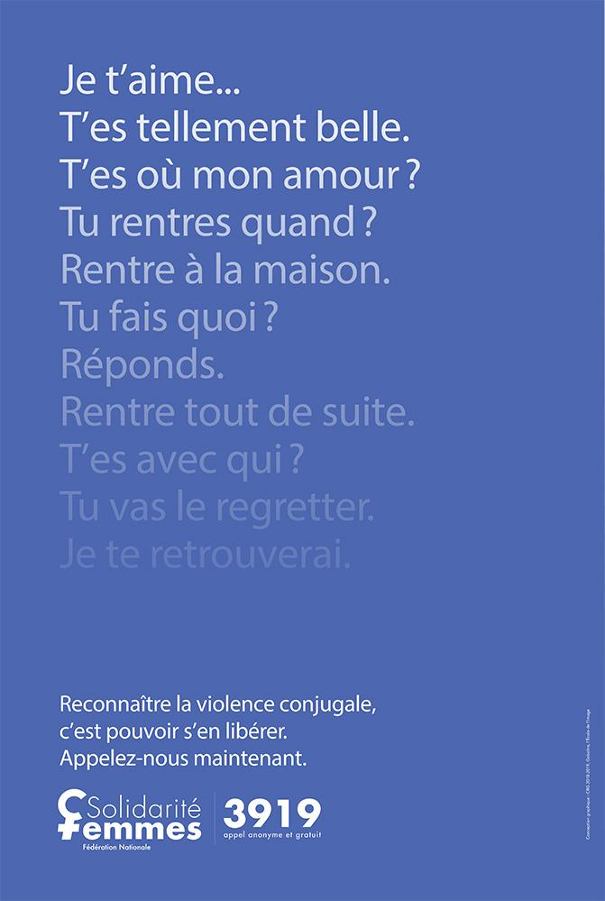

# Violences basées sur le genre

Les violences basées sur le genre englobent tous les actes, comportements ou attitudes violents commis à l’encontre d’une personne en raison de son identité de genre, réelle ou supposée. Elles sont le plus souvent dirigées à l’encontre des femmes, du fait de normes de société qui perpétuent les inégalités entre les sexes et de la persistance de traditions néfastes.

Cependant des violences s’exercent aussi sur les personnes transgenres : 85% des personnes transgenres en sont victimes. Les femmes trans en sont les principales victimes. SOS Homophobie rapporte que les agressions transphobes ont augmenté de 27% par rapport à 2021.\
\
Rapport de l'observatoire des violences et discriminations 2022 - 2023 (association Acceptess-T) :&#x20;



Ces violences peuvent prendre différentes formes :

**Violences physiques** : il peut s’agir de coups, blessures, morsures, brûlures, fractures, sans oublier leur forme ultime qui aboutit au décès, le plus souvent par arme à feu, arme blanche ou strangulation. On parle désormais de féminicide, mot entré depuis peu dans le vocabulaire courant et qui a le mérite de mieux comptabiliser les décès en lien avec le sexe de la victime.

On peut en rapprocher les foeticides de filles, à savoir le fait d’éliminer un fœtus fille dans le ventre de sa mère parce que l’échographie a montré qu’’il était de sexe féminin, et que dans de nombreuses cultures, avoir une fille est une mauvaise nouvelle. Ou encore les infanticides de filles, tuées à la naissance à cause de leur sexe.

Le législateur reconnait aujourd’hui une nouvelle forme de féminicide en lien avec des violences : il s’agit du suicide forcé lorsque la victime, totalement broyée par la violence de son agresseur, ne voit pas d’autre issue pour y échapper que la mort. Cette reconnaissance aboutit à tripler le nombre de décès attribuables à la violence d’un conjoint, puisqu’on estime qu’il y a en France environ 130 féminicides par an et 250 suicides forcés.

**Violences verbales** : ces violences visent à humilier la personne et à lui ôter toute estime d’elle-même, par des remarques qui la rabaissent, des insultes, des crachats. Les victimes estiment que ces violences, invisibles car elles ne laissent aucune trace, sont plus difficiles à supporter que les violences physiques car personne ne peut les voir et de ce fait, les victimes n’osent pas en parler et sont difficilement crues.

**Violences** **psychologiques** : elles précèdent en général les violences physiques et sont les plus fréquentes. Elles conduisent à détruire la personnalité de la victime, à la faire douter d’elle-même, à se croire folle et stupide, incapable par exemple de s’occuper de ses enfants. C’est une forme de manipulation à laquelle on peut rattacher le harcèlement sous toutes ses formes, notamment le cyber harcèlement qui s’appuie sur les nouvelles technologies pour augmenter son impact : installer un logiciel espion dans le téléphone de sa conjointe, surveiller ses mails, l’humilier au travers des réseaux sociaux ; mais aussi lui envoyer des messages et photos à caractère sexistes (_dick pics_, photos du pénis) ou diffuser des images intimes d’elle sans son consentement.

Le contrôle coercitif est une forme de violence, où tout est mis en place pour contrôler la vie de la victime, ses déplacements, ses choix, ses dépenses, sa tenue, son maquillage, et même sa contraception.

**Violences** **sexuelles :** qu’il s’agisse de harcèlement sexuel, d’agressions sexuelles ou de viols, les victimes en sont le plus souvent des filles ou des femmes.

On différencie les agressions sexuelles des viols qui impliquent une pénétration, qu’elle soit vaginale, anale ou buccale. Rappelons que le viol est un crime, qui se juge au pénal.

Le fait de subir des violences sexuelles dans un cadre familial, censé sécuriser et protéger les personnes, est un élément aggravant, et le viol conjugal est reconnu depuis 2010.

L’inceste occupe une place à part, notamment du fait de la découverte ces dernières années de son caractère massif et parfois transgénérationnel. Les statistiques révèlent que les garçons sont plus touchés que les filles par cette violence.

Enfin, les mutilations sexuelles féminines peuvent s’observer aujourd’hui dans toutes les régions du monde, du fait des migrations.

**Les traditions néfastes et les pratiques discriminatoires** implantées de longue date, au point que certaines cultures et sociétés finissent par les considérer comme acceptables et ne les remettent jamais en question, font le lit de multiples violences. Elles reflètent des valeurs profondément ancrées et une perception des filles comme étant inférieures aux hommes, ce qui les dévalorise et bafoue leur liberté de disposer de leur vie et de leur corps. Qu’il s’agisse de mariage forcé, de mutilations génitales, de repassage ou de bandage des seins, d’injonctions à se reproduire ou de crimes d’honneur, ce sont les filles qui payent le plus lourd tribut.

Une évolution sociétale, partout dans le monde, est indispensable. L’éducation des garçons est essentielle car la violence basée sur le genre la plus banale dont sont victimes les garçons est incontestablement le modèle de virilité, que l’on qualifie aujourd’hui de masculinité toxique, qui leur est imposé. Ce modèle qui les oblige à être forts, les coupe de leurs émotions et leur fait croire qu’ils ont un droit de vie et de mort sur leurs compagnes contribue très largement à pérenniser les violences faites aux femmes.

.png>)

L’obligation d’arrêter les pratiques néfastes est explicitement mentionnée dans plusieurs traités internationaux de droits de l’Homme. La Convention sur les droits de l’enfant établit l’obligation pour les Etats de “prendre les mesures appropriées et efficaces en vue d’abolir les pratiques traditionnelles préjudiciables à la santé des enfants.”

De même, la Convention sur l’élimination de toutes les formes de discriminations à l’égard des femmes établit que les Etats doivent “prendre toutes les mesures appropriées, y compris des mesures législatives, pour modifier ou abolir les lois actuelles, les règles, coutumes et pratiques qui constituent une discrimination à l’égard des femmes”.

Le cinquième objectif pour le développement durable établi par les Nations Unies prévoit l’égalité des sexes à l’horizon de 2030. Nous ne serons certainement pas au rendez-vous !


## **Quelques idées reçues sur les violences sexuelles**

Il est important de savoir que de nombreuses idées reçues persistent dans nos sociétés au sujet des violences sexuelles. Voici les principales :

_**La majorité des viols ou agressions sexuelles sont commis par un inconnu, durant la nuit, dans un lieu public et sous la menace d’une arme.**_

**Faux !** Dans plus de 75% des cas, l’agresseur est un proche de la victime. Dans la majorité des cas, les violences sexuelles infligées à des mineur·e·s sont commises par des proches (famille, école, activités parascolaires, institutions de soins, etc.) et, pour les adultes, ont lieu au travail ou dans leur couple.

_**Les viols et agressions sexuelles sont dus à des pulsions sexuelles que l’agresseur ne peut pas maîtriser.**_

**Faux !** Ce sont des stéréotypes sexistes qui véhiculent l’idée que la sexualité masculine est nécessairement violente et que les hommes ont des besoins incontrôlables qu’ils ont le droit d’exercer sur la femme. Les viols et agressions sexuelles sont des manifestations de pouvoir et n’ont rien à voir avec la sexualité et encore moins l’amour.

_**La victime doit apprendre à tourner la page, prendre sur elle et oublier ce qu’elle a subi.**_

**Faux !** Bien souvent, lors d’une agression sexuelle, la victime se trouve en état de choc, ce qui paralyse tout activité de son cerveau. Elle se trouve alors dans l’incapacité de réagir de façon réfléchie, reste pétrifiée ou agit de façon automatique. Cet état provoque une surproduction d’hormones de stress (adrénaline et cortisol), ce qui comporte des risques pour la victime (au niveau cardiologique et/ou neurologique). Pour éviter cela, le cerveau provoque une « disjonction », qu’on nomme **dissociation traumatique**. La victime se sent « déconnectée » et assiste de façon passive à l’événement, comme s’il n’était pas réel. C’est parce qu’elles subissent des dissociations traumatiques que certaines victimes ont l’air très calmes et détachées, comme si rien ne s’était passé. Cela peut être déstabilisant pour les personnes qui les entourent (témoins, personnes à qui elles se seraient confiées, ou services de police si elles déposent plainte), et cela rend très difficile la détection de ces situations.

Dans tous les cas, il est fondamental :

* que la victime soit aidée par des professionnels,
* que la justice ait une part dans cette aide, même si son objet n’est pas tant le soutien aux victimes que la préservation de l’ordre public et la punition des auteurs.

Il est important de dire que correctement prise en charge, la victime peut surmonter son traumatisme et vivre une vie épanouie.

Et même si le corps n’oublie rien (titre d’un livre fondamental sur le trauma) on n’est pas forcément une victime pour la vie…

_**Si la victime parle de ce qui lui est arrivé, sa situation empirera.**_

**Faux !**  Pour réussir à surmonter un tel traumatisme, il est important d’en parler, que ce soit à un·e proche (ami·e, membre de la famille) ou à une oreille externe (service d’aide et/ou d’accompagnement, groupes de parole, psychologue, médecin et bien d’autres). Bien sûr, il n’est pas facile de s’ouvrir et d’exprimer cela, car en parler rend ces événements concrets. Cette démarche est encore plus difficile quand l’auteur est un proche, car la victime culpabilise d’autant plus, en se disant que, si elle dépose plainte, ce sera sa faute si cette personne risque d’aller en prison. **Si un auteur risque la prison, ce n’est pas parce que la victime le dénonce, mais bien parce qu’il a commis un·des acte·s puni·s par la loi.**

_**Une tenue trop sexy justifie-t-elle le viol ?**_&#x20;

27 % des Français affirment que l'auteur d'un viol est moins responsable si la femme porte une tenue trop aguichante. Explication et déconstruction de la culture du viol par des lycéens : [https://www.journaldeslycees.fr/actualite-jeunes/finistere/lycee-paul-serusier/une-tenue-trop-sexy-justifie-t-elle-le-violnbsp--,1099.html](https://www.journaldeslycees.fr/actualite-jeunes/finistere/lycee-paul-serusier/une-tenue-trop-sexy-justifie-t-elle-le-violnbsp--,1099.html)

_(Source : Planning familial de Belgique)_


**Attention : il ne suffit pas de parler, encore faut-il être entendue (cf film d’information : la conspiration des oreilles bouchées)**



.png>)

## **Prévalence**

* **Dans le monde, on estime que 736 millions de femmes - soit près d’une sur trois - ont subi au moins une fois des violences physiques et/ou sexuelles de la part d’un partenaire intime, et/ou des violences sexuelles de la part d’une autre personne (30 pour cent des femmes de plus de 15 ans).** Ce chiffre ne tient pas compte du harcèlement sexuel. Les taux de dépression, d’avortement et de contamination par le VIH sont plus élevés chez les femmes ayant subi ce type de violence, par rapport aux femmes qui ne l’ont pas subi, ainsi que d’autres problèmes de santé qui peuvent durer encore longtemps après que les violences ont cessé.
* **La plupart des violences contre les femmes sont perpétrées par le mari ou le partenaire intime actuel ou passé.** Plus de 640 millions de femmes âgées de plus de 15 ans ont été confrontées à la violence perpétrée par leur partenaire intime (26 pour cent des femmes âgées de 15 ans et plus).
* **Parmi celles qui ont été en couple, près d’une fille adolescente sur quatre âgées de 15 à 19 ans (24 pour cent) a subi des violences physiques et/ou sexuelles de la part de son partenaire intime ou de son mari.** Seize pour cent des jeunes femmes âgées de 15 à 24 ans ont subi cette forme de violence au cours des douze derniers mois.
* **En 2018, une femme sur sept a subi des violences physiques et/ou sexuelles de la part de son partenaire intime ou de son mari au cours des douze derniers mois (13 pour cent des femmes âgées de 15 à 49 ans).** Ces chiffres ne reflètent pas l’impact de la pandémie de COVID-19, qui a augmenté les facteurs de risque des violences faites aux femmes.
* **Dans le monde, les violences faites aux femmes touchent de manière disproportionnée les pays et régions à faibles et moyens revenus.** Trente-sept pour cent des femmes âgées de 15 à 49 ans vivant dans des pays classés par les Objectifs de Développement Durable comme « les moins développés » ont été confrontées à la violence perpétrée par le partenaire intime au cours des douze derniers mois – un taux sensiblement plus élevé que la moyenne mondiale de 13 %.
* **Dans le monde, 81 000 femmes et filles ont été tuées en 2020, dont environ 47 000 (58 %) par un partenaire intime ou un membre de la famille, ce qui équivaut à une femme ou une fille tuée toutes les 11 minutes dans son foyer.** Dans 58 % des meurtres perpétrés par des partenaires intimes ou d'autres membres de la famille, la victime était une femme ou une fille.

## Impact de la pandémie de Covid-19

Il existe des **premières preuves d’une intensification de la violence contre les femmes et les filles à travers le monde pendant la pandémie de Covid-19**. Les données des rapports d’utilisation des services dans différents pays ont montré une augmentation importante des cas de violence domestique signalés aux lignes d’écoute, aux refuges et abris pour femmes et à la police. Les appels aux lignes d’écoute ont quintuplé dans certains pays. D’autres pays, cependant, ont observé une diminution du nombre d’incidents de violence domestique signalés, soulignant les défis en termes d’accessibilité et de disponibilité pendant les confinements et autres mesures de distanciation sociale.

## **Signalement des violences faites aux femmes**

**Moins de 40 pour cent des femmes qui subissent des violences demandent de l’aide sous une forme ou une autre.** Dans la majorité des pays disposant de données sur ce sujet, parmi les femmes qui demandent de l’aide, la plupart se tournent vers leur famille ou leurs ami·e·s, et très peu vont vers des institutions officielles telles que la police et les services de santé. De fait, moins de 10 pour cent de celles qui demandent de l’aide font appel à la police.

## Lois sur la violence faite aux femmes et aux filles

**Au moins 158 pays ont promulgué des lois sur la violence domestique et 141 disposent de lois sur le harcèlement sexuel au travail.**

Cependant, même lorsque de telles lois existent, cela ne signifie pas forcément qu’elles se conforment aux normes et recommandations internationales, ni qu’elles sont appliquées. En 2020, le Koweït et Madagascar ont introduit pour la première fois une législation spécifique et complète sur la violence conjugale.

## Facteurs de risque de violence contre les femmes et les filles

* Une analyse régionale des enquêtes sur la santé des femmes menée dans cinq États membres de la CARICOM – Grenade, Guyana, Jamaïque, Suriname et Trinité-et-Tobago – de 2016 à 2019 a révélé que les femmes âgées de 15 à 64 ans qui étaient en **couple et qui avaient des attitudes et des comportements qui renforcent la position dominante des hommes sur les femmes et perpétuent l’inégalité entre les sexes** étaient plus susceptibles d’avoir été confrontées à la violence conjugale au moins une fois dans leur vie et au cours des douze derniers mois.
* Les comportements destinés à contrôler le corps des femmes, leur autonomie et leurs contacts avec les autres sont également fortement corrélés à une expérience accrue de la violence conjugale.

## Quelques initiatives européennes en matière de lutte contre les violences faites aux femmes

### **En France**

Les violences faites aux femmes ont été déclarées grande cause du premier quinquennat d’Emmanuel Macron, au cours duquel s’est tenu un « Grenelle des violences conjugales ».

Parmi les actions envisagées, on retrouve le soutien à la création de structures dédiées à la prise en charge médico-psycho-sociale des victimes, sur le modèle de la Maison des femmes de Saint-Denis. Un dépôt de plainte est organisé sur place avec la participation de policiers ou de gendarmes volontaires. Une offre de soins spécifique est dédiée aux viols et violences sexuelles de moins de 5 jours. En effet, durant cette période, on peut encore retrouver des éléments de preuve (sperme, peau, cheveux, et toute source d’ADN du violeur) et établir un certificat de coups et blessures argumenté, facilitant ainsi le dépôt de plainte et le travail de la justice.

### **En Espagne**

L'Espagne fait figure de pionnière dans la lutte contre les violences conjugales, par l'arsenal législatif et les financements déployés.

* Selon ONU Femmes, l’Espagne bénéficie d’une des lois les plus protectrices dans le monde. Une loi-cadre intitulée : « Mesure de protection intégrale contre les violences conjugales » a été votée en 2004. Elle a été complétée en 2017 par une loi « pacte d’État » contenant 290 mesures interministérielles.
* **Ce Pacte d'État sur les Violences faites aux femmes** est doté d'un budget d'1 milliard d'euros supplémentaire en plus d’un budget déjà conséquent réparti entre l’État, communautés autonomes et les municipalités.
* Le nombre de féminicides a baissé de 25 % depuis 2004 en Espagne. L’Espagne délivre également 17 fois plus d’ordonnances de protection que la France et dispose de 33 % d’hébergement spécialisé supplémentaire.\

**Quelques ressources :**&#x20;

<figure><figcaption></figcaption></figure>

3919 pour les victimes de violences conjugales

119 pour les violences faites aux enfants

114 par SMS pour les personnes malentendantes

Centres d’informations sur les droits des femmes et des familles : CIDFF [https://fncidff.info](https://fncidff.info/)

Fédération d’associations France Victimes [https://www.france-victimes.fr](https://www.france-victimes.fr/)

Association Du côté des femmes [https://www.ducotedesfemmes.asso.fr](https://www.ducotedesfemmes.asso.fr/)

Women for women France [https://www.womenforwomenfrance.org/fr/](https://www.womenforwomenfrance.org/fr/)

Association Contre les violences faites aux mineurs : [https://association-cvm.org/](https://association-cvm.org/)

Association Face à l’inceste [https://facealinceste.fr](https://facealinceste.fr/)

CIIVISE (Commission indépendante sur l’inceste et les violences sexuelles faites aux enfants) [https://www.ciivise.fr](https://www.ciivise.fr/)

CPIV (Centre du Psychotrauma de l’Institut de Victimologie) [https://www.cpiv.org](https://www.cpiv.org/)
