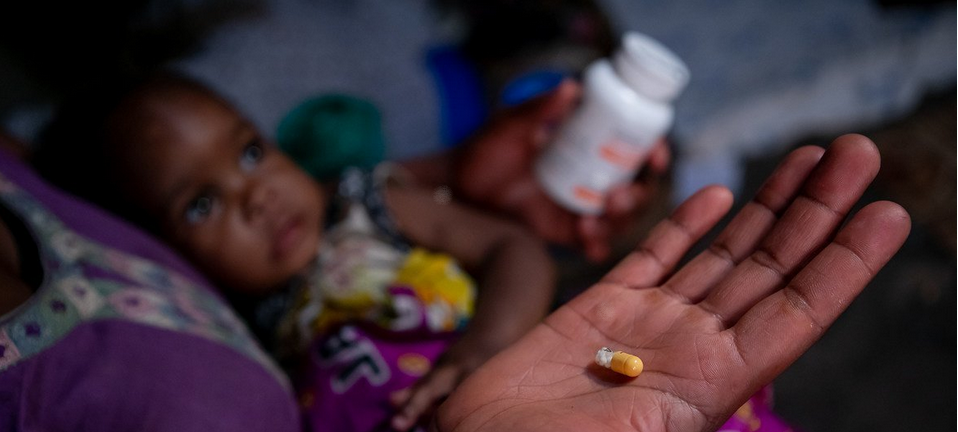

# Les outils virologiques du diagnostic et du suivi de l'infection VIH

## **Diagnostic et dépistage**&#x20;

### **Enjeux**

Le dépistage et le diagnostic de l’infection à VIH sont des enjeux majeurs de la lutte contre l’épidémie, pour les individus comme pour la collectivité. L’enjeu, pour les individus, réside dans la prescription rapide d’un traitement antirétroviral (ARV) qui va réduire, voire supprimer, les complications et le risque de mortalité liés au VIH.

Au niveau de la collectivité, le traitement ARV précoce, conséquence bénéfique directe du dépistage, contribue à diminuer le risque de transmission du VIH par le contrôle de la réplication virale et, donc, à mieux contenir la diffusion de l’épidémie.

Le dépistage représente un outil important dans les stratégies de prévention en permettant, en cas de positivité du test, de débuter le traitement et renforcer les conseils pouvant éviter une transmission ou, en cas de test négatif, en proposant notamment une prophylaxie adaptée (préservatif, prophylaxie préexposition / PrEP, traitement post-exposition / TPE).

### **Outils du dépistage et du diagnostic**

La temporalité d’apparition des marqueurs virologiques et immunologiques (figure 1) permet de comprendre les indications et les limites des différents tests de dépistage. Après la contamination, une période d’environ dix jours, dite d’« éclipse » ou « fenêtre virologique », est caractérisée par l’absence de tout marqueur détectable. L’ARN VIH plasmatique est le marqueur virologique le plus précoce, qui peut être détecté dans un délai médian de dix jours après la contamination.

L’antigène p24, protéine de capside du VIH, est détectable à partir du quinzième jour. La réponse anticorps spécifique du VIH (IgM et IgG) apparaît à partir de vingt et un jours en moyenne. Le délai à partir duquel ces anticorps peuvent être détectés va dépendre de la sensibilité des différents tests utilisés. La période sans détection possible d’anticorps est appelée fenêtre sérologique.

Figure 1 **** Evolution des marqueurs au cours de l’infection par le VIH

>)>)

Anticorps

ARN plasmatique

Seuil de détection

Ag p24

Exposition 11-12 14-15 20-21 28-29 Temps (jours)

Fenêtre virologique

Fenêtre sérologique

### **Les tests**

Les tests biologiques de détection du VIH sont de deux types :

* Tests indirects, ou sérologiques, visant à détecter dans le sang les anticorps produits par le système immunitaire contre les antigènes du virus ;
* Tests directs, reposant sur la mise en évidence du virus (détection d’un composant du virus comme l’antigène p24 ou l’ARN génomique).

Le choix des tests dépend de l’âge du sujet testé : chez l’adulte et l’enfant de plus de dix-huit mois, le dépistage et le diagnostic de l’infection à VIH se font à l’aide des tests sérologiques ; chez l’enfant de moins de dix-huit mois, ils font obligatoirement appel aux tests de détection directe du virus. L’enfant né d’une mère séropositive aura les anticorps de sa mère sans pour autant être infecté. Cas particuliers : en cas de suspicion d’infection très récente, on préfèrera un test vital direct en raison du risque de négativité des anticorps (fenêtre sérologique).

#### _Test de dépistage ELISA_

Le principe des tests immuno-enzymatiques anticorps (dit « de 3e génération ») consiste à utiliser des peptides immunogènes ou des protéines recombinantes du VIH-1 (groupe M et O) et du VIH-2 sur un support solide pour capter les anticorps spécifiques présents dans le sang. Les tests de 3e génération détectant les IgG et IgM spécifiques du VIH sont positifs en médiane vingt-trois jours (interquartile 25-75 % : 18-29 jours) après la contamination.

Les tests ELISA dits de 4e génération permettent de détecter également l’antigène p24 du VIH-1. Ces tests sont dits mixtes, car ils détectent les anticorps anti-VIH-1 et anti-VIH-2, et combinés car ils détectent aussi l’Ag p24. Ils sont plus sensibles pour dépister une infection récente (dix-huit jours en médiane après la contamination). Ils sont très fiables (précision supérieure à 99 %), automatisables et peu coûteux.

#### _Test rapide d’orientation diagnostique (TROD)_

Les TROD sont des tests de détection des anticorps anti-VIH-1 et anti-VIH-2. Ce sont des tests réalisés à l’unité, à lecture visuelle subjective, de réalisation simple et donnant un résultat en moins de trente minutes (figure 2).

Les TROD sont pratiqués sur du sang total, du sérum, du plasma ou de la salive. L’échantillon est déposé sur le support du test et s’il contient des anticorps anti-VIH-1 et/ou anti-VIH-2, ceux-ci vont se fixer aux antigènes VIH-1/2 présents sur le support (antigènes recombinants du VIH-1, du VIH-2 et du VIH-1 du groupe O et d’un peptide de synthèse du VIH-2). C’est ce complexe antigène-anticorps qui sera révélé par l’apparition d’une bande (ou d’un point) coloré(e) sur le test ; une autre bande (ou point) correspondant à la réaction ≪ contrôle ≫, permettant de s’assurer que le test n’est pas défectueux et a été bien réalisé, devra également être positif(ve).

La sensibilité des TROD est très bonne en phase chronique de l’infection, mais faible en cas d’infection récente (entre 65 et 85 % des TROD se positivent en médiane trente jours après la contamination).

Ces tests peuvent être _négatifs en cas de primo-infection_ ou d’utilisation chez des personnes sous traitement ARV.

Le taux de faux positifs est estimé entre 1 et 5 % et rend indispensable l’utilisation d’un second test de dépistage (test ELISA).

Figure 2 Réalisation (A) et lecture (B) d’un TROD

>)

A

B

#### _Les autotests_

Les autotests sont des tests rapides, réalisés sur le sang total (sang du bout du doigt) ou sur la salive, qui exploitent la même technologie que les TROD. Ils sont destinés à être utilisés dans un environnement domestique par des utilisateurs profanes. Le prélèvement et l’interprétation sont effectués directement par l’intéressé.

>)

: un programme d’autotests en Afrique

#### _Test de confirmation: Western Blot/Immunoblot_

Le Western Blot est un test de confirmation réalisé après la découverte d’une sérologie ELISA positive (figure 3). Il permet de mettre en évidence les différents anticorps dirigés contre les différentes protéines du VIH.

Le Western Blot VIH-1 est considéré comme positif quand le sérum du sujet contient des anticorps contre au moins deux bandes d’enveloppe parmi les suivantes (gp160, gp120, gp41) et une autre bande correspondant à une réactivité contre une protéine gag ou pol.

Figure 3 Exemples de différents résultats de Western-Blot VIH-1, illustrant différentes situations d’infection VIH

>)

#### _Détection de l’antigène p24 (capside)_

Elle se fait par technique ELISA. Son intérêt essentiel est le diagnostic d’une primo-infection VIH avant l’apparition des anticorps, car l’antigène p24 est détectable environ quinze jours après la contamination, alors que les anticorps sont présents seulement vingt-et-un à vingt-six jours après. Les tests ELISA combinés de 4e génération (antigène-anticorps) remplacent la recherche isolée de l’antigène p24.

## **Les outils virologiques du suivi de l’infection VIH**

Lorsqu’apparait l’épidémie en 1981 ou même lorsque le VIH est découvert, la virologie clinique est balbutiante. Seule la quantification de l’antigénémie VIH, imparfaite mesure de quantification, sera disponible au début des années 1990. Il faudra attendre 1995 pour que la mise au point des techniques PCR (_Polymerase Chain Reaction)_ en routine puisse permettre de quantifier la production virale. C’est une technologie de biologie moléculaire très sensible qui mesure directement la production de virus.

Actuellement, le suivi virologique est un élément clé pour évaluer l’efficacité d’un traitement ARV, déterminer si le virus est contrôlé (succès virologique) ou si persiste la réplication (échec virologique) et pouvoir confirmer la non-transmission.

### **Comment mesurer la réplication du VIH ?**

#### _La technique PCR_

L’ARN VIH dans le plasma (charge virale) est quantifié par des technologies d’amplification des acides nucléiques (_reverse transcriptase-polymerase chain reaction_ \[RT-PCR]). La première étape consiste en l’extraction de l’ARN, puis se déroule une étape d’amplification des quantités plus ou moins importantes d’acides nucléiques viraux qui vont être ciblées à l’aide d’amorces et de sondes spécifiques du génome viral VIH-1 (figure 4).

_Figure 4 Exemples de systèmes de mesure de la charge virale VIH-1 automatisés et en système fermé_

>)_A. Système haut débit  B Système unitaire_

Les seuils de quantification sont compris entre 10 et 200 copies/mL de plasma selon les kits commerciaux et l’étendue d’amplification peut atteindre 108 copies/mL.

Les techniques de quantification permettent d’amplifier les différents groupes de VIH-1. En revanche, très peu de techniques commercialisées amplifient spécifiquement le VIH-2.

La charge virale (CV) peut se mesurer dans différents liquides biologiques : sang, sperme, secrétions vaginales, lait, liquide céphalorachidien pour apprécier la production de virus au niveau cérébral.

#### _À quoi sert la mesure de la charge virale ?_

La quantification de la réplication virale est un marqueur pronostique de l’évolution de l’infection sans traitement et permet de mesurer l’efficacité du traitement. La quantification de la CV est devenue une recommandation forte de l’OMS pour toutes les personnes vivant avec le VIH.

L’ARN viral est détectable dès sept à dix jours après la contamination. La PCR remplace de plus en plus l’antigénémie p24 en cas de suspicion de primo-infection.

La mesure de la CV est aussi indispensable à la prise en charge d’un patient sous traitement ARV. La réplication virale sous traitement mesurée par la CV a des conséquences importantes sur l’émergence de résistance aux ARV, ainsi que sur la transmission du VIH.

#### _Approches alternatives à la quantification de la charge virale plasmatique_

Dans les pays à ressources limitées, le nombre restreint de laboratoires spécialisés aptes à pratiquer ces tests de biologie moléculaire a conduit au développement d’approches alternatives pour permettre l’accès plus large à la CV.

_- Sang séché sur buvard ou dried blot spot (DBS)_

Le sang total est déposé directement sur un buvard, séché à l’air libre puis conservé au froid (-20°C), Après préparation simple pour fixer le prélèvement, la CV peut être quantifiée avec des kits commerciaux comme NucliSENS EasyQ. HIV-1 v. 2.0, Abbott m2000rt Real Time™ HIV-1 assay et Generic HIV Charge virale®. Le seuil de détection reste cependant assez élevé, environ 800-1 500 copies/mL.

_- Système de charge virale en point of care (POC)_

Ces techniques pourraient favoriser l’expansion nécessaire des tests de CV au niveau des sites décentralisés et pallier les contraintes de transport des échantillons et des DBS. De plus, elles permettent d’effectuer la CV à proximité du point de prise en charge du patient. De nombreux systèmes sont développés, incluant les étapes d’extraction et d’amplification en temps réel avec un rendu en moins de deux heures.

### **Résistance du VIH aux antirétroviraux**

#### _Principes de la résistance du VIH aux antirétroviraux_

La résistance du VIH aux ARV est liée à la sélection de mutations au niveau des gènes qui codent les enzymes cibles des ARV. Cette résistance ne se développe qu’en cas de réplication virale persistant sous médicaments ARV.

Ceci peut être lié à :

* Des médicaments ARV insuffisamment pris (défaut d’observance) ;
* Des médicaments ARV présents en quantité insuffisante dans le sang en raison d’interactions avec d’autres médicaments qui font baisser leur concentration sanguine, les rendant moins efficaces sur le VIH ;
* Des médicaments ARV insuffisamment puissants face à un virus déjà résistant.

Toute réplication sous traitement ARV « non suppressif », c’est-à-dire ne parvenant pas à rendre la CV indétectable, conduit habituellement au _développement de la résistance_ (figure 5).

Cette sélection est rendue possible par la grande diversité génétique du VIH chez un même individu. Ainsi, chaque jour, sont générés des virus portant des mutations à chacune des positions du génome, notamment au niveau des gènes cibles des ARV. Les mutants résistants sont donc préexistants à l’instauration de la thérapeutique, en proportion minoritaire parmi les copies présentes dans l’organisme. Les mutations entraînent des modifications de structure des enzymes cibles dont l’interaction avec les ARV correspondants est perturbée, empêchant ainsi les ARV de se fixer à leur cible, donc de l’inhiber. Ainsi, les virus avec des mutations sélectionnées par les ARV sont capables de se multiplier en présence de l’ARV mais au prix d’une capacité réplicative virale diminuée.

Figure 5 Principe de la sélection de variants résistants sous pression de sélection antirétrovirale et réémergence des variants sauvages en cas d’arrêt de traitement

#### _Barrière génétique à la résistance_

La barrière génétique à la résistance est définie par le nombre de mutations de résistance nécessaires pour induire la résistance à un ARV donné et par la rapidité à laquelle ces mutations sont sélectionnées en cas de réplication virale sous cet ARV. La résistance à certains ARV, névirapine ou lamivudine par exemple, est liée à la présence d’une seule mutation dans le gène de la transcriptase inverse. On parle alors de faible barrière génétique à la résistance (figure 6). Chez des individus qui n’ont jamais reçu ces ARV, avec une CV VIH plasmatique de 10 000 copies/mL, un génome viral portant déjà cette mutation peut être présent.

Si la multiplication virale est mal contrôlée chez un patient traité par l’un de ces ARV, les mutants résistants vont donc pouvoir être rapidement sélectionnés et devenir, en quelques jours, la population virale prédominante. Pour la classe des inhibiteurs de protéase (IP), la résistance ne survient que lorsque plusieurs mutations se sont accumulées, de sorte que les mutants résistants émergent plus lentement. On parle ainsi d’une _barrière génétique élevée à la résistance_.

Il existe une notion plus globale qui est la barrière thérapeutique à la résistance : cette notion concerne la combinaison ARV utilisée et comprend à la fois la puissance anti-rétrovirale de la combinaison, des critères virologiques (barrière génétique à la résistance) et pharmacologiques (demi-vie des ARV).

Figure 6 Principe de la barrière génétique à la résistance d’un antirétroviral

#### _Les techniques_

Les tests génotypiques d’analyse de la résistance aux ARV sont très largement utilisés pour la prise en charge thérapeutique des patients. Ils sont recommandés au moment du diagnostic avant l’initiation du traitement afin de rechercher une possible transmission de résistance, détectée dans environ 10% des nouvelles infections, et bien évidemment en cas d’échec sous traitement ARV.

Les tests génotypiques analysent les séquences des gènes de la transcriptase inverse, de la protéase et de l’intégrase en comparaison de celles d’un virus sauvage de référence afin de mettre en évidence les mutations associées à la résistance ; ils peuvent être réalisés par des techniques commerciales ou des protocoles dits « maison » (figure 7). Les tests commerciaux fournissent réactifs, programmes informatiques pour l’alignement des séquences et leur interprétation à l’aide d’algorithmes devant être régulièrement mis à jour.

Leur réalisation dans le contexte d’un échappement thérapeutique doit se faire alors que le patient est toujours sous médication ARV ou, si cela n’est pas possible, le plus précocement dans les semaines qui suivent l’arrêt du traitement. Les tests génotypiques doivent être effectués en cas d’échec virologique (CV > 50 copies/mL, confirmée sur deux mesures consécutives).

Figure 7 Les différentes étapes de biologie moléculaire d’un test génotypique de résistance

Source : Image B. Visseaux

Les séquences génotypiques sont interprétées à l’aide d’algorithmes définissant le virus comme « sensible », « résistant » ou « résistant possible » aux différents ARV en fonction des mutations mises en évidence (figure 8). Les algorithmes de l’ANRS I MIE, Stanford et Rega sont les plus utilisés, publiquement accessibles et régulièrement mis à jour.

[_(www.hivfrenchresistance.or_](http://www.hivfrenchresistance.org)_g,_ [_https://hivdb.stanford.edu)._](https://hivdb.stanford.edu)

L’interprétation des tests de résistance doit se faire en concertation entre cliniciens, virologues et pharmacologues, examinant ensemble l’histoire du traitement du patient, l’évolution de la CV et du nombre de lymphocytes T CD4+, les éventuels problèmes d’observance, d’intolérance et d’interactions médicamenteuses.

Dans les centres de prise en charge, les réunions de discussion de dossiers (RCP) sont importantes et doivent prendre en compte l’ensemble des génotypes de résistance disponibles au cours de l’histoire thérapeutique du patient (génotype de résistance dit « cumulé »).

Figure 8 Deux génotypes de résistance interprétés selon l’algorithme ANRS

**Virus**

**entièrement**

**sensible**

**Virus résistant IP et INI**

**Séquençage sur papier buvard et (DBS)**

Les pays du Sud souffrent d’un manque de ressources adaptées à ces techniques de biologie moléculaires disponibles en routine.

Le prélèvement de sang séché sur papier buvard (DBS, _dried blood spot_ en anglais) est relativement facile à réaliser, stocker et transporter. Contrairement au sang total et au plasma, les contraintes liées à la chaîne du froid et au risque biologique sont réduites. Selon l’OMS, le DBS est un prélèvement fiable et adapté à la surveillance des résistances dans les pays du Sud. Les séquences obtenues sur DBS ont une bonne similarité comparée au plasma. La sensibilité (> 5 000 copies/ml) est cependant limitée en raison du faible volume de sang testé. Ce support de prélèvements permet d’effectuer les analyses de résistance de façon centralisée et élargissent aujourd’hui l’accès aux tests de résistance.

### **Quantifier le réservoir cellulaire (ADN VIH)**

La taille du réservoir viral est estimée par la quantité d’ADN VIH présent dans les cellules cibles du VIH. L’ADN VIH dans les cellules sanguines cibles peut être détecté et/ou quantifié par PCR en copies par million de cellules sanguines mononuclées(PBMC).

Il est possible de détecter les virus résistants archivés dans le réservoir cellulaire par génotype. Ainsi, dans le cadre d’un changement de traitement (allègement thérapeutique par exemple) chez une personne présentant une CV plasmatique indétectable, un test de résistance peut être réalisé à partir de l’ADN VIH dans les cellules cibles.

_Attention_ : l’absence de détection de mutations de résistance dans l’ADN proviral ne signifie pas que la mutation n’est pas archivée, elle peut être présente en proportion minoritaire ou dans un autre réservoir.
