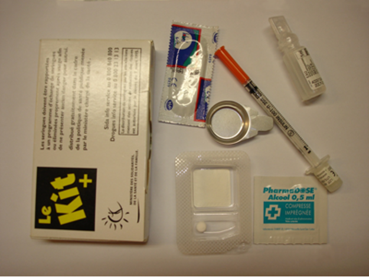

# Politiques de réduction des risques liés à l'usage de drogues

Pour comprendre comment se sont organisés le soutien et la prévention auprès des usagers de drogue par voie intraveineuse, il faut revenir brièvement sur une conjonction historique propre aux années 1980 : l’apparition de l’épidémie de sida, la consommation accrue d’héroïne et l’intensification des politiques répressives contre la drogue.

## **Une histoire longue**

En France, depuis 1970 et la loi qui a pour but « la lutte contre la toxicomanie et la répression du trafic et de l'usage illicite de substances vénéneuses », les usagers de drogues sont dans le même temps considérés comme des malades et des délinquants puisque l’usage simple pouvait valoir une peine de prison.

L’injection de drogue n’entraîne pas par elle-même de contamination, mais le risque va venir d’une pratique courante chez les héroïnomanes : le partage de seringues. En effet, depuis un décret de 1972, la vente de seringues n’est possible qu’en pharmacie et sur ordonnance (ou contre l’enregistrement de l’identité de l’acheteur, ce qui revient _ipso facto_ à déclarer sa toxicomanie). Faute d’être accessibles, les seringues sont donc partagées par les injecteurs de produits. Pendant une décennie, overdoses et contaminations (aux virus du sida et des hépatites) vont toucher en grande partie des personnes jeunes, pauvres, marginalisées et souvent « racialisées ». En France la position est figée, alors que dans d’autres pays, des scientifiques et des décideurs politiques ont déjà passé le stade du constat et des mesures à mettre en œuvre, même si cela ne s’est pas fait sans débats. En Amérique du Nord, en Grande-Bretagne, aux Pays-Bas, en Allemagne notamment, une politique dite de « _harm reduction_ » (réduction des risques liés à l’usage de drogue) se met en place en s’appuyant sur des associations d'usagers de drogues, sur l’accessibilité des seringues et sur les traitements de substitution. Il en va tout autrement en France. Deux brochures sont éditées par l’association Aides en 1985 et 1986 pour alerter et informer les usagers de drogue.&#x20;

Certes, la ministre de la santé Michèle Barzach, elle-même médecin, parvient à faire abroger le décret de 1972 et à libéraliser la vente des seringues en pharmacie. Son décret paraît le 13 mai 1987, après huit mois de lutte contre certains professionnels de santé et une partie de ses collègues ministres. Néanmoins, le texte est adopté à titre expérimental, pour un an. Renouvelé en 1988 pour un an supplémentaire, il est finalement pérennisé en 1989. Il faudra attendre encore encore six années de plus pour qu’advienne une politique de réduction des risques (RdR). Ce chemin parcouru à pas de tortue a indubitablement coûté bien des vies. Publié en 1995, le rapport de la Commission Henrion affirme que « _la politique de lutte contre la toxicomanie, fondée sur l'idée selon laquelle il ne faut rien faire pour faciliter la vie des toxicomanes, a provoqué des catastrophes sanitaires et sociales_ ». Et de fait, en 1989, le rapport Trautmann sur la lutte contre la toxicomanie et le trafic des stupéfiants n’abordait quasiment pas la question du sida. En décembre 1990, la Délégation générale à la lutte contre la drogue et la toxicomanie n’en dit pas un mot dans sa campagne nationale intitulée « _Combat pour la vie »_. Entre 1990 et 1992, l’AFLS (Association française de lutte contre le sida) finance toutefois certaines actions de proximité, notamment des campagnes de sensibilisation auprès des pharmaciens et des projets de mise à disposition de matériel en vrac, jusqu’à l’arrivée des premiers Stéribox® en 1991.&#x20;

Côté associatif, les choses s’accélèrent également. En 1989, trois programmes d’échange de seringues voient le jour, en toute illégalité : à Marseille (géré par l’AMPT, Association Méditerranéenne de Prévention et de Traitement des Addictions, devenue Addiction Méditerranée), à Saint-Denis (repris ensuite par l’association Arcades) et à Paris (par Médecins du Monde). Un __ projet commun est tout d’abord envisagé avec des spécialistes mais n'aboutit pas et MdM se lance seul dans un programme d'échanges des seringues. __ La décision provoque d’ailleurs des remous car la distribution de seringues est considérée par certains volontaires de l’association comme une incitation à l’usage de drogues. Au fil des mois, et à la limite de la légalité parfois, d’autres acteurs inventent des moyens d’accueillir les usagers et de mettre du matériel à leur disposition (dans leurs locaux, dans des bus, _via_ des automates). Ils agissent sur fonds propres et, parfois, avec des crédits de l’AFLS ou des directions départementales des affaires sanitaires et sociales. Par ailleurs, suite à la circulaire de 1990 qui modifie le protocole méthadone de 1973, le docteur A. Charles-Nicolas ouvre douze places au Centre Pierre-Nicolle, à Paris.

Mais au-delà de ces engagements épars, c’est en 1992 que s’opère le tournant vers une action collective et concertée. Cette année-là, lors de la VIIIe Conférence internationale sur le sida à Amsterdam, de nombreuses communications font état des différentes politiques de RdR menées à travers le monde : leurs résultats sont encourageants, notamment grâce à l’implication des usagers. Pour l’association ASUD, créée fin 1992, « _le principal volet de la réduction des risques repose sur la possibilité pour les usagers de drogue de prendre en charge une partie de leur traitement, ce qui suppose le recours à l’éducation par les pairs »_.

## **Réduire les risques liés à l’usage de drogues : le passage à l’acte en France**

Avec le colloque Tri-Villes, organisé en janvier 1993 par le ministre de la santé de l’époque, Bernard Kouchner, la prise de conscience et les échanges s’intensifient entre les acteurs de terrain. Des rencontres informelles, puis des réunions plus organisées, vont aboutir à la création du collectif _Limiter la casse_. Le 25 mars 1993, « _neuf associations avaient été invitées, mais ce collectif était d’abord un rassemblement de personnes avec ses trois composantes : des militants de l’auto-support, des militants de la lutte contre le sida et des acteurs de santé_ » raconte Anne Coppel. L’assemblée générale constitutive de _Limiter la casse_ se tient le 6 septembre 1993. Quelques jours après, le rapport du Conseil national du sida sur la toxicomanie et le sida est publié : appelant de ses vœux une politique de RdR, il indique clairement que « _la priorité des pouvoirs publics doit être la prévention et la protection de la santé publique, et non la répression de l'usage simple de drogues_ ». Cette recommandation va dans le sens de la IXe Conférence internationale sur le sida qui, comme la précédente, a largement confirmé l’efficacité des expériences de RdR menées à l’étranger. Mais ce message est-il entendu par les responsables politiques français ?

La première étape n’est guère spectaculaire : en effet, c’est l’abstinence et non la prévention des risques infectieux qui est au cœur du plan de lutte contre la toxicomanie de 1993. Le texte prévoit le doublement des lits de post-cure, la création de trois à cinq lits de sevrage dans les hôpitaux et la constitution de réseaux de médecins généralistes ville-hôpital en toxicomanie. Il garantit aussi l’accès aux soins en prison pour les toxicomanes. Mais si le sida est mentionné pour la première fois dans un plan gouvernemental sur la toxicomanie, la Ministre de la Santé Simone Veil a laissé en annexe les mesures applicables à moyen terme : elles posent néanmoins les principes d’une RdR que son ministère pourra déployer administrativement par la suite, de façon autonome. Tactique ou évitement ? La question se pose au regard des précautions avec lesquelles sont évoquées la création de centres d'urgence chargés d’accueillir la « _fraction de la population la plus marginalisée_ » ou le développement de programmes d'échange de seringues et de traitements de substitution.

Déçus par l’inversion des priorités, les défenseurs de la RdR réagissent majoritairement de façon négative, jugeant le rapport « _frileux_ », « _pauvre_ », « _insuffisant_ ». Le 19 octobre, le collectif _Limiter la casse_ publie un appel dans les quotidiens Le Monde et Libération : « _Des toxicomanes meurent chaque jour du sida, d’hépatite, de septicémie, par suicide ou par overdose. Ces morts peuvent être évitées, (….) , limitons la casse ! »_.

Simone Veil, de plus en plus convaincue, doit manœuvrer pour agir sans faillir à sa loyauté gouvernementale. Au 1er mars 1994, elle rend public un premier bilan de son action. Quatre “dispensaires de vie” s'ajoutent aux 2 “boutiques” existantes et 16 programmes d'échange de seringues sont créés. 217 places méthadone avaient été ouvertes en septembre 1993, 256 sont agréées en janvier. Chaque projet, chaque place méthadone a exigé une volonté inébranlable alliée à une connaissance précise des rouages administratifs qui ont permis de surmonter en six mois les obstacles qui exigent habituellement des années ». La pression est pourtant maintenue par le collectif _Limiter la casse_ qui réunit quelques 800 personnes les 4-5 juin 1994, pour les États généraux « Drogue et sida ». Simone Veil vient clôturer la manifestation « _pour qu’enfin on passe à la vitesse supérieure dans la politique de réduction du risque vis-à-vis de l’épidémie du sida_ ».

Le 21 juillet 1994, dix nouvelles mesures budgétisées sont annoncées pour limiter les risques de contamination des toxicomanes. Cela inclut la mise en vente des Stéribox® en pharmacie, le développement d’automates-distributeurs de kits, la légalisation de la mise à disposition des seringues par les associations, la montée en charge des programmes de méthadone à 1 645 places fin 1994, la création de 9 boutiques supplémentaires, de 12 réseaux ville-hôpital-toxicomanie et de 25 programmes d'échange de seringues.

Dix ans plus tard, la loi de santé publique du 9 août de 2004 ancre le dispositif de RdR initié par Simone Veil dans une véritable politique publique, clôturant une (trop) longue période expérimentale. La définition des activités de RdR pour les usagers de drogues est spécifiée par décret en avril 2005 (n°2005-347). Deux types de structures forment les piliers du dispositif français :

* les centres d’accueil et d’accompagnement à la réduction des risques pour usagers de drogue (CAARUD), créés par la loi de santé publique du 9 août 2004 et mis en place dans tous les départements français à partir de janvier 2006,
* les centres de soins, d’accompagnement et de prévention en addictologie (CSAPA), institués par le décret n°2007-877 du 14 mai 2007. Ils prennent le relais des CSST (Centre spécialisé de soins aux toxicomanes) et accueillent en journée, toute personne, mineure ou majeure, seule ou en famille, confrontée à l’addiction.

En quasiment 25 ans, des premiers cas de sida recensés en 1981 jusqu’à la loi de santé publique de 2004, la RdR a été l’un des combats les plus difficiles à mener. Faute de visibilité sociale d’abord, de réactivité sanitaire ensuite. Au début des années 1990, il y a entre 250 000 et 300 000 usagers de drogues injectables en France. Moins de 20 000 fréquentent régulièrement des institutions de soins. Parmi eux, 30% à 40% sont séropositifs au VIH, et la prévalence du virus de l’hépatite C est évaluée à plus de 70%. En outre, près d’un quart des personnes hétérosexuelles contaminées par voie sexuelle sont des partenaires de toxicomanes. Quant aux transmissions mère-enfant, elles concernent des femmes contaminées lors d’un usage de drogues dans plus de 40% des cas. Six mois après la remise des seringues en vente libre, les contaminations VIH entre usagers de drogues sont réduites de 80%. Entre 1994 et 2004, le nombre de surdoses d’héroïne est divisé par trois, du simple fait de l’accès aux traitements de substitution aux opiacés (TSO). Des inégalités subsistent encore dans l’accès au dispositif, mais la RdR est un succès. Un succès qui repose sur l’adhésion massive des soi-disant “victimes de la drogue”. Les toxicomanes furent les principaux acteurs du système les autorisant à prendre en charge eux-mêmes les actions de prévention_._ C'est le passage d’une « _logique de prise en charge à une logique de santé publique_ » écrit Anne Coppel ; « _Travailler avec et non pour la personne_ » __ selon Jean-Pierre Lhomme_._

La baisse des contaminations par le VIH, la chronicisation de la maladie et l’arrivée de traitements curatifs pour l’hépatite C ont modifié le paysage. En mieux pour la santé individuelle des usagers de drogue. Pas forcément pour la RdR qui se retrouve noyée dans le concept d’addictologie. C’est une discipline hospitalo-universitaire animée par les nouveaux mandarins du champ, pour la plupart des psychiatres issus de l’alcoologie. Un véritable hold-up qui emprunte à la RdR son rationalisme mais ignore superbement son combat citoyen. À la conduite unique qui était promue par le corps médical et politique avant la RdR (“guérir des drogues”) est venue se substituer une autre conduite, plus compréhensive certes, mais tout aussi unique : être compliant, dans ses consommations de drogues, aux messages portés par la RdR telle qu’elle est définie par le guide technique des Nations unies de 2009. La normativité de la technique prend le pas sur la réflexion politique repoussant aux marges les débats sur les salles de consommation à moindre risque et sur la dépénalisation. Les salles de consommation à moindre risque (SCMR) ont été autorisées par la loi en 2016. Il en existe actuellement deux en France : une à Paris et l’autre à Strasbourg, celle de Marseille est en discussion depuis des décennies sans jamais avoir vu le jour.

## Et au Sud ?

L’usage de produits psychoactifs n’est pas réservé aux pays du Nord et, depuis plusieurs années en Afrique, des usagers sont parfois identifiés et leur accompagnement et leur prise en charge commencent à s’organiser. Quelques programmes de substitution ont été mis en place depuis une dizaine d’années en Afrique. Les premiers ont été installés en Afrique anglophone (Kenya, Tanzanie). Depuis le 1er décembre 2014, un centre dédié à la prise en charge des usagers de produits psychoactifs a été ouvert à Dakar (Sénégal) : le CEPIAD. Outre la délivrance de méthadone, c’est la prise en charge ambulatoire globale des personnes dépendantes aux substances psychoactives qui y est mise en avant. Des dépistages (VIH et hépatites) y sont effectués et un programme d’échanges de seringues y est accolé depuis 2011.

Dans la grande majorité des pays d’Afrique, les mesures prises face à l’usage de produits ont été la pénalisation, l’incarcération. Ce choix, qui a montré très rapidement ses limites, a été dénoncé au niveau international par la plupart des experts, qu’ils soient associatifs ou scientifiques. L’incarcération ne fait qu’aggraver les conditions psychologiques et médicales des consommateurs, déjà en grande vulnérabilité en raison de leur usage de produits psychoactifs.

Tout comme ce fut le cas au Nord, il semble indispensable de favoriser la création d’un mouvement communautaire pour que les consommateurs eux-mêmes puissent définir un modèle d’action, de prévention, voire de prise en charge. Des réseaux commencent à voir le jour, comme en 2017 à Grand Bassam (Côte d’Ivoire) où neuf associations de type communautaire ont fondé le Rafasud (Réseau Afrique francophone autosupport des usagers de drogues). Il faut pouvoir construire des réponses adaptées aux habitants des pays sans reproduire à l’identique ce qui a pu se passer en France.

Il faut bien sûr aussi développer des études dans les pays avec les associations et les usagers qui connaissent le terrain et ainsi participer à améliorer la prévention, l’accompagnement et la prise en charges des usagers. Il en est ainsi du travail engagé au Mali qui, après avoir été un site de transit du trafic de drogues, a vu sa population d’usagers augmenter significativement. Pour trouver des solutions, des enquêtes ont été mises en place à la demande des structures locales. L’étude conduite par MdM en 2015 à Bamako auprès de 500 usagers de drogues (essentiellement des hommes) a montré que les deux substances les plus consommées (hors cannabis) étaient l’héroïne (98% des participants) et le crack (70%), et que seuls 8% déclaraient avoir déjà injecté des produits. Ces chiffres ne reflètent pas les dernières informations issues des articles de presse, des données scientifiques récentes et des saisies faites sur le territoire malien où prédominent méthamphétamine et tramadol. Etant donné l’utilisation détournée de ce dernier médicament pour lutter contre la fatigue ou les troubles sexuels et son pouvoir addictogène, lié à son appartenance à la classe des opioïdes, le lien entre usage et pratiques à risque liées à la transmission du VIH et du VHC semble crucial à explorer. De plus, il a été montré que 4 à 6% des personnes qui détournent les opioïdes de leur usage thérapeutique passent graduellement vers l’usage d’héroïne. Si le tramadol est le médicament psychotrope le plus saisi par les douanes, il en existe beaucoup d’autres sur les marchés, souvent contrefaits, et consommés par des groupes variés de la population. La consommation de drogues, particulièrement par voie intraveineuse et surtout chez les porteurs du VIH, aggrave également l’incidence de la tuberculose. Enfin, l’usage de méthamphétamine est connu pour être associé à des pratiques à risque importantes de transmission du VIH. Il apparaît donc crucial d’initier et de consolider une approche de RdR adaptée et efficace qui répondrait aux besoins des usagers. Ces derniers constituent une population protéiforme (injecteurs, travailleur-se-s du sexe, chauffeurs de taxi, vendeurs ambulants, jeunes, femmes, etc.). Ils ont néanmoins en commun, par le fait de pratiques de consommation illégales, d’être soumis à des formes de clandestinité et de stigmatisation qui les tiennent éloignés des services de prévention et de prise en charge, par ailleurs très limités et/ou méconnus dans le pays. Pour évaluer les besoins, et améliorer la qualité de vie des usagers de produits psychoactifs, l’ANRS-MIE a dans ce cadre financé une étude appelée Bé Djé (étude menée par le SESSTIM et Arcad-Santé Plus au sein du CIRSAC (Centre intégré de recherche, de soins et d’action communautaire) de Bamako.

En effet l’Afrique est un passage important pour les drogues à destination de l’Europe et, en se basant simplement sur l’évolution démographique, l’ONUDC affirme dans son Rapport mondial sur la drogue 2021 que le nombre des usagers de produits psychoactifs devrait augmenter de 40% dans les 10 années à venir. Les produits sont assez diversifiés, détournement de médicaments (tramadol), cocaïne, héroïne, cannabis, et les voies d’administration sont elles aussi variées ; l’injection y est retrouvée mais n’est pas forcément majoritaire.

Quelques programmes de prévention et de recherche sont financés. En Afrique comme au Nord, il est capital de dissocier le trafic et l’usage afin de pouvoir réduire les risques infectieux qu’affrontent les usagers de ces produits.


Si les risques infectieux liés à l’usage de produits dans les pays du Nord et en France en particulier ont diminué depuis les années 1990, il faut néanmoins rester particulièrement vigilant en accompagnant les structures associatives communautaires qui sont des sentinelles, attentives aux nouvelles pratiques et qui permettent d’alerter les autorités sanitaires sur de nouveaux risques. Au Sud, la prévention, le soutien, la prise en charge doivent être développés auprès des usagers et l’accompagnement politique et scientifique intensifiés auprès des autorités judiciaires et sanitaires des pays.


**Pour en savoir plus**&#x20;

* COPPEL Anne, _Peut-on civiliser les drogues ? De la guerre à la drogue à la réduction des risques_, Paris, Éditions La Découverte, 2002
* Olivier MAUREL & Michel BOURRELLY. Une histoire de la lutte contre le sida. Le Nouveau Monde éditions, 2021, 720 p.
* O’HARE Pat, « Petite histoire de la réduction des risques, de l’initiative locale à la problématique globale » in MdM (coord. par DEBAULIEU Céline, LUHMANN Niklas & MAGUET Olivier)
* ROBERTSON J.R., BUCKNALL A.B.V. & al. (1986) “Epidemic of AIDS Related Virus (HTVL III/LAV) Infection among Intravenous Drug Abusers”, _British Journal of Addiction, 192_, p.527.
