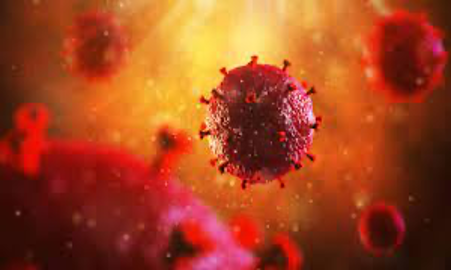

# Qu'est-ce que le VIH ?


Qu'est-ce qu'un virus ?

* micro-organisme mesurant environ 40 à 100 nm ;
* constitué de son génome (ARN ou ADN) protégé par une structure protéique (capside) ;
* il doit obligatoirement infecter une cellule pour pouvoir se répliquer et survivre en formant de nouvelles particules virales.


Le Virus de l’Immunodéficience Humaine (VIH), de type 1 (VIH-1) ou de type 2 (VIH-2), est un rétrovirus, c’est-à-dire un virus dont le matériel génétique (génome) est un ARN (comme le virus de la grippe ou les coronavirus). C’est aussi un virus capable de copier son ARN en ADN.

Ces possibilités, spécifiques à cette classe de virus, en font un prédateur doté de qualités hors pair. D’une part, il possède les qualités d’un attaquant de la cellule grâce à son ARN entraînant une forte multiplication de plusieurs milliards de virus chaque jour, qui détruisent des milliards de lymphocytes. D’autre part, grâce à sa transformation en ADN, il s’intègre au cœur du noyau de la cellule qu’il infecte pour y rester caché et silencieux et constituer ce que l’on appelle le réservoir viral. Cette persistance du VIH au sein de l’ADN des cellules infectées explique que l’infection VIH ne peut être  aujourd’hui éradiquée, car on ne sait actuellement ni repérer les cellules réservoirs, ni désintégrer l’ADN viral qu’elles contiennent.

Les copies du VIH sont sphériques et entourées d’une enveloppe. Le VIH a été identifié pour la première fois en 1983 par une équipe française et initialement appelé LAV (_Lymphadenopathy Associated Virus_). En 1986, la découverte d’un deuxième virus différent du premier a conduit à une nouvelle classification définissant les VIH de type 1 (VIH-1) et de type 2 (VIH-2).

Les virus VIH-1 sont actuellement classés en quatre groupes : le groupe M (_major_, responsable de la pandémie mondiale), le groupe O (_outlier_), le groupe N (_non-M non-O_) et le groupe P, selon la chronologie de leur découverte. Les virus VIH-2 sont classés en neuf groupes (A à I) (figure 1).&#x20;

Tous les VIH dérivent de virus de l’immunodéficience du singe (dits SIV). Cependant, les différents types et groupes de VIH dérivent de SIV présents chez différentes espèces de singes, parfois assez éloignées les unes des autres. Alors que les VIH-1 groupe M et N sont proches du SIVcpz (infectant une sous-espèce de chimpanzés dits Pan troglodytes troglodytes), les VIH-1 groupe O et P sont proches des SIVgor (infectant les gorilles) et le VIH-2 est plus proche des SIVsmm (infectant les sootey mangabey, petits singes d’Afrique de l’Ouest) (figure 2).&#x20;

Ainsi, chaque groupe de VIH-1 et VIH-2 représente une introduction séparée d’une souche de SIV à l’homme. Le passage des différentes souches de SIV du singe à l’homme est expliqué par le fait que les singes ont été chassés, et sont parfois encore braconnés, comme gibier (chimpanzé, gorille, sooty mangabey) ou comme animal de compagnie (sooty mangabey).

La répartition géographique des différents VIH-1 diffère selon l’ancienneté de l’épidémie dans le pays, l’effet fondateur dans le groupe d’individus considéré et les migrations de population.

Dans les pays du Nord, le sous-type B est prédominant et il est responsable de l’épidémie initiale dans les pays industrialisés, en particulier l’Amérique du Nord et l’Europe de l’Ouest, dont la France.&#x20;

En revanche, à l’échelle mondiale, les VIH-1 non-B représentent au moins 85 % des virus circulants. Les sous-types prédominants sont :

* le sous-type C, responsable de 47 % des infections, principalement en Afrique du Sud et en Inde,
* le sous-type B (12 %) en Amérique du Nord et en Europe,
* le sous-type A (10 %) en Europe de l’Est, Asie centrale et Afrique de l’Est,&#x20;
* le CRF02\_AG (7,7 %) en Afrique de l’Ouest et le CRF01\_AE (5,3 %) en Asie du Sud-Est (figure 3).&#x20;

La proportion de virus recombinants est de 23 %. **** En Afrique centrale, circulent tous les sous-types du groupe M et la majorité des formes recombinantes. Contrastant avec l’extraordinaire diffusion des VIH-1 du groupe M aboutissant à une pandémie, les infections par les VIH-1 non-M restent localisées en Afrique centrale, principalement au Cameroun.

## **Variabilité du VIH**

Le VIH dispose d’une capacité très importante de muter, de faire varier son apparence et son contenu, en se reproduisant mais jamais complètement à l’identique, en mutant notamment sur ses enzymes. Sa diversité génétique est grande ; on dit qu’il est très variable.

Le facteur le plus contributif à la diversité génétique du VIH est le taux d’erreur de l’enzyme virale Transcriptase Inverse (TI), quand elle recopie le génome viral au cours du cycle de réplication. Cette introduction de mutations à une fréquence élevée, associée à un taux élevé de réplication virale (entre 109 et 1010 nouveaux virus produits par jour chez une personne infectée) en absence de traitement, génère une quantité importante de variants viraux par jour, appelés quasi-espèces.

À ces deux facteurs s’ajoutent les phénomènes de recombinaison entre deux génomes viraux, phénomène habituel entre virus qui s’échangent ainsi du matériel génétique.&#x20;

Cette variabilité des VIH leur confère la possibilité de :

* développer des mutations de résistance aux médicaments antirétroviraux,
* échapper à l’action des anticorps produits par le système immunitaire en réaction à l’infection virale.

## **Structure du VIH**

Le VIH a une structure sphérique d’environ 100 nm de diamètre, avec une enveloppe composée d’une bicouche lipidique d’origine cellulaire et de la glycoprotéine d’enveloppe.

Le VIH est un virus à ARN dont le génome comprend environ 10 000 paire de bases. Deux brins d’ARN viral sont présents dans la particule virale.

L’enveloppe virale est constituée de deux parties : une sous-unité transmembranaire (TM) et une sous-unité de surface (SU). La capside (dite antigène p24 car protéine d’un poids moléculaire de 24 kDa) va entourer le génome viral (figure 4).

## **Cellules cibles du VIH**

Les cellules cibles du VIH portent à leur surface le principal récepteur du VIH : la molécule CD4. Ces cellules sont les lymphocytes T CD4+, en moindre proportion les macrophages, cellules chargées d’éliminer les éléments pathogènes intrus et les cellules dendritiques, chargées quant à elles d’apporter aux ganglions lymphatiques, piliers du système immunitaire, la particule virale à éliminer. Mais ce faisant, ces cellules circulantes vont contribuer à la dissémination du virus dans tout l’organisme.

## **Cycle de multiplication du VIH**

### Entrée du virus dans la cellule

L’entrée du virus dans la cellule cible se fait en trois étapes consécutives :

* Attachement de la glycoprotéine de surface virale au récepteur cellulaire CD4 ;
* Liaison de la glycoprotéine de surface à un corécepteur qui est une molécule insérée dans la membrane cytoplasmique de la cellule cible. Il existe deux principaux corécepteurs : (i) CCR5, principalement présent sur les monocytes-macrophages, et (ii) CXCR4, principalement présent sur les lymphocytes T ;
* Fusion entre l’enveloppe virale et la membrane cellulaire, réalisée par la glycoprotéine transmembranaire de surface qui permet l’introduction de la particule virale à l’intérieur de la cellule.

### Rétro-transcription par la transcriptase inverse virale (TI)

Par une opération complexe, la TI va synthétiser un double brin d’ADN viral à partir du génome viral à ARN. La TI doit, de façon répétée, s’attacher et se détacher de l’ADN et de l’ARN viral, et c’est à cette étape que survient le risque d’erreur par dérapage à chaque ré-attachement et donc l’introduction de mutations. Or, ces erreurs ne peuvent pas être corrigées car la TI du VIH ne possède pas de propriété de « relecture ».

### Intégration de l’ADN viral

Cet ADN double brin est ensuite importé dans le noyau de la cellule lymphocytaire au sein d’un complexe de pré-intégration, puis intégré dans le génome humain par l’intégrase virale. Il est alors appelé ADN proviral.

Une partie de cet ADN VIH intégré dans le noyau du lymphocyte CD4, niché dans ses chromosomes, va rester en sommeil. L’autre partie va refabriquer de l’ARN, se multiplier et produire de nouveaux virions (nouvelles copies du virus).

### Étapes tardives du cycle de réplication virale

Une fois dans le cytoplasme, l’ARN doit refabriquer les protéines structurelles du VIH. Ainsi, les gènes constitutifs du VIH (Gag et Pol), _via_ l’action de la protéase virale, vont conduire à la fabrication des nouveaux virus. Une étape de maturation va permettre que soient libérés des virions.

La durée d’un cycle viral est très rapide, de l’ordre de 14 heures, et la production de virus par un sujet infecté est de l’ordre de un à dix milliards par jour !

La connaissance de ce cycle et des différentes étapes médiées par les enzymes constitutives du virus est évidemment **un élément clé** pour pouvoir imaginer, construire les parades à cette machinerie que sont les médicaments antirétroviraux (ARV) (Voir le Chapitre 12).&#x20;

Corollaire d’importance, les ARV ne peuvent agir que sur un virus qui se multiplie mais pas sur un virus « dormant » dans le noyau et parfaitement silencieux. Les ARV n’agissent donc pas sur le réservoir.

## **Réservoir du VIH**

L’intégration du génome viral dans le génome cellulaire entraîne une persistance du VIH dans l’organisme humain, ce qui empêche actuellement toute éradication virale. On distingue :

* des réservoirs anatomiques, représentés par les organes et tissus dans lesquels le VIH persiste au cours du traitement ARV en raison de la mauvaise pénération de ces médicaments dans ces compartiments, &#x20;
* des réservoirs cellulaires principalement constitués par les lymphocytes T CD4+ mémoires, retrouvés surtout dans les organes lymphoides.

## **Le VIH-2**

Le VIH-2, découvert en 1986, est très proche du virus de l’immunodéficience simienne du sooty mangabey. Le génome du VIH-2 ne partage que 40 à 50 % d’homologie nucléotidique avec le génome du VIH-1.

On estime entre 1 et 2 millions le nombre de personnes vivant avec le VIH-2 ; la majorité vit en Afrique de l’Ouest (Sénégal, Côte d’Ivoire, Mali, Guinée-Bissau, Burkina Faso, Cap-Vert) et, en Europe, dans deux pays ayant des liens historiques avec cette région : la France, où le VIH-2 représente 1,8 % des nouveaux diagnostics d’infection VIH, et le Portugal.

L’infection VIH-2, considérée comme une infection rétrovirale dite « atténuée » en comparaison avec l’infection par VIH-1, est caractérisée par :

* une progression plus lente, avec une pente de décroissance des lymphocytes CD4 plus faible,
* un taux moindre d’événements sida,
* un taux de mortalité cinq fois plus faible,
* un niveau de réplication plus faible : 60 à 70 % des personnes vivant avec le VIH-2 ont une charge virale plasmatique spontanément indétectable en l’absence de traitement ARV ;
* un taux de transmission plus faible par voie sexuelle, de l’ordre de 10 fois moins ;
* un taux  de transmission par voie materno-foetale  plus faible : 1-4 % pour VIH-2 _vs_ 20-25 % pour VIH-1.

&#x20;Le VIH-2 présente une résistance naturelle ou une sensibilité diminuée à plusieurs ARV, ce qui limite fortement les possibilités thérapeutiques. Ainsi, le VIH-2 est naturellement résistant à l’ensemble des INNTI, à l’inhibiteur de fusion enfuvirtide et à certains IP (seuls le lopinavir et le darunavir sont actifs). Les INI sont actifs.

