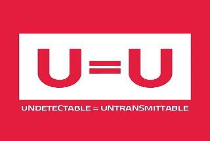

# Traiter l’infection VIH : les stratégies thérapeutiques antirétrovirales

## **Principes du traitement antirétroviral**

Parce que le VIH se réplique massivement dès sa pénétration dans l’organisme, parce qu’il est constamment délétère et responsable d’un déficit immunitaire progressif, parce que la transmission du VIH est étroitement liée à son niveau de réplication et parce qu’il n’existe pas de guérison spontanée de l’infection VIH, seul le contrôle du virus par des antirétroviraux (ARV) bloquant son cycle de multiplication peut arrêter son processus mortifère.

### Un traitement ARV pour contrôler la progression de l’infection VIH

L’objectif du traitement ARV (TARV) est de contrôler (empêcher) la réplication virale jusqu’à ce que celle-ci ne soit plus détectable par les [techniques de PCR](les-outils-virologiques.md) avec des valeurs sous le seuil de 50 copies/ml. Ce contrôle, ou suppression virologique, permet la restauration de l’immunité et l’arrêt des phénomènes inflammatoires délétères induits par le VIH.


[les-outils-virologiques.md](les-outils-virologiques.md)


### Un traitement ARV pour ne pas risquer de contaminer

Un bénéfice majeur du TARV est, outre le contrôle du VIH dans le sang, celui de son contrôle dans les secrétions potentiellement contaminantes comme les secrétions sexuelles (sperme, secrétions génitales). Des études contrôlées (essai HPTN 052, PARTNERS) ont de façon convaincante confirmé cette efficacité protectrice du traitement antirétroviral (> 95%) vis-à-vis du partenaire non-infecté.

Le slogan U=U de l’anglais _Undetectable_ = _Untransmittable_ ou en français Indétectable = Intransmissible constitue une révolution majeure. Ceci constitue une profonde évolution de la manière dont se perçoivent et sont perçus les personnes vivant avec le VIH (PVVIH).


Trois décennies de recherche intense ont permis :

* D’empêcher durablement la progression du virus en empêchant sa multiplication grâce aux médicaments antirétroviraux.
* De démontrer que le traitement ARV devait concerner tout patient infecté par le VIH quel que soit le stade de son infection et son immunité CD4.
* D’établir que le contrôle maximal de la réplication virale, c’est-à-dire l’indétectabilité de la charge virale, permet la non-transmission du virus à une autre personne, qu’il s’agisse d’un adulte par voie sexuelle ou d’un enfant au cours de la grossesse, de l’accouchement ou de l’allaitement : U=U.
* De protéger les personnes non infectées par la prise d’un traitement préventif (prophylaxie préexposition ou PrEP).


### Un traitement à vie

Parce que le VIH est intégré dans le noyau des cellules lymphocytaires, intimement mêlé à l’ADN de ces cellules et qu’il y est en partie inactif, il n’est pas possible de l’éliminer de l’organisme. La réplication quotidienne du VIH impose que celui-ci soit en permanence inhibé par les molécules ARV actives.

Dans les années 2000-2010, face à la toxicité et la complexité des traitements, la possibilité de faire des interruptions de TARV a été évaluée dans plusieurs études, avec l’objectif d’envisager des pauses de traitement.


Tous ces essais ont conclu à l’impossibilité d’arrêter le TARV, sous peine d’un rebond viral en une à trois semaines et la perte de tous les avantages du traitement sur l’immunité et la transmission.


## **Quand débuter un traitement antirétroviral ?**

Les recommandations de traitement basées sur le niveau des CD4 ont considérablement évolué en trois décennies.

* À la fin des années 1980, la mise en évidence d’une certaine activité de la zidovudine et la mortalité très élevée des personnes atteintes ont conduit tout d’abord à envisager un TARV dès que les CD4 baissaient en dessous de 500/mm3. Mais, en 1993-1994, les résultats de l’essai Concorde ne vont pas inciter à administrer précocement la zidovudine chez les adultes asymptomatiques.
* À partir de 1996, l’apparition des nouvelles classes d’antirétroviraux, les IP et les HAART (_Highly Active AntiRetroviral Therapy_) fait reposer la question du meilleur moment pour l’initiation du TARV. Passée la période d’une offensive thérapeutique précoce contre le VIH « _Hit Hard, Hit Early_ », une approche plus prudente est adoptée devant les risques de toxicité cumulée et d’émergence de résistances.
* En 2002, les recommandations sont d’initier le traitement ARV au-dessus de 200 CD4/mm3 chez les personnes asymptomatiques.
* En 2004, la barre des 350 CD4 pour initier le TARV est franchie. Entre 350/mm3 et 500/mm3, les ARV peuvent être initiés en fonction du niveau de charge virale.
* À la fin des années 2000, plusieurs études vont démontrer le caractère délétère du VIH non traité. Dans le même temps, arrivent de nouvelles molécules permettant de reconsidérer l’idée d’un contrôle plus précoce de l’infection. Les barres de valeur de CD4 exigibles pour l’initiation vont remonter progressivement. Ainsi, en 2010, en moins de quatre ans, le seuil situé entre 200 et 350 CD4/mm3 est passé à 350 CD4/mm3, puis à 500 CD4/mm3.
* Puis est venu le traitement universel, quel que soit le niveau de CD4. Pour statuer de façon rigoureuse, ont été mis en place deux larges essais afin de comparer, chez des PVVIH ayant plus de 500 CD4/mm3, le traitement immédiat _versus_ le traitement différé à moins de 500 /mm3. Les deux essais - TEMPRANO (ANRS 12136) en Afrique de l’Ouest et START dans trente-cinq pays - montrent une réduction du risque de morbidité sévère de 44 % chez les patients débutant précocement le TARV. Sur la base de ces résultats, l’OMS recommandera en 2015 __ que le TARV soit instauré chez toutes les PVVIH, quel que soit leur niveau de CD4.
* Depuis 2017, l’OMS comme toutes les sociétés savantes nationales, encourage les prescripteurs à initier le TARV rapidement, c’est-à-dire dans les sept jours maximum après le diagnostic de l’infection par le VIH (site internet [_OMS guidelines_](https://www.who.int/publications/i/item/9789240031593)_)._ Il est même possible de démarrer le traitement immédiatement après confirmation du diagnostic, le même jour, chez les patients qui se sentent prêts.

Il est évidemment important d’apprécier la capacité du patient à débuter le traitement très rapidement : il faut prendre en compte ses connaissances sur le VIH, son état psychologique, évaluer un contexte éventuellement difficile (stigmatisation de l’infection VIH par l’environnement familial, violence domestique ou autre coercition qui risquerait d’influencer négativement les bénéfices du TARV débuté rapidement).

## **Stratégies thérapeutiques d’initiation**

Si le socle classique du TARV ([cf chapitre "Traiter l'infection VIH : les médicaments antirétroviraux"](ARV.md)) reste la trithérapie composée de deux inhibiteurs nucléosidiques (INTI) et d’un troisième agent soit inhibiteur d’intégrase (INI) ou inhibiteur non nucléosidique (INNTI), voire un IP, l’évolution au cours des cinq dernières années s’est faite progressivement vers un allègement du traitement. En effet, plusieurs stratégies d’allègement se sont révélées efficaces soit en initiation de traitement pour induire l’indétectabilité de la charge virale soit pour la maintenir (stratégies de maintenance).


[ARV.md](ARV.md)


Plusieurs bithérapies commencent à entrer dans la pratique et figurent dans les recommandations nationales et internationales.


Ainsi, si le dogme intangible du TARV reste l’obtention ou le maintien d’un contrôle maximal de la charge virale, le moyen d’y arriver n’est plus obligatoirement une trithérapie.



Quelques définitions

Trithérapie classique : 2 inhibiteurs nucléosidiques de la transcriptase inverse (INTI) et un 3e agent d’une classe différente. Ce 3e agent a évolué au cours du temps : inhibiteur de la protéase (IP), inhibiteur non nucléosidique de la transcriptase inverse (INNTI) et maintenant, inhibiteur de l’intégrase (INI).

Bithérapie : 2 molécules  INI/3TC ou FTC

&#x20;                                         INI/INNTI

&#x20;                                         IP/3TC

Simplification : réduction du nombre de prises ou du nombre de gélules au sein d’une même stratégie (avec les comprimés 2 en 1 et 3 en 1).

Allègement thérapeutique : réduction du nombre de doses de médicaments ARV (par exemple 4 jours de traitement par semaine).


Tableau 1 - Stratégies d’antirétroviraux recommandées en initiation pour les adultes infectés par le VIH

>)

Tableau 2 - Stratégies alternatives : recommandations OMS 2021

| Populations            | Traitement de préférence | Traitement alternatif              |
| ---------------------- | ------------------------ | ---------------------------------- |
| Adultes et adolescents | TDF/3TC (ou FTC)/DTG     | TDF/3TC/EFV 400 mg                 |
| Enfants                | ABC/3TC/DTG              | ABC/3TC/LPV/r TAF/3TC (ou FTC)/DTG |
| Nouveau-nés            | AZT (ouABC)/3TC/ALh      | AZT/3TC/NVP                        |

_Source : OMS_ [_https://www.who.int/publications/i/item/9789240031593_](https://www.who.int/publications/i/item/9789240031593)

### Trithérapie classique

Le ténofovir disoproxil fumarate (TDF) ou ténofovir alafénamide (TAF) accompagné par l’emtricitabine, constitue la charpente la plus utilisée des trithérapies. L’abacavir doit être utilisé seulement lorsqu’un test génétique HLA-B\*5701 est négatif, en tout cas dans les populations caucasiennes chez lesquelles ce profil génétique est rencontré.

Le choix d’un **3e agent, c’est-à-dire le médicament combiné en trithérapie aux 2INTI,** est, selon les recommandations européennes (EACS Octobre 2021 https://www.eacsociety.org/) ou nord-américaines. (DHSS 2021 https://clinicalinfo.hiv.gov/en/guidelines) ou de l’OMS (https://www.who.int/fr) :

\- **soit un INI**

* le bictégravir combiné à TAF/FTC (Bictarvy®)
* le dolutégravir combiné à TDF/3TC, TAF/3TC ou ABC/3TC (Triumeq®)

**- soit un INNTI** : doravirine associé à TDF et lamivudine (Delstrigo®) (recommandations européennes)

L’éfavirenz ou la rilpivirine ne sont plus recommandées en médiation de traitement pour des raisons de puissances (rilpivirine) ou de tolérance (éfavirenz). Enfin, l’utilisation d’IP en première ligne de traitement __ reste une option, notamment si le risque de résistance transmise ou acquise est évoqué, ou si d’autres options sont inadéquates. Dans ces situations, le choix se portera sur le darunavir boosté soit par du cobicistat soit par du ritonavir.

### Cas particuliers

* _Grossesse_ : le TARV est une urgence. Le DTG peut maintenant être donné, après une alerte écartée en 2021 sur des anomalies fœtales neurologiques, compte tenu d’un bénéfice important sur la vitesse de suppression virale, particulièrement sensible dans un contexte de découverte de VIH et de grossesse.
* _Co-infection avec Virus Hépatite B_ : le traitement doit impérativement associer le TDF ou le TAF, actifs sur VHB.
* _Tuberculose_ nécessitant un traitement par rifampicine : la dose de DTG doit être doublée (2 × 50 mg). Aucune nécessité d’adapter la dose de l’éfavirenz.


**Abréviations des antirétroviraux**

**INTI : Inhibiteurs nucléos(t)idiques de la transcriptase inverse**

3TC : lamivudine – ABC : abacavir – d4T : stavudine – ddC : zalcitabine – ddI : didanosine – FTC : emtricitabine – TAF : ténofovir alafénamide – TDF : ténofovir disoproxil fumarate – ZDV (ou AZT) : zidovudine

**INNTI : Inhibiteurs non nucléosidiques de la transcriptase inverse**

DOR : doravirine – EFV : éfavirenz – ETR : étravirine – NVP : névirapine – RPV : rilpivirine

**IP : Inhibiteurs de la protéase**

ATV : atazanavir – COBI ou c : cobicistat – DRV : darunavir – LPV : lopinavir  RTV ou r : ritonavir

**INI : Inhibiteurs d’intégrase**

BIC : bictégravir – CAB : cabotégravir – DTG : dolutégravir – EVG : elvitégravir – RAL : raltégravir

**Inhibiteur du CCR5**

MVC : maraviroc


### Bithérapie en initiation

Seule l’association DTG/3TC (DovatoR) est recommandée en initiation chez des patients non porteurs du VHB.

Les grands essais GEMINI 1 et 2 ont solidement démontré que la bithérapie DTG/3TC était aussi efficace que la trithérapie TDF/3TC/DTG en initiation de TARV. La vitesse de réduction de la CV était similaire, de même que la restauration immunitaire. En outre, aucune mutation de résistance n’était détectée en cas d’échec virologique.

## **Les stratégies d’allègement**

Une stratégie dite « allégée » se définit par rapport à un standard, actuellement une trithérapie composée de trois molécules administrées à un dosage fixe et tous les jours. Les stratégies d’allègement peuvent consister en moins de molécules (bi- ou monothérapies), des dosages moins élevés ou une fréquence de prise moindre (figure 1).

Plusieurs éléments ont conduit à cette évolution thérapeutique :

* le traitement universel pour tous les patients, qui conduit à traiter plus tôt, avec des CV plus faibles et des CD4 plus élevés ;
* des molécules actuelles plus efficaces et plus robustes ;
* la nécessité d’un traitement ARV à vie ;
* la prise de conscience qu’aucune molécule n’est exempte d’effets secondaires à long terme.

Ainsi, la tendance actuelle est davantage à l’individualisation du traitement. Le dogme de la trithérapie devrait s’effacer devant celui d’une stratégie de contrôle de la réplication, quelles qu’en soient les modalités, pourvu que ce contrôle soit durable.

L’allègement se définit par une diminution de l’exposition de l’organisme aux ARV. Il ne doit pas être confondu avec une simplification du traitement, qui va comporter moins de comprimés ou moins de prises, comme par exemple avec une combinaison d’ARV en prise unique.

### Réduction de posologie

Seules quelques médicaments validés dans des essais cliniques peuvent être utilisés à posologie réduite en trithérapie : l’efavirenz (Sustiva®) 400 mg, le darunavir (Prezista®) 400 mg ou encore l’atazanavir (Reyataz®) utilisé non boosté.

### Bithérapies en switch

Plusieurs stratégies se sont révélées aussi efficaces que la poursuite d’une trithérapie pour le maintien du contrôle virologique et figurent dans les recommandations européennes :

* Bithérapie DTG/3TC (Dovato®) : 1 comprimé /jour
* Bithérapie DTG/RPV (Juluca®) : 1 comprimé /jour
* Bithérapie CAB/RPV longue durée Vocabria ®, Rekambys ® _IM_
* Bithérapie IP/3TC : DRV/r +3TC ; LPV/3TC ; ATV/3TC.

### Allégement avec traitement intermittent 4 jours par semaine

Ce type de stratégie, dont le but est une réduction de l’exposition aux médicaments, a été évalué dans plusieurs études pilotes. En Afrique du Sud l’essai Breather (cinq jours sur sept) et en France l’essai ANRS 4D vont montrer que des trithérapies comportant des prises quatre jours consécutifs sur sept (lundi-mardi-mercredi-jeudi) et le week-end _off_ permettent de maintenir un excellent taux d’indétectabilité (>90%) (figure 2). Ces résultats vont être validés à plus large échelle dans l’essai comparatif randomisé QUATUOR chez plus de 600 patients, avec des taux de succès virologique équivalents pour la trithérapie quatre jours sur sept comparée à la trithérapie standard sept jours sur sept.

Largement utilisée dans certains centres ou par certains médecins, cette stratégie quatre jours sur sept recueille les faveurs des patients qui disposent d’un long week-end end sans TARV ! Elle réduit de 40% l’exposition aux molécules et le coût de la thérapie sans mettre en péril la suppression virologique.

## **Comment surveiller un traitement antirétroviral ?**

### Surveillance de l’efficacité virologique

L’objectif permanent du TARV étant la suppression virologique, avec maintien d’une CV <50 copies/ml dans le sang, il faut impérativement disposer de la mesure de cette CV pour surveiller l’efficacité du traitement.

En initiation de TARV, les objectifs sont les suivants :

* À 1 mois du début : la CV doit avoir diminué de 2 log10, soit d’un facteur 100
* À 3 mois être < 400 copies /ml
* À 6 mois être < 50 copies/ml.


Exemple : Si CV ARN VIH avant traitement de 100 000 copies/mL, objectif attendu à 1 mois de TARV : CV 1 000 cp/mL maximum


Au cours du suivi : une fois acquise l’indétectabilité, mesure de la CV tous les 6 mois dans les pays sans restriction de ressources.

Dans certains cas de CV initiale très élevée, l’indétectabilité peut parfois n’être atteinte qu’au bout d’un an.

### Surveillance immunitaire

La mesure de la restauration immunitaire se fait à 3 et/ou 6 mois en fonction du niveau initial, puis une fois par an.

## **Gérer un échec virologique**

Alors que les traitements actuellement utilisés permettent de contrôler la réplication virale (> 90% des cas), la proportion de patients en échec de TARV est encore beaucoup trop importante, en particulier dans les pays du Sud.

L’échec thérapeutique doit être prévenu à chaque étape du suivi thérapeutique pour empêcher l’émergence de la résistance et la poursuite de la transmission. Il n’y a pas de prévention possible de l’échec sans accès large à la CV, indispensable outil du traitement. La mesure des concentrations plasmatiques des ARV à l’échec est un outil précieux dont l’usage devrait être développé plus largement.

Les conséquences de l’échec sont nombreuses : échec clinique, échec de la prévention de la transmission, échec avec diffusion de la résistance, échec au plan économique avec un traitement qui coûte et ne fonctionne pas. L’éducation des soignants et des patients, la nécessaire implication des pouvoirs publics pour garantir l’accès aux outils du succès – médicaments efficaces et charge virale – devraient permettre d’atteindre les objectifs parfaitement réalistes de 90 % des patients traités en succès virologique.


Quelques définitions

_La suppression_ ou _contrôle virologique_ se définit par une CV plasmatique indétectable, c’est à dire < 50 copies d’ARN VIH /ml.

_L’échec virologique_ est défini comme toute valeur de la CV plasmatique > 50 copies d’ARN VIH/ml confirmée sur deux prélèvements à deux – quatre semaines d’intervalle. En pratique, il est souvent admis que c’est à partir d’une valeur de CV > 200 copies qu’une modification du TARV est souhaitable. La valeur retenue par l’OMS pour l’échec (CV 100 copie/mL) est considérée comme élevée.

_Réplication persistante de bas niveau,_ en anglais _low level viremia_ (_LLV) :_ persistance chez certains patients et de façon répétée d’une CV oscillant entre 50 et 200 copies, alors même que les concentrations plasmatiques d’ARV sont adéquates et qu’il n’existe pas de résistance. Elle est à priori sans conséquence.

_Blip :_ se définit par une valeur au-dessus de la limite de détection de la CV, encadrée de deux valeurs de CV indétectable. Il ne s’agit donc pas d’un échec virologique.

_Échec clinique :_ survenue de manifestations cliniques liées au VIH (infections opportunistes ou tumeurs), habituellement dans un contexte d’échec virologique et immunologique et souvent dans un contexte de rupture de soins.

_Échec immunologique_ : absence d’ascension des lymphocytes CD4 malgré un TARV efficace depuis au moins 6 mois. Fréquent en cas d’immunité très basse avant traitement. La remontée des lymphocytes CD4 peut être lente, cependant sans sur-risque de manifestations opportunistes lorsque la CV est contrôlée.

_Observance :_ prise régulière de traitement selon la prescription médicale


### **Mécanismes et conséquence de l’échec virologique**

L’échec virologique résulte toujours d’une inhibition insuffisante de la réplication virale, due soit :

* à un défaut d’observance ;
* à une posologie de médicaments inadéquate ;
* à des interactions médicamenteuses abaissant les concentrations des ARV ;
* à une résistance existante vis-à-vis d’un ou de plusieurs médicaments ARV.

En première ligne de traitement, en dehors d’une résistance primaire du virus, c’est habituellement une observance défaillante qui est à l’origine de l’échec virologique. Plus tard, alors que les résistances s’accumulent, le TARV vient à manquer de puissance et ne peut pas contrôler la réplication, quand bien même le patient est observant.

### **Qualifier et quantifier le type d’échec virologique**&#x20;

Si la CV est détectable, il peut s’agir :

* soit d’une réponse insuffisante à un traitement de première ligne, devant faire évoquer un défaut d’observance ou une résistance. En cas de CV initiale très élevée, l’obtention de l’indétectabilité au seuil de 50 copies/ml peut nécessiter plus de temps, et une CV habituellement < 200 copies/ml peut perdurer plus de 12 mois ;
* soit d’un rebond virologique après une période de succès virologique confirmé sur deux prélèvements consécutifs (à distinguer d’un blip).

### **Reconstruire l’histoire thérapeutique**

C’est une étape essentielle qui doit préciser les différentes molécules reçues avec leur impact respectif en termes d’efficacité virologique, immunologique, leur tolérance et les motifs d’arrêts éventuels. En l’absence de génotype de résistance disponible, cette analyse permet de faire des hypothèses sur les mutations de résistance possibles. L’existence d’un dossier patient informatisé et/ou l’inclusion des patients dans une cohorte, qui permettent de disposer de toutes ces informations cumulées au cours du temps, facilitent cette analyse.

### Évaluer l’observance du patient

Évaluer l’adhésion et l’observance du patient au TARV est une étape fondamentale. Même si les traitements se sont simplifiés et sont mieux tolérés, la difficulté pour certaines personnes d’accepter leur infection et par là-même leur traitement, la lassitude vis-à-vis d’un traitement à prendre à vie, l’existence de manifestations minimes d’intolérance, mais aussi tous les incidents ou les accidents de la vie (rupture, décès, chômage, voyage…) constituent autant de circonstances qui peuvent à un moment faire basculer un patient dans une rupture de soins. Dans de nombreux pays, au Sud en particulier, les problèmes de stigmatisation sociale, l’absence de partage du statut sérologique avec le partenaire ou l’entourage, l’éloignement des centres de dispensation des médicaments, la précarité sont des facteurs majeurs de non-observance. Le rôle du médecin en consultation ou de tout autre professionnel de santé est de savoir dépister de telles difficultés.

### Mesures des concentrations plasmatiques d’antirétroviraux

Cette __ mesure des concentrations plasmatiques des molécules ARV permet d’identifier si un sous-dosage peut expliquer dans l’échec virologique : des concentrations inexistantes ou extrêmement basses permettent d’affirmer la non-prise des médicaments ; des concentrations basses peuvent, outre une mauvaise observance, être liées soit à une interaction avec un autre médicament soit une prise inadéquate.

### Test de résistance du virus

Les tests de résistance dits génotypiques vont permettre de faire le bilan des mutations de résistance sur les virus présents dans le sang (cf_._ chapitre _« Résistance du VIH aux antirétroviraux »_).

Schématiquement, l’ARN viral plasmatique est séquencé et « observé » à la loupe de la biologie moléculaire pour identifier s’il existe des mutations vis-à-vis des médicaments ARV les rendant partiellement ou entièrement résistants.

Ces tests requièrent une expertise en biologie moléculaire ; coûteux, ils ne sont pas, en pratique, accessibles dans de nombreuses régions du monde.

### Modifier le traitement ARV

L’analyse de l’échec permet d’envisager les actions suivantes :

_**En cas de défaut d’observance** (si possible attesté par le dosage des ARV) :_

* Sans intolérance : reprendre l’éducation du patient vis-à-vis du TARV ;
* Par intolérance à un médicament : identification et arrêt du médicament en cause pour le remplacer, soit dans la même classe thérapeutique, soit dans une classe nouvelle.

_**Si pas de défaut d’observance**, attesté par dosage des médicaments dans le sang :_

* En fonction du génotype de résistance, idéalement un TARV doit comporter au moins deux molécules pleinement sensibles. \
  En l’absence de pression médicamenteuse d’une classe donnée, des mutations acquises dans le passé peuvent ne pas être retrouvées dans le génotype ARN VIH réalisé au moment de l’échec. Il faut considérer les données cumulées des génotypes interprétés selon l’algorithme et/ou l’histoire immuno-viro-thérapeutique pour estimer le profil de la résistance accumulée ;
* Cas particulier de la lamivudine : malgré la présence de mutations de résistance (M184V), le 3TC garde une certaine efficacité et peut-être maintenu dans le traitement ultérieur.

La gestion d’une situation d’échec est généralement plus difficile au Sud : l’accès à la CV y est plus difficile, avec des délais de réalisation des examens fluctuant selon la disponibilité des appareils, des réactifs, des ressources humaines, et avec une faible accessibilité au génotype de résistance. Pourtant, les enjeux sont les mêmes : obtenir le statut d’indétectabilité qui garantit la qualité de vie, la non-transmission et limite l’émergence de résistance. Moins on a de molécules disponibles, plus elles sont précieuses et doivent être préservées. Seule la CV accessible et disponible rapidement assure une telle sécurité.


* Les stratégies ARV recommandées permettent le contrôle de la réplication virale dans plus de 90% des cas si elles sont adaptées au virus du patient, accessibles et prises de façon adéquate par le patient.
* Le monitorage de leur efficacité ne peut se faire qu’avec la mesure de la charge virale.
* Le traitement ARV doit être administré à vie pendant des décennies.
* L’échec thérapeutique doit être prévenu et traqué pour éviter de perdre des options thérapeutiques avec le développement de la résistance.
* Les conditions de prise en charge


